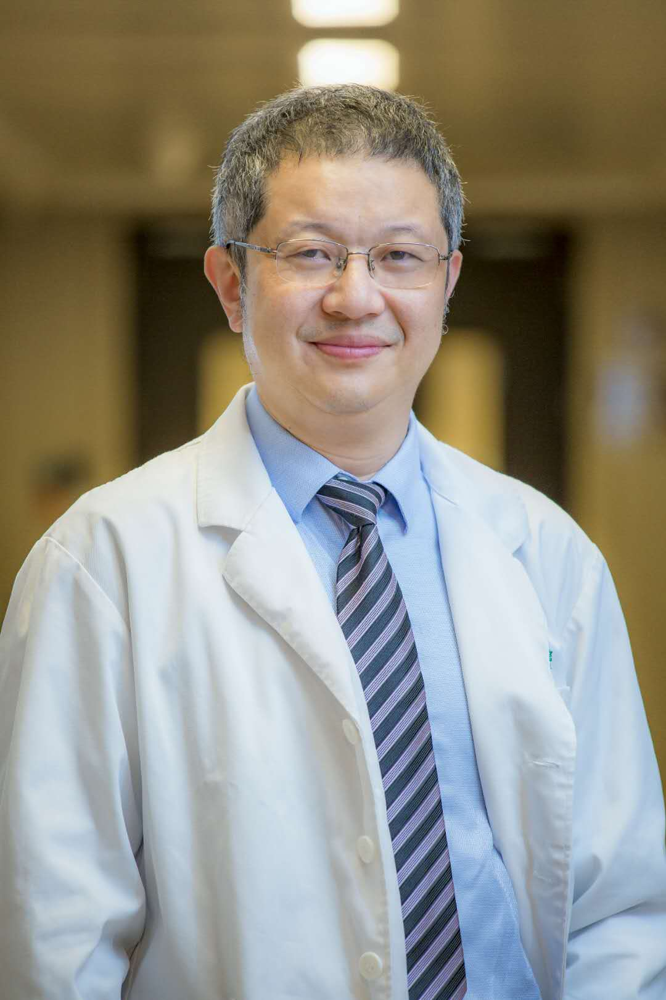

<!-- AUTO-GENERATED-BY: work/generate_obsidian_profiles.py -->

<!-- TEMPLATE: D:\workspace\信息收集整理\医生画像仓库\模板\医生画像模板.md -->

# 杨川

## 基础信息

| 字段 | 内容 |
|---|---|
| 姓名 | 杨川 |
| 医院 | 中山大学孙逸仙纪念医院 |
| 科室 | 内分泌内科 |
| 职称/身份 | 教授, 主任医师 |
| 来源链接 | [官网原文](https://www.gzsys.org.cn/doctor/15322) |
| 采集日期 | 2026-08-13 |

## 简介/擅长

糖尿病、甲状腺疾病、骨质疏松等代谢内分泌疾病

## 教育与进修经历

- 1991年7月湖南医科大学本科毕业，获学士学位；
- 1995年8月到1998年7月湖南医科大学内分泌研究所研究生毕业，获硕士学位；
- 1998年8月到2001年7月中南大学内分泌研究所博士研究生毕业，获博士学位；
- 2001年8月到2003年7月中山大学附属二医院从事有关糖尿病的博士后研究工作。

## 科研项目与成果

- 2008年受国家留学基金资助作为访问学者到New York Blood Center的Lindsley F. Kimball Research Institute研修一年，主要从事C.elegans的脂肪沉积的调节途径的研究。
- 近5年来在国内外杂志发表论文20余篇，主持或参加国家及省部级科研项目12余项。

## 论文与学术产出

- 近5年来在国内外杂志发表论文20余篇，主持或参加国家及省部级科研项目12余项。

## 可包装亮点

- 内分泌内科主任医师、硕士生导师，现任糖尿病专科主任。
- 2003年7月出站并获得内科副教授及副主任医师资格，被中山大学附属第二医院聘为内科副教授、副主任医师及硕士生导师。
- 2008年受国家留学基金资助作为访问学者到New York Blood Center的Lindsley F. Kimball Research Institute研修一年，主要从事C.elegans的脂肪沉积的调节途径的研究。
- 近5年来在国内外杂志发表论文20余篇，主持或参加国家及省部级科研项目12余项。

## 重点疾病/人群标签

- 慢性病：糖尿病、慢性、代谢
- 肿瘤：
- 生殖疾病：
- 免疫/风湿：
- 术后恢复/康复：
- 疑难重症：

## 证据摘录

> 只摘录官网公开信息中的短句或关键字段，不复制大段原文。

- 官网身份字段：教授, 主任医师
- 官网简介/擅长：糖尿病、甲状腺疾病、骨质疏松等代谢内分泌疾病
- 官网亮眼经历线索：内分泌内科主任医师、硕士生导师，现任糖尿病专科主任。 2003年7月出站并获得内科副教授及副主任医师资格，被中山大学附属第二医院聘为内科副教授、副主任医师及硕士生导师。 2008年受国家留学基金资助作为访问学者到New York Blood Center的Lindsley F. Kimball Research Institute研修一年，主要从事C.elegans的脂肪沉积的调节途径的研究。 近5年来在国内外杂志发表论文20余篇，主…
- 来源链接：https://www.gzsys.org.cn/doctor/15322

## BD 画像摘要

杨川医生可作为慢性病方向的基础画像候选。后续 BD 使用应继续以官网来源和人工复核为准，不添加疗效承诺或无来源包装。

## 合规边界

- 仅使用医院官网、官方公众号、官方小程序等公开渠道。
- 不采集私人电话、私人微信、家庭住址、患者隐私或非公开排班信息。
- 不写“保证治愈”“疗效第一”“包治疑难杂症”等无法由官网证明的表述。
