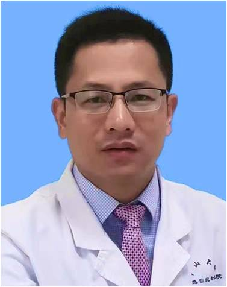

<!-- AUTO-GENERATED-BY: work/generate_obsidian_profiles.py -->

<!-- TEMPLATE: D:\workspace\信息收集整理\医生画像仓库\模板\医生画像模板.md -->

# 杨琼

## 基础信息

| 字段 | 内容 |
|---|---|
| 姓名 | 杨琼 |
| 医院 | 中山大学孙逸仙纪念医院 |
| 科室 | 肿瘤内科 |
| 职称/身份 | 副主任医师 |
| 来源链接 | [官网原文](https://www.gzsys.org.cn/doctor/15312) |
| 采集日期 | 2026-08-13 |

## 简介/擅长

## 教育与进修经历

- 肿瘤学博士，肿瘤内科副主任及副主任医师，硕士生导师，德国杜伊斯堡-埃森大学医学院博士后，访问学者。

## 可包装亮点

- 肿瘤学博士，肿瘤内科副主任及副主任医师，硕士生导师，德国杜伊斯堡-埃森大学医学院博士后，访问学者。
- 任职广州抗癌协会常务理事，广州抗癌协会大肠癌专委会副主任委员，广州抗癌协会消化肿瘤青委会首任主任委员，广东省医疗行业协会肿瘤科管理分会副主任委员，中国抗癌协会肿瘤异质性与个体化治疗专委会委员

## 重点疾病/人群标签

- 慢性病：
- 肿瘤：肿瘤、癌、胃癌、肠癌
- 生殖疾病：
- 免疫/风湿：
- 术后恢复/康复：
- 疑难重症：

## 证据摘录

> 只摘录官网公开信息中的短句或关键字段，不复制大段原文。

- 官网身份字段：副主任医师
- 官网亮眼经历线索：肿瘤学博士，肿瘤内科副主任及副主任医师，硕士生导师，德国杜伊斯堡-埃森大学医学院博士后，访问学者。 任职广州抗癌协会常务理事，广州抗癌协会大肠癌专委会副主任委员，广州抗癌协会消化肿瘤青委会首任主任委员，广东省医疗行业协会肿瘤科管理分会副主任委员，中国抗癌协会肿瘤异质性与个体化治疗专委会委员
- 来源链接：https://www.gzsys.org.cn/doctor/15312

## BD 画像摘要

杨琼医生可作为肿瘤方向的基础画像候选。后续 BD 使用应继续以官网来源和人工复核为准，不添加疗效承诺或无来源包装。

## 合规边界

- 仅使用医院官网、官方公众号、官方小程序等公开渠道。
- 不采集私人电话、私人微信、家庭住址、患者隐私或非公开排班信息。
- 不写“保证治愈”“疗效第一”“包治疑难杂症”等无法由官网证明的表述。
