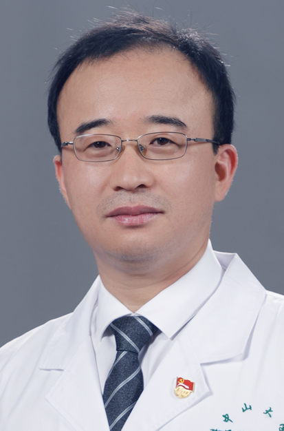

<!-- AUTO-GENERATED-BY: work/generate_obsidian_profiles.py -->

<!-- TEMPLATE: D:\workspace\信息收集整理\医生画像仓库\模板\医生画像模板.md -->

# 杨睿

## 基础信息

| 字段 | 内容 |
|---|---|
| 姓名 | 杨睿 |
| 医院 | 中山大学孙逸仙纪念医院 |
| 科室 | 骨外科 |
| 职称/身份 | 教授, 主任医师 |
| 来源链接 | [官网原文](https://www.gzsys.org.cn/node/14679) |
| 采集日期 | 2026-08-13 |

## 简介/擅长

## 教育与进修经历

- 承担了博士生和硕士生的指导工作，已毕业硕士生3名，在读博士研究生2人、硕士4人，合作博士后1人。

## 科研项目与成果

- 主持国家自然科学基金3项、广东省自然科学基金1项、广州市重大民生项目1项，参与多项国家、省级研究项目。

## 论文与学术产出

- 目前以通讯作者和第一作者发表SCI论文10余篇。

## 可包装亮点

- 入选首届广东省杰出青年医学人才和2019年广州实力中青年医生榜。
- 担任中华医学会关节镜学组委员，中国医师协会运动医学及关节镜专业委员会委员，广东省医学会运动医学分会常委及上肢组副组长，广东省医师协会运动医学分会常委及上肢学组副组长，广东省医学会骨科分会青委会副主任委员等。
- 年门诊量近3000人次，每年关节镜手术量400余台，其中肩关节镜200余台，曾获广东省科技进步三等奖。
- 主持国家自然科学基金3项、广东省自然科学基金1项、广州市重大民生项目1项，参与多项国家、省级研究项目。

## 重点疾病/人群标签

- 慢性病：
- 肿瘤：
- 生殖疾病：
- 免疫/风湿：
- 术后恢复/康复：
- 疑难重症：

## 证据摘录

> 只摘录官网公开信息中的短句或关键字段，不复制大段原文。

- 官网身份字段：教授, 主任医师
- 官网亮眼经历线索：入选首届广东省杰出青年医学人才和2019年广州实力中青年医生榜。 担任中华医学会关节镜学组委员，中国医师协会运动医学及关节镜专业委员会委员，广东省医学会运动医学分会常委及上肢组副组长，广东省医师协会运动医学分会常委及上肢学组副组长，广东省医学会骨科分会青委会副主任委员等。 年门诊量近3000人次，每年关节镜手术量400余台，其中肩关节镜200余台，曾获广东省科技进步三等奖。 主持国家自然科学基金3项、广东省自然科学基金1项、广州市重大…
- 来源链接：https://www.gzsys.org.cn/node/14679

## BD 画像摘要

杨睿医生可作为中山大学孙逸仙纪念医院骨外科的基础医生资料入库。当前重点方向以总底表标签为准，官网未展示的信息保持空白。

## 合规边界

- 仅使用医院官网、官方公众号、官方小程序等公开渠道。
- 不采集私人电话、私人微信、家庭住址、患者隐私或非公开排班信息。
- 不写“保证治愈”“疗效第一”“包治疑难杂症”等无法由官网证明的表述。
