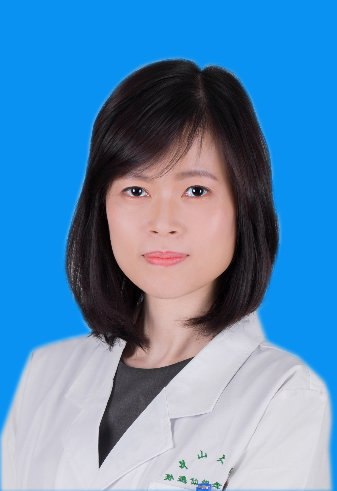

<!-- AUTO-GENERATED-BY: work/generate_obsidian_profiles.py -->

<!-- TEMPLATE: D:\workspace\信息收集整理\医生画像仓库\模板\医生画像模板.md -->

# 杨绮华

## 基础信息

| 字段 | 内容 |
|---|---|
| 姓名 | 杨绮华 |
| 医院 | 中山大学孙逸仙纪念医院 |
| 科室 | 放射科影像专科 |
| 职称/身份 | 副主任医师 |
| 来源链接 | [官网原文](https://www.gzsys.org.cn/doctor/14748) |
| 采集日期 | 2026-08-13 |

## 简介/擅长

## 教育与进修经历

- 本科、硕士研究生以及博士研究生均毕业于中山大学，2008年开始就职于中山大学孙逸仙纪念医院放射科，现主要从事CT、MRI 影像学诊断，主攻儿科相关疾病影像学诊断，尤其是地中海贫血脏器铁过载评估。
- 多次负责中山大学临床医学5年制本科生以及全英留学生班医学影像学课程教学工作，曾获中山大学孙逸仙纪念医院青年教师英文授课大赛一等奖，中山大学青年教师英文授课大赛三等奖。

## 科研项目与成果

- 在职期间，以第一作者及通讯作者发表SCI论文以及中文论著多篇，主持一项广东省自然科学基金，作为主要成员参与国家自然科学基金、中山大学临床医学研究5010计划项目。

## 论文与学术产出

- 在职期间，以第一作者及通讯作者发表SCI论文以及中文论著多篇，主持一项广东省自然科学基金，作为主要成员参与国家自然科学基金、中山大学临床医学研究5010计划项目。

## 可包装亮点

- 在职期间，以第一作者及通讯作者发表SCI论文以及中文论著多篇，主持一项广东省自然科学基金，作为主要成员参与国家自然科学基金、中山大学临床医学研究5010计划项目。
- 现任广东省抗癌协会肿瘤影像专业委员会青年委员会副主任委员、广东省临床医学学会儿童试题肿瘤专业委员会常委、中国研究型医院学会儿童肿瘤专业委员会青年委员、广东省抗癌协会小儿肿瘤专业委员会青年委员以及广东省女医师协会放射专业委员会委员；
- 多次负责中山大学临床医学5年制本科生以及全英留学生班医学影像学课程教学工作，曾获中山大学孙逸仙纪念医院青年教师英文授课大赛一等奖，中山大学青年教师英文授课大赛三等奖。
- 2008年曾赴瑞士日内瓦大学附属医院短期交流，2014年获郑裕彤博士奖学金前往香港大学玛丽医院交流学习。

## 重点疾病/人群标签

- 慢性病：
- 肿瘤：肿瘤、癌
- 生殖疾病：
- 免疫/风湿：
- 术后恢复/康复：
- 疑难重症：

## 证据摘录

> 只摘录官网公开信息中的短句或关键字段，不复制大段原文。

- 官网身份字段：副主任医师
- 官网亮眼经历线索：在职期间，以第一作者及通讯作者发表SCI论文以及中文论著多篇，主持一项广东省自然科学基金，作为主要成员参与国家自然科学基金、中山大学临床医学研究5010计划项目。 现任广东省抗癌协会肿瘤影像专业委员会青年委员会副主任委员、广东省临床医学学会儿童试题肿瘤专业委员会常委、中国研究型医院学会儿童肿瘤专业委员会青年委员、广东省抗癌协会小儿肿瘤专业委员会青年委员以及广东省女医师协会放射专业委员会委员； 多次负责中山大学临床医学5年制本科生以及全…
- 来源链接：https://www.gzsys.org.cn/doctor/14748

## BD 画像摘要

杨绮华医生可作为肿瘤方向的基础画像候选。后续 BD 使用应继续以官网来源和人工复核为准，不添加疗效承诺或无来源包装。

## 合规边界

- 仅使用医院官网、官方公众号、官方小程序等公开渠道。
- 不采集私人电话、私人微信、家庭住址、患者隐私或非公开排班信息。
- 不写“保证治愈”“疗效第一”“包治疑难杂症”等无法由官网证明的表述。
