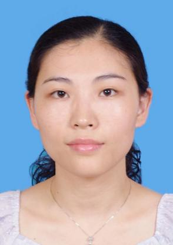

<!-- AUTO-GENERATED-BY: work/generate_obsidian_profiles.py -->

<!-- TEMPLATE: D:\workspace\信息收集整理\医生画像仓库\模板\医生画像模板.md -->

# 林向华

## 基础信息

| 字段 | 内容 |
|---|---|
| 姓名 | 林向华 |
| 医院 | 中山大学孙逸仙纪念医院 |
| 科室 | 检验科 |
| 职称/身份 | 副主任技师 |
| 来源链接 | [官网原文](https://www.gzsys.org.cn/doctor/14661) |
| 采集日期 | 2026-08-13 |

## 简介/擅长

## 科研项目与成果

- 从事临床检验工作21年，近8年主要从事临床流式细胞术检测工作，对白血病/淋巴瘤免疫分型、MRD检测及临床细胞免疫监测等有较丰富的经验，并参与和设计多项临床流式科研项目。

## 论文与学术产出

- 近年来发表并参与SCI论文约10篇。

## 可包装亮点

- 近年来发表并参与SCI论文约10篇。
- 现任广州抗癌协会病理学与分子病理诊断专业委员会常务委员，广东省医疗行业协会检验分会委员，中国中西医结合学会检验医学专业委员会流式细胞分析诊断专家委员会委员。

## 重点疾病/人群标签

- 慢性病：
- 肿瘤：癌、淋巴瘤、白血病、免疫
- 生殖疾病：
- 免疫/风湿：癌、淋巴瘤、白血病、免疫
- 术后恢复/康复：
- 疑难重症：

## 证据摘录

> 只摘录官网公开信息中的短句或关键字段，不复制大段原文。

- 官网身份字段：副主任技师
- 官网亮眼经历线索：近年来发表并参与SCI论文约10篇。 现任广州抗癌协会病理学与分子病理诊断专业委员会常务委员，广东省医疗行业协会检验分会委员，中国中西医结合学会检验医学专业委员会流式细胞分析诊断专家委员会委员。
- 来源链接：https://www.gzsys.org.cn/doctor/14661

## BD 画像摘要

林向华医生可作为肿瘤、免疫/风湿/感染方向的基础画像候选。后续 BD 使用应继续以官网来源和人工复核为准，不添加疗效承诺或无来源包装。

## 合规边界

- 仅使用医院官网、官方公众号、官方小程序等公开渠道。
- 不采集私人电话、私人微信、家庭住址、患者隐私或非公开排班信息。
- 不写“保证治愈”“疗效第一”“包治疑难杂症”等无法由官网证明的表述。
