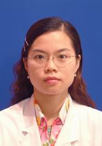

<!-- AUTO-GENERATED-BY: work/generate_obsidian_profiles.py -->

<!-- TEMPLATE: D:\workspace\信息收集整理\医生画像仓库\模板\医生画像模板.md -->

# 林茵

## 基础信息

| 字段 | 内容 |
|---|---|
| 姓名 | 林茵 |
| 医院 | 中山大学孙逸仙纪念医院 |
| 科室 | 药学部 |
| 职称/身份 | 副主任药师 |
| 来源链接 | [官网原文](https://www.gzsys.org.cn/node/14694) |
| 采集日期 | 2026-08-13 |

## 简介/擅长

## 教育与进修经历

- 副主任药师，国家卫健委临床药师培训基地抗感染药物专业带教师资，中山大学优秀临床带教老师，广东省柯麟医学临床优秀带教教师。

## 科研项目与成果

- 主持参与多项国家级省级科研立项，发表第一作者论文三十多篇；

## 论文与学术产出

- 主持参与多项国家级省级科研立项，发表第一作者论文三十多篇；
- 执笔多个专家共识，参编论著四部。

## 可包装亮点

- 学术任职：广东省女医师协会感染与抗感染专业委员会常务委员，广东省药学会重症医学用药专家委员会常委，广东省药理学会药物警戒联盟专家组青年专家，广东省药学会临床药学服务与实践专委会委员，广东省药学会药物治疗学专业委员会委员。
- 主持参与多项国家级省级科研立项，发表第一作者论文三十多篇；

## 重点疾病/人群标签

- 慢性病：
- 肿瘤：
- 生殖疾病：
- 免疫/风湿：感染、重症
- 术后恢复/康复：
- 疑难重症：感染、重症

## 证据摘录

> 只摘录官网公开信息中的短句或关键字段，不复制大段原文。

- 官网身份字段：副主任药师
- 官网亮眼经历线索：学术任职：广东省女医师协会感染与抗感染专业委员会常务委员，广东省药学会重症医学用药专家委员会常委，广东省药理学会药物警戒联盟专家组青年专家，广东省药学会临床药学服务与实践专委会委员，广东省药学会药物治疗学专业委员会委员。 主持参与多项国家级省级科研立项，发表第一作者论文三十多篇；
- 来源链接：https://www.gzsys.org.cn/node/14694

## BD 画像摘要

林茵医生可作为免疫/风湿/感染、疑难重症方向的基础画像候选。后续 BD 使用应继续以官网来源和人工复核为准，不添加疗效承诺或无来源包装。

## 合规边界

- 仅使用医院官网、官方公众号、官方小程序等公开渠道。
- 不采集私人电话、私人微信、家庭住址、患者隐私或非公开排班信息。
- 不写“保证治愈”“疗效第一”“包治疑难杂症”等无法由官网证明的表述。
