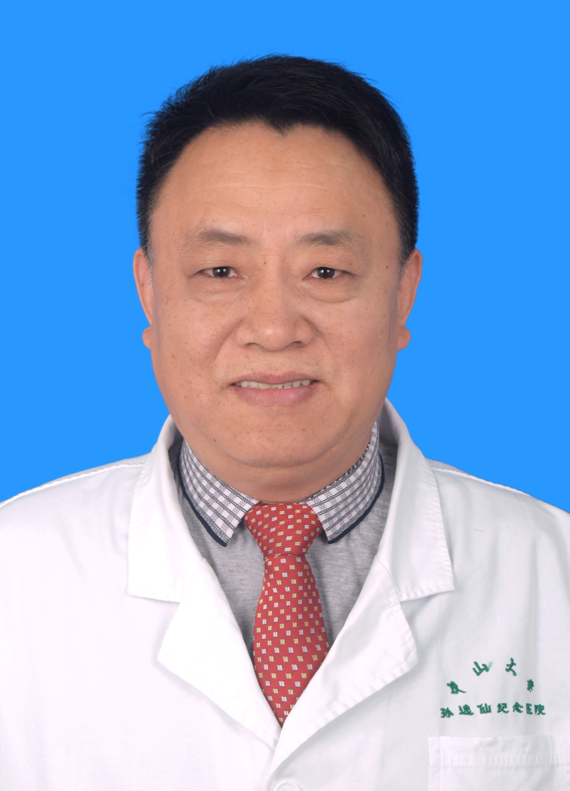

<!-- AUTO-GENERATED-BY: work/generate_obsidian_profiles.py -->

<!-- TEMPLATE: D:\workspace\信息收集整理\医生画像仓库\模板\医生画像模板.md -->

# 梁九根

## 基础信息

| 字段 | 内容 |
|---|---|
| 姓名 | 梁九根 |
| 医院 | 中山大学孙逸仙纪念医院 |
| 科室 | 核医学科 |
| 职称/身份 | 副教授, 副主任医师 |
| 来源链接 | [官网原文](https://www.gzsys.org.cn/doctor/15218) |
| 采集日期 | 2026-08-13 |

## 简介/擅长

血管瘤/脉管畸形、甲亢、甲状腺癌、骨质疏松症等。

## 教育与进修经历

- 1984年本科毕业，1991年核医学专业研究生毕业。

## 科研项目与成果

- 后一直在中山大学孙逸仙纪念医院从事核医学临床、教学和科研工作。
- 参与国家、卫生部、省科技厅、省卫生厅、中山大学等各级科研课题十余项，发表学术论文70多篇，参编著作7部。

## 论文与学术产出

- 参与国家、卫生部、省科技厅、省卫生厅、中山大学等各级科研课题十余项，发表学术论文70多篇，参编著作7部。

## 可包装亮点

- 1999年任副教授、副主任医师，硕士导师。
- 现任广东省医学会核医学分会委员，广东省医学会核医学质控中心委员，中华医学会骨质疏松和骨矿盐疾病分会质控组委员，广东省医学会骨质疏松分会常务委员，广东省和广州市医疗事故技术鉴定专家，广东省科技咨询专家。
- 参与国家、卫生部、省科技厅、省卫生厅、中山大学等各级科研课题十余项，发表学术论文70多篇，参编著作7部。

## 重点疾病/人群标签

- 慢性病：
- 肿瘤：癌、瘤
- 生殖疾病：
- 免疫/风湿：
- 术后恢复/康复：
- 疑难重症：

## 证据摘录

> 只摘录官网公开信息中的短句或关键字段，不复制大段原文。

- 官网身份字段：副教授, 副主任医师
- 官网简介/擅长：血管瘤/脉管畸形、甲亢、甲状腺癌、骨质疏松症等。
- 官网亮眼经历线索：1999年任副教授、副主任医师，硕士导师。 现任广东省医学会核医学分会委员，广东省医学会核医学质控中心委员，中华医学会骨质疏松和骨矿盐疾病分会质控组委员，广东省医学会骨质疏松分会常务委员，广东省和广州市医疗事故技术鉴定专家，广东省科技咨询专家。 参与国家、卫生部、省科技厅、省卫生厅、中山大学等各级科研课题十余项，发表学术论文70多篇，参编著作7部。
- 来源链接：https://www.gzsys.org.cn/doctor/15218

## BD 画像摘要

梁九根医生可作为肿瘤方向的基础画像候选。后续 BD 使用应继续以官网来源和人工复核为准，不添加疗效承诺或无来源包装。

## 合规边界

- 仅使用医院官网、官方公众号、官方小程序等公开渠道。
- 不采集私人电话、私人微信、家庭住址、患者隐私或非公开排班信息。
- 不写“保证治愈”“疗效第一”“包治疑难杂症”等无法由官网证明的表述。
