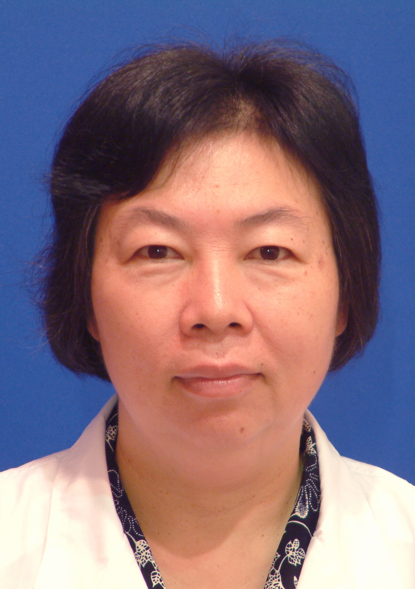

<!-- AUTO-GENERATED-BY: work/generate_obsidian_profiles.py -->

<!-- TEMPLATE: D:\workspace\信息收集整理\医生画像仓库\模板\医生画像模板.md -->

# 梁碧玲

## 基础信息

| 字段 | 内容 |
|---|---|
| 姓名 | 梁碧玲 |
| 医院 | 中山大学孙逸仙纪念医院 |
| 科室 | 放射科影像专科 |
| 职称/身份 | 教授, 主任医师 |
| 来源链接 | [官网原文](https://www.gzsys.org.cn/node/14523) |
| 采集日期 | 2026-08-13 |

## 简介/擅长

骨关节和肿瘤的影像诊断，人体各系统和各部位疾病的MR诊断造诣尤深。

## 教育与进修经历

- 1976年毕业于中山医学院医疗系，1989年北京积水潭创伤骨科研究所获硕士学位，1989年瑞典LUND大学医学院放射学科访问学者，1990年在美国SAN DIEGO加州大学医疗中心从事博士后研究。

## 科研项目与成果

- 1976年毕业于中山医学院医疗系，1989年北京积水潭创伤骨科研究所获硕士学位，1989年瑞典LUND大学医学院放射学科访问学者，1990年在美国SAN DIEGO加州大学医疗中心从事博士后研究。
- 多年来不断追踪影像医学的最新进展，获国家自然科学基金、卫生部出国人员科研基金、省卫生厅科研基金等十数项科研课题，发表论文100多篇，主编或参与编写有关专著11本，并担任过卫生部医学院教材主编。
- 获各级科研成果奖励8项，其中有国家教委一等奖、广东省科技进步二、三等奖。

## 论文与学术产出

- 多年来不断追踪影像医学的最新进展，获国家自然科学基金、卫生部出国人员科研基金、省卫生厅科研基金等十数项科研课题，发表论文100多篇，主编或参与编写有关专著11本，并担任过卫生部医学院教材主编。

## 可包装亮点

- 中山大学孙逸仙纪念医院放射科学科带头人，一级主任医师、二级教授、博士生导师，中山大学名医。
- 中国医师协会放射医师分会第二届副会长，中国医师协会放射医师分会第一、三届常委，中华放射学会骨肌学组顾问，中国抗癌协会神经肿瘤专业委员会顾问，全国继续医学教育委员会影像医学组专家，国际骨关节学会委员，亚洲骨关节学会委员。
- 1976年毕业于中山医学院医疗系，1989年北京积水潭创伤骨科研究所获硕士学位，1989年瑞典LUND大学医学院放射学科访问学者，1990年在美国SAN DIEGO加州大学医疗中心从事博士后研究。
- 多年来不断追踪影像医学的最新进展，获国家自然科学基金、卫生部出国人员科研基金、省卫生厅科研基金等十数项科研课题，发表论文100多篇，主编或参与编写有关专著11本，并担任过卫生部医学院教材主编。

## 重点疾病/人群标签

- 慢性病：
- 肿瘤：肿瘤、癌
- 生殖疾病：
- 免疫/风湿：
- 术后恢复/康复：
- 疑难重症：

## 证据摘录

> 只摘录官网公开信息中的短句或关键字段，不复制大段原文。

- 官网身份字段：教授, 主任医师
- 官网简介/擅长：骨关节和肿瘤的影像诊断，人体各系统和各部位疾病的MR诊断造诣尤深。
- 官网亮眼经历线索：中山大学孙逸仙纪念医院放射科学科带头人，一级主任医师、二级教授、博士生导师，中山大学名医。 中国医师协会放射医师分会第二届副会长，中国医师协会放射医师分会第一、三届常委，中华放射学会骨肌学组顾问，中国抗癌协会神经肿瘤专业委员会顾问，全国继续医学教育委员会影像医学组专家，国际骨关节学会委员，亚洲骨关节学会委员。 1976年毕业于中山医学院医疗系，1989年北京积水潭创伤骨科研究所获硕士学位，1989年瑞典LUND大学医学院放射学科访问学…
- 来源链接：https://www.gzsys.org.cn/node/14523

## BD 画像摘要

梁碧玲医生可作为肿瘤方向的基础画像候选。后续 BD 使用应继续以官网来源和人工复核为准，不添加疗效承诺或无来源包装。

## 合规边界

- 仅使用医院官网、官方公众号、官方小程序等公开渠道。
- 不采集私人电话、私人微信、家庭住址、患者隐私或非公开排班信息。
- 不写“保证治愈”“疗效第一”“包治疑难杂症”等无法由官网证明的表述。
