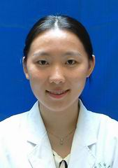

<!-- AUTO-GENERATED-BY: work/generate_obsidian_profiles.py -->

<!-- TEMPLATE: D:\workspace\信息收集整理\医生画像仓库\模板\医生画像模板.md -->

# 梁颖

## 基础信息

| 字段 | 内容 |
|---|---|
| 姓名 | 梁颖 |
| 医院 | 中山大学孙逸仙纪念医院 |
| 科室 | 内分泌内科 |
| 职称/身份 | 副主任医师 |
| 来源链接 | [官网原文](https://www.gzsys.org.cn/doctor/15325) |
| 采集日期 | 2026-08-13 |

## 简介/擅长

糖尿病、甲亢等

## 教育与进修经历

- 2001年以优异成绩毕业于中山医科大学临床医学系，留校于孙逸仙纪念医院内分泌专科工作至今已10年。
- 在临床工作中勤奋刻苦，理论基础扎实，工作认真负责，不断提高临床诊疗水平，积累临床经验，2002年即取得执业医师资格，2007年顺利晋升内分泌主治医师，同年获得硕士学位。

## 科研项目与成果

- 近年来共以第一作者发表或参与发表论著10篇（含SCI文章），参与国家及省基金课题2项，并多次在中华医学会全国会议上作口头发言及壁报交流等，曾在2008年全国内分泌代谢性疾病系列研讨会暨中青年论坛英文演讲比赛中获三等奖。

## 论文与学术产出

- 近年来共以第一作者发表或参与发表论著10篇（含SCI文章），参与国家及省基金课题2项，并多次在中华医学会全国会议上作口头发言及壁报交流等，曾在2008年全国内分泌代谢性疾病系列研讨会暨中青年论坛英文演讲比赛中获三等奖。

## 可包装亮点

- 内分泌内科副主任医师，医学在读博士。
- 作为高年资医师，有丰富的临床经验，熟练掌握内分泌专业常见病、多发病的诊治方法，尤其是糖尿病、甲状腺等疾病，可处理疑难病例，具备较好的临床技能和良好的医德医风，多次受到患者好评。
- 近年来共以第一作者发表或参与发表论著10篇（含SCI文章），参与国家及省基金课题2项，并多次在中华医学会全国会议上作口头发言及壁报交流等，曾在2008年全国内分泌代谢性疾病系列研讨会暨中青年论坛英文演讲比赛中获三等奖。

## 重点疾病/人群标签

- 慢性病：糖尿病、代谢、疑难
- 肿瘤：
- 生殖疾病：
- 免疫/风湿：
- 术后恢复/康复：
- 疑难重症：糖尿病、代谢、疑难

## 证据摘录

> 只摘录官网公开信息中的短句或关键字段，不复制大段原文。

- 官网身份字段：副主任医师
- 官网简介/擅长：糖尿病、甲亢等
- 官网亮眼经历线索：内分泌内科副主任医师，医学在读博士。 作为高年资医师，有丰富的临床经验，熟练掌握内分泌专业常见病、多发病的诊治方法，尤其是糖尿病、甲状腺等疾病，可处理疑难病例，具备较好的临床技能和良好的医德医风，多次受到患者好评。 近年来共以第一作者发表或参与发表论著10篇（含SCI文章），参与国家及省基金课题2项，并多次在中华医学会全国会议上作口头发言及壁报交流等，曾在2008年全国内分泌代谢性疾病系列研讨会暨中青年论坛英文演讲比赛中获三等奖。
- 来源链接：https://www.gzsys.org.cn/doctor/15325

## BD 画像摘要

梁颖医生可作为慢性病、疑难重症方向的基础画像候选。后续 BD 使用应继续以官网来源和人工复核为准，不添加疗效承诺或无来源包装。

## 合规边界

- 仅使用医院官网、官方公众号、官方小程序等公开渠道。
- 不采集私人电话、私人微信、家庭住址、患者隐私或非公开排班信息。
- 不写“保证治愈”“疗效第一”“包治疑难杂症”等无法由官网证明的表述。
