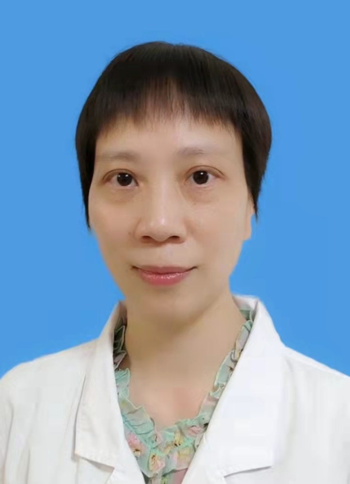

<!-- AUTO-GENERATED-BY: work/generate_obsidian_profiles.py -->

<!-- TEMPLATE: D:\workspace\信息收集整理\医生画像仓库\模板\医生画像模板.md -->

# 欧冰

## 基础信息

| 字段 | 内容 |
|---|---|
| 姓名 | 欧冰 |
| 医院 | 中山大学孙逸仙纪念医院 |
| 科室 | 超声科 |
| 职称/身份 | 副主任医师 |
| 来源链接 | [官网原文](https://www.gzsys.org.cn/node/14693) |
| 采集日期 | 2026-08-13 |

## 简介/擅长

乳腺及甲状腺等浅表器官疾病的超声诊断及超声弹性成像。

## 教育与进修经历

- 2001年中山医科大学临床影像本科毕业，进入中山二院超声科工作，2006年获得中山大学临床医学硕士学位。

## 科研项目与成果

- 于2010年作为课题组主要成员，以课题《超声弹性成像在乳腺癌诊断中的应用》获广东省科技成果二等奖。
- 个人主持一项省卫生厅科研项目，并参与多项国家级及省部级的科研项目。

## 论文与学术产出

- 本人的超声弹性成像技术运用娴熟，已经获得临床医生的认可，并在国内核心期刊发表相关文章进行该技术的推广应用；
- 近几年以共同第一作者或通讯作者在《PLOS ONE》、《European Journal of Radiology》、《Clinical Breast Cancer》等国外杂志上发表多篇SCI论文。
- 并以第一作者在国内核心期刊《中国超声医学杂志》、《中华影像学杂志》、《中国医学影像技术》上发表文章二十多篇。

## 可包装亮点

- 2004年超声弹性成像技术刚进入中国时，配合科室最早在全国率先将超声弹性成像这种新技术用于乳腺疾病的诊断，目前该技术已成为科室乳腺、甲状腺疾病的常规诊断操作，诊断水平位居全国的领先地位。
- 本人的超声弹性成像技术运用娴熟，已经获得临床医生的认可，并在国内核心期刊发表相关文章进行该技术的推广应用；
- 于2010年作为课题组主要成员，以课题《超声弹性成像在乳腺癌诊断中的应用》获广东省科技成果二等奖。
- 近几年以共同第一作者或通讯作者在《PLOS ONE》、《European Journal of Radiology》、《Clinical Breast Cancer》等国外杂志上发表多篇SCI论文。

## 重点疾病/人群标签

- 慢性病：
- 肿瘤：肿瘤、乳腺癌、疑难
- 生殖疾病：
- 免疫/风湿：
- 术后恢复/康复：
- 疑难重症：肿瘤、乳腺癌、疑难

## 证据摘录

> 只摘录官网公开信息中的短句或关键字段，不复制大段原文。

- 官网身份字段：副主任医师
- 官网简介/擅长：乳腺及甲状腺等浅表器官疾病的超声诊断及超声弹性成像。
- 官网亮眼经历线索：2004年超声弹性成像技术刚进入中国时，配合科室最早在全国率先将超声弹性成像这种新技术用于乳腺疾病的诊断，目前该技术已成为科室乳腺、甲状腺疾病的常规诊断操作，诊断水平位居全国的领先地位。 本人的超声弹性成像技术运用娴熟，已经获得临床医生的认可，并在国内核心期刊发表相关文章进行该技术的推广应用； 于2010年作为课题组主要成员，以课题《超声弹性成像在乳腺癌诊断中的应用》获广东省科技成果二等奖。 近几年以共同第一作者或通讯作者在《PLOS…
- 来源链接：https://www.gzsys.org.cn/node/14693

## BD 画像摘要

欧冰医生可作为肿瘤、疑难重症方向的基础画像候选。后续 BD 使用应继续以官网来源和人工复核为准，不添加疗效承诺或无来源包装。

## 合规边界

- 仅使用医院官网、官方公众号、官方小程序等公开渠道。
- 不采集私人电话、私人微信、家庭住址、患者隐私或非公开排班信息。
- 不写“保证治愈”“疗效第一”“包治疑难杂症”等无法由官网证明的表述。
