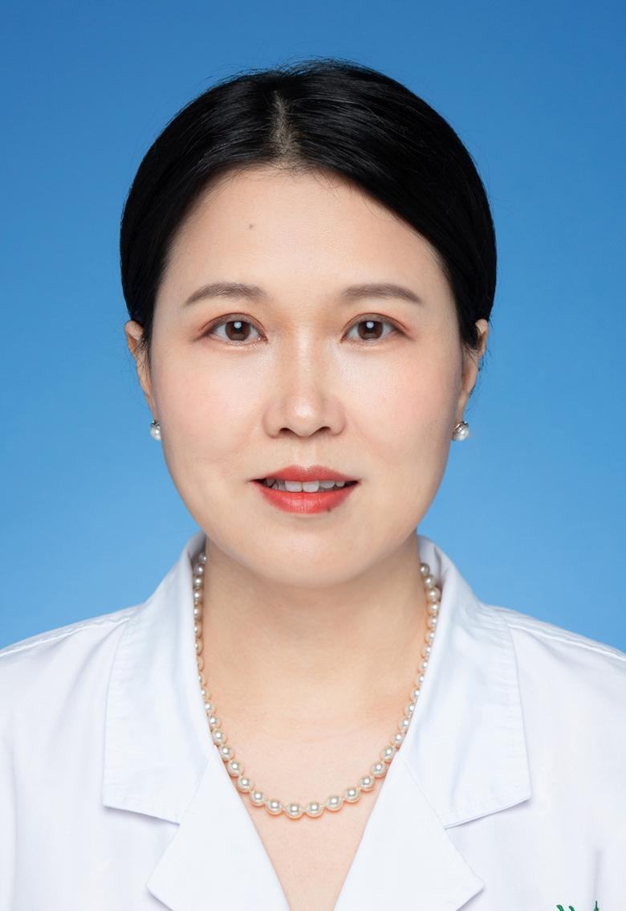

<!-- AUTO-GENERATED-BY: work/generate_obsidian_profiles.py -->

<!-- TEMPLATE: D:\workspace\信息收集整理\医生画像仓库\模板\医生画像模板.md -->

# 欧阳颖

## 基础信息

| 字段 | 内容 |
|---|---|
| 姓名 | 欧阳颖 |
| 医院 | 中山大学孙逸仙纪念医院 |
| 科室 | 新生儿及儿童重症专科 |
| 职称/身份 | 主任医师 |
| 来源链接 | [官网原文](https://www.gzsys.org.cn/node/14684) |
| 采集日期 | 2026-08-13 |

## 简介/擅长

## 科研项目与成果

- 发表SCI论文20余篇,国内期刊30篇,主持及参与国家自然科学基金2项,省自然科学基金9项,主持广州市科技攻关计划1项。

## 论文与学术产出

- 发表SCI论文20余篇,国内期刊30篇,主持及参与国家自然科学基金2项,省自然科学基金9项,主持广州市科技攻关计划1项。
- 十四五规划儿科继教教材副主编，科技部重大专项评审专家。

## 可包装亮点

- 医学博士, 主任医师,博士/硕士生导师, 中山大学孙逸仙纪念医院新生儿及儿童重症监护专科副主任。
- 获得岭南名医 、 广东实力中青年医生专家的称号，从事儿科工作30年，擅长于儿童及新生儿危重急症的抢救及处理及早产儿脑损伤、支气管肺发育不良、早产儿营养、儿童生长发育、儿童呼吸系统疾病及儿童常见病的治疗。
- 发表SCI论文20余篇,国内期刊30篇,主持及参与国家自然科学基金2项,省自然科学基金9项,主持广州市科技攻关计划1项。
- 积极从事儿科教学活动,培养博士硕士10余名，主持儿科病例讨论,多次获得教学查房比赛奖项。

## 重点疾病/人群标签

- 慢性病：
- 肿瘤：
- 生殖疾病：
- 免疫/风湿：
- 术后恢复/康复：营养、危重、重症
- 疑难重症：营养、危重、重症

## 证据摘录

> 只摘录官网公开信息中的短句或关键字段，不复制大段原文。

- 官网身份字段：主任医师
- 官网亮眼经历线索：医学博士, 主任医师,博士/硕士生导师, 中山大学孙逸仙纪念医院新生儿及儿童重症监护专科副主任。 获得岭南名医 、 广东实力中青年医生专家的称号，从事儿科工作30年，擅长于儿童及新生儿危重急症的抢救及处理及早产儿脑损伤、支气管肺发育不良、早产儿营养、儿童生长发育、儿童呼吸系统疾病及儿童常见病的治疗。 发表SCI论文20余篇,国内期刊30篇,主持及参与国家自然科学基金2项,省自然科学基金9项,主持广州市科技攻关计划1项。 积极从事儿科教…
- 来源链接：https://www.gzsys.org.cn/node/14684

## BD 画像摘要

欧阳颖医生可作为术后恢复/康复、疑难重症方向的基础画像候选。后续 BD 使用应继续以官网来源和人工复核为准，不添加疗效承诺或无来源包装。

## 合规边界

- 仅使用医院官网、官方公众号、官方小程序等公开渠道。
- 不采集私人电话、私人微信、家庭住址、患者隐私或非公开排班信息。
- 不写“保证治愈”“疗效第一”“包治疑难杂症”等无法由官网证明的表述。
