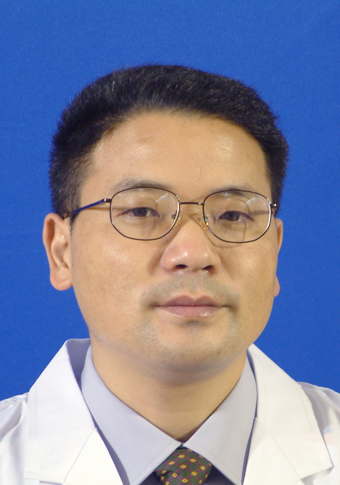

<!-- AUTO-GENERATED-BY: work/generate_obsidian_profiles.py -->

<!-- TEMPLATE: D:\workspace\信息收集整理\医生画像仓库\模板\医生画像模板.md -->

# 江山平

## 基础信息

| 字段 | 内容 |
|---|---|
| 姓名 | 江山平 |
| 医院 | 中山大学孙逸仙纪念医院 |
| 科室 | 呼吸与危重症医学科 |
| 职称/身份 | 教授, 主任医师 |
| 来源链接 | [官网原文](https://www.gzsys.org.cn/node/15230) |
| 采集日期 | 2026-08-13 |

## 简介/擅长

肺部感染和免疫性疾病的诊断与治疗。

## 科研项目与成果

- 主持国家自然科学基金课题5项，省部级课题8项、厅局级课题3项。
- 获省部、厅级成果各1项、校级医疗成果3项。

## 论文与学术产出

- Eur Rev Med Pharmacol Sci编委、中华结核和呼吸杂志编委。
- 以第一作者和/或通讯作者发表论著80余篇，其中SCI收录32篇。

## 可包装亮点

- 教授、主任医师、博士生导师。
- 现任医院学术委员会主任、疑难病会诊中心主任、抗生素研究所主任、呼吸与危重症医学科主任。
- 主持国家自然科学基金课题5项，省部级课题8项、厅局级课题3项。
- 以第一作者和/或通讯作者发表论著80余篇，其中SCI收录32篇。

## 重点疾病/人群标签

- 慢性病：
- 肿瘤：
- 生殖疾病：
- 免疫/风湿：免疫、感染、疑难、危重
- 术后恢复/康复：
- 疑难重症：免疫、感染、疑难、危重

## 证据摘录

> 只摘录官网公开信息中的短句或关键字段，不复制大段原文。

- 官网身份字段：教授, 主任医师
- 官网简介/擅长：肺部感染和免疫性疾病的诊断与治疗。
- 官网亮眼经历线索：教授、主任医师、博士生导师。 现任医院学术委员会主任、疑难病会诊中心主任、抗生素研究所主任、呼吸与危重症医学科主任。 主持国家自然科学基金课题5项，省部级课题8项、厅局级课题3项。 以第一作者和/或通讯作者发表论著80余篇，其中SCI收录32篇。
- 来源链接：https://www.gzsys.org.cn/node/15230

## BD 画像摘要

江山平医生可作为免疫/风湿/感染、疑难重症方向的基础画像候选。后续 BD 使用应继续以官网来源和人工复核为准，不添加疗效承诺或无来源包装。

## 合规边界

- 仅使用医院官网、官方公众号、官方小程序等公开渠道。
- 不采集私人电话、私人微信、家庭住址、患者隐私或非公开排班信息。
- 不写“保证治愈”“疗效第一”“包治疑难杂症”等无法由官网证明的表述。
