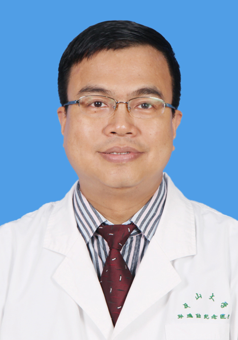

<!-- AUTO-GENERATED-BY: work/generate_obsidian_profiles.py -->

<!-- TEMPLATE: D:\workspace\信息收集整理\医生画像仓库\模板\医生画像模板.md -->

# 洪俊

## 基础信息

| 字段 | 内容 |
|---|---|
| 姓名 | 洪俊 |
| 医院 | 中山大学孙逸仙纪念医院 |
| 科室 | 眼科 |
| 职称/身份 | 副主任医师 |
| 来源链接 | [官网原文](https://www.gzsys.org.cn/node/14538) |
| 采集日期 | 2026-08-13 |

## 简介/擅长

## 教育与进修经历

- 作为广东省健康科普专家，充分发挥专业优势，在省内各地市主讲公益性健康科普讲座和参与各种形式的义诊、宣教活动，并积极参加各种学术交流和继续教育培训。

## 科研项目与成果

- 从事眼科临床医疗、教学和科研工作36年，是资深眼科专家。

## 可包装亮点

- 广东省健康科普专家 广东省医院协会眼健康管理委员会委员，广东省视光学学会低视力康复专家委员会常委， 广东省健康管理学会健康管理专委会常委 。
- 熟悉眼科各类疾病的诊治，具有眼全科医生的良好专业素养，善于运用全面的眼科知识指导临床实践，对眼科疑难病例的诊治有较丰富的临床经验。
- 上世纪90年代率先在本院开展眼底外科手术，填补了多项空白。

## 重点疾病/人群标签

- 慢性病：糖尿病、康复、疑难
- 肿瘤：
- 生殖疾病：
- 免疫/风湿：
- 术后恢复/康复：糖尿病、康复、疑难
- 疑难重症：糖尿病、康复、疑难

## 证据摘录

> 只摘录官网公开信息中的短句或关键字段，不复制大段原文。

- 官网身份字段：副主任医师
- 官网亮眼经历线索：广东省健康科普专家 广东省医院协会眼健康管理委员会委员，广东省视光学学会低视力康复专家委员会常委， 广东省健康管理学会健康管理专委会常委 。 熟悉眼科各类疾病的诊治，具有眼全科医生的良好专业素养，善于运用全面的眼科知识指导临床实践，对眼科疑难病例的诊治有较丰富的临床经验。 上世纪90年代率先在本院开展眼底外科手术，填补了多项空白。
- 来源链接：https://www.gzsys.org.cn/node/14538

## BD 画像摘要

洪俊医生可作为慢性病、术后恢复/康复、疑难重症方向的基础画像候选。后续 BD 使用应继续以官网来源和人工复核为准，不添加疗效承诺或无来源包装。

## 合规边界

- 仅使用医院官网、官方公众号、官方小程序等公开渠道。
- 不采集私人电话、私人微信、家庭住址、患者隐私或非公开排班信息。
- 不写“保证治愈”“疗效第一”“包治疑难杂症”等无法由官网证明的表述。
