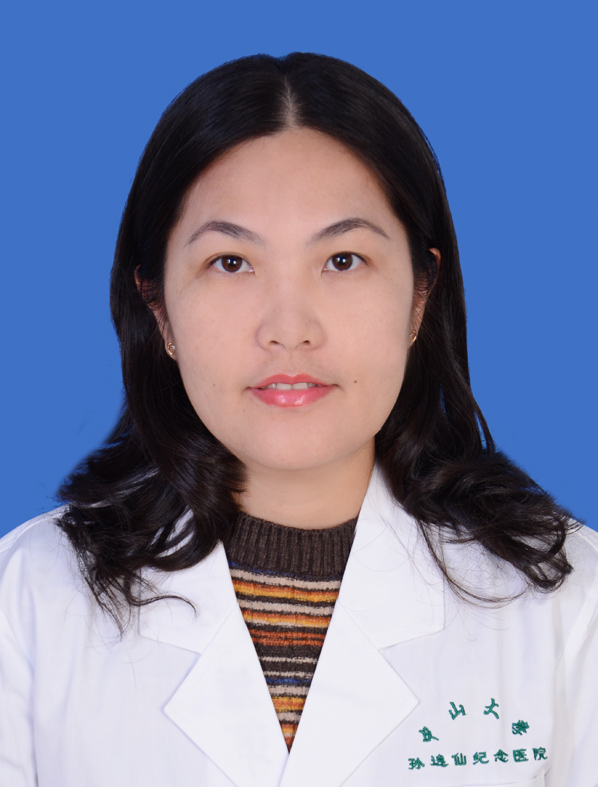

<!-- AUTO-GENERATED-BY: work/generate_obsidian_profiles.py -->

<!-- TEMPLATE: D:\workspace\信息收集整理\医生画像仓库\模板\医生画像模板.md -->

# 潘萍

## 基础信息

| 字段 | 内容 |
|---|---|
| 姓名 | 潘萍 |
| 医院 | 中山大学孙逸仙纪念医院 |
| 科室 | 妇科生殖内分泌专科 |
| 职称/身份 | 副主任医师 |
| 来源链接 | [官网原文](https://www.gzsys.org.cn/doctor/15444) |
| 采集日期 | 2026-08-13 |

## 简介/擅长

## 科研项目与成果

- 以第一作者发表论文20余篇，以第一负责人主持科研基金3项，参与编写学术专著2部。

## 论文与学术产出

- 以第一作者发表论文20余篇，以第一负责人主持科研基金3项，参与编写学术专著2部。

## 可包装亮点

- 副主任医师，医学博士，硕士生导师。
- 广东省医师协会生殖医学医师分会第二届委员会女科医师专业组组员，广东省保健协会生殖健康分会第一届委员，广东省女医师协会女性内分泌专业委员会第二届委员。
- 以第一作者发表论文20余篇，以第一负责人主持科研基金3项，参与编写学术专著2部。
- 作为主要参与者之一获2011年广东省科学技术三等奖和2012年第二届广东省优生优育技术进步金域奖三等奖。

## 重点疾病/人群标签

- 慢性病：
- 肿瘤：
- 生殖疾病：生殖、不孕、卵巢、辅助生殖、胚胎、多囊、月经
- 免疫/风湿：
- 术后恢复/康复：
- 疑难重症：

## 证据摘录

> 只摘录官网公开信息中的短句或关键字段，不复制大段原文。

- 官网身份字段：副主任医师
- 官网亮眼经历线索：副主任医师，医学博士，硕士生导师。 广东省医师协会生殖医学医师分会第二届委员会女科医师专业组组员，广东省保健协会生殖健康分会第一届委员，广东省女医师协会女性内分泌专业委员会第二届委员。 以第一作者发表论文20余篇，以第一负责人主持科研基金3项，参与编写学术专著2部。 作为主要参与者之一获2011年广东省科学技术三等奖和2012年第二届广东省优生优育技术进步金域奖三等奖。
- 来源链接：https://www.gzsys.org.cn/doctor/15444

## BD 画像摘要

潘萍医生可作为生殖疾病方向的基础画像候选。后续 BD 使用应继续以官网来源和人工复核为准，不添加疗效承诺或无来源包装。

## 合规边界

- 仅使用医院官网、官方公众号、官方小程序等公开渠道。
- 不采集私人电话、私人微信、家庭住址、患者隐私或非公开排班信息。
- 不写“保证治愈”“疗效第一”“包治疑难杂症”等无法由官网证明的表述。
