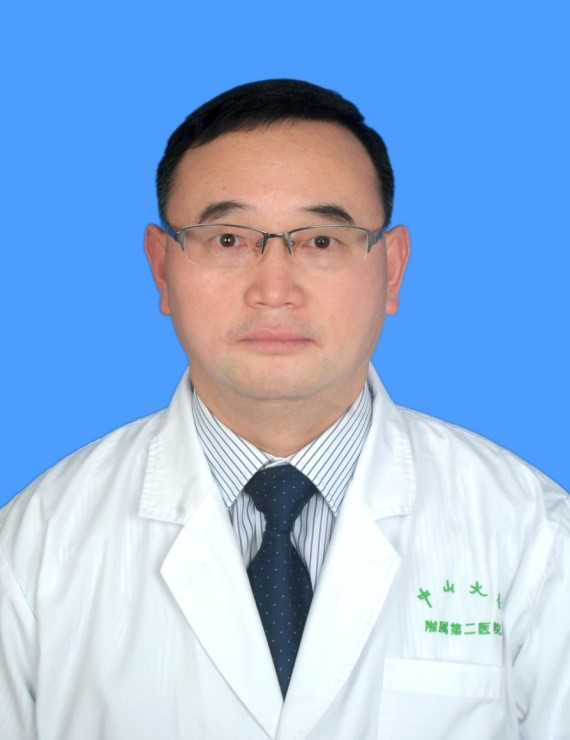

<!-- AUTO-GENERATED-BY: work/generate_obsidian_profiles.py -->

<!-- TEMPLATE: D:\workspace\信息收集整理\医生画像仓库\模板\医生画像模板.md -->

# 熊小强

## 基础信息

| 字段 | 内容 |
|---|---|
| 姓名 | 熊小强 |
| 医院 | 中山大学孙逸仙纪念医院 |
| 科室 | 消化内科、全科医学科 |
| 职称/身份 | 主任医师 |
| 来源链接 | [官网原文](https://www.gzsys.org.cn/node/14532) |
| 采集日期 | 2026-08-13 |

## 简介/擅长

## 教育与进修经历

- 中山医科大学医学系六年制毕业，长期潜心于消化内科临床医疗工作。

## 可包装亮点

- 广东省健康管理学会心身医学专业委员会主任委员，广东省医学会心身医学分会第六届委员会副主任委员，广东省控烟协会常务副会长兼秘书长、法人代表，中华消化心身联盟广东省委员会常务副主任委员，广东省医疗行业协会消化系统疾病规范化管理分会副主任委员，广东省健康管理学会老年医学专业委员会副主任委员，广东省临床医学学会临床心身医学和心理治疗专委会副主任委员，广东省医师协会…

## 重点疾病/人群标签

- 慢性病：
- 肿瘤：肿瘤、感染
- 生殖疾病：
- 免疫/风湿：肿瘤、感染
- 术后恢复/康复：
- 疑难重症：

## 证据摘录

> 只摘录官网公开信息中的短句或关键字段，不复制大段原文。

- 官网身份字段：主任医师
- 官网亮眼经历线索：广东省健康管理学会心身医学专业委员会主任委员，广东省医学会心身医学分会第六届委员会副主任委员，广东省控烟协会常务副会长兼秘书长、法人代表，中华消化心身联盟广东省委员会常务副主任委员，广东省医疗行业协会消化系统疾病规范化管理分会副主任委员，广东省健康管理学会老年医学专业委员会副主任委员，广东省临床医学学会临床心身医学和心理治疗专委会副主任委员，广东省医师协会全科医师分会常委，广东省医学会涉外与特需医疗服务委员会常委，广东省医院协会医院医…
- 来源链接：https://www.gzsys.org.cn/node/14532

## BD 画像摘要

熊小强医生可作为肿瘤、免疫/风湿/感染方向的基础画像候选。后续 BD 使用应继续以官网来源和人工复核为准，不添加疗效承诺或无来源包装。

## 合规边界

- 仅使用医院官网、官方公众号、官方小程序等公开渠道。
- 不采集私人电话、私人微信、家庭住址、患者隐私或非公开排班信息。
- 不写“保证治愈”“疗效第一”“包治疑难杂症”等无法由官网证明的表述。
