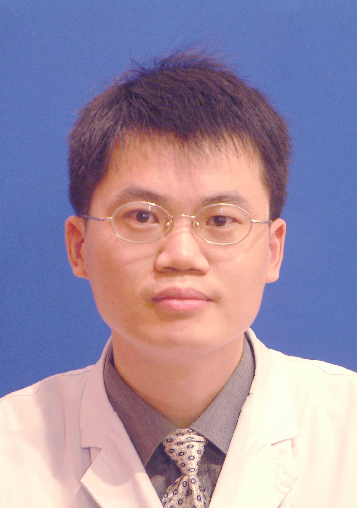

<!-- AUTO-GENERATED-BY: work/generate_obsidian_profiles.py -->

<!-- TEMPLATE: D:\workspace\信息收集整理\医生画像仓库\模板\医生画像模板.md -->

# 王建广

## 基础信息

| 字段 | 内容 |
|---|---|
| 姓名 | 王建广 |
| 医院 | 中山大学孙逸仙纪念医院 |
| 科室 | 口腔科 |
| 职称/身份 | 主任医师 |
| 来源链接 | [官网原文](https://www.gzsys.org.cn/node/14677) |
| 采集日期 | 2026-08-13 |

## 简介/擅长

## 教育与进修经历

- 美国南加州大学博士后，口腔科教研室主任，中山大学颅颌面外科中心秘书 中华口腔医学会颌面外科专委会肿瘤内科委员 广东省口腔颌面外科专业委员会常委 广东省医师协会头颈肿瘤专委会常委 广东省抗癌医学会头颈肿瘤专委会委员 广东省口腔数字化材料管理专业委员会委员 《中华临床医师杂志》编委 《中华口腔医学研究杂志》编委 擅长口腔颌面头颈部良恶性肿瘤诊治及头颈部软硬组织缺损修复；

## 科研项目与成果

- 主持国家自然科学基金1项，参加国家自然科学基金3项，省部级科研基金10余项，在国际或国内重要专业期刊发表论文50多篇，副主编或参编专著6部。

## 论文与学术产出

- 主持国家自然科学基金1项，参加国家自然科学基金3项，省部级科研基金10余项，在国际或国内重要专业期刊发表论文50多篇，副主编或参编专著6部。

## 可包装亮点

- 美国南加州大学博士后，口腔科教研室主任，中山大学颅颌面外科中心秘书 中华口腔医学会颌面外科专委会肿瘤内科委员 广东省口腔颌面外科专业委员会常委 广东省医师协会头颈肿瘤专委会常委 广东省抗癌医学会头颈肿瘤专委会委员 广东省口腔数字化材料管理专业委员会委员 《中华临床医师杂志》编委 《中华口腔医学研究杂志》编委 擅长口腔颌面头颈部良恶性肿瘤诊治及头颈部软硬组织…
- 主持国家自然科学基金1项，参加国家自然科学基金3项，省部级科研基金10余项，在国际或国内重要专业期刊发表论文50多篇，副主编或参编专著6部。

## 重点疾病/人群标签

- 慢性病：
- 肿瘤：肿瘤、癌
- 生殖疾病：
- 免疫/风湿：
- 术后恢复/康复：
- 疑难重症：

## 证据摘录

> 只摘录官网公开信息中的短句或关键字段，不复制大段原文。

- 官网身份字段：主任医师
- 官网亮眼经历线索：美国南加州大学博士后，口腔科教研室主任，中山大学颅颌面外科中心秘书 中华口腔医学会颌面外科专委会肿瘤内科委员 广东省口腔颌面外科专业委员会常委 广东省医师协会头颈肿瘤专委会常委 广东省抗癌医学会头颈肿瘤专委会委员 广东省口腔数字化材料管理专业委员会委员 《中华临床医师杂志》编委 《中华口腔医学研究杂志》编委 擅长口腔颌面头颈部良恶性肿瘤诊治及头颈部软硬组织缺损修复； 主持国家自然科学基金1项，参加国家自然科学基金3项，省部级科研基金1…
- 来源链接：https://www.gzsys.org.cn/node/14677

## BD 画像摘要

王建广医生可作为肿瘤方向的基础画像候选。后续 BD 使用应继续以官网来源和人工复核为准，不添加疗效承诺或无来源包装。

## 合规边界

- 仅使用医院官网、官方公众号、官方小程序等公开渠道。
- 不采集私人电话、私人微信、家庭住址、患者隐私或非公开排班信息。
- 不写“保证治愈”“疗效第一”“包治疑难杂症”等无法由官网证明的表述。
