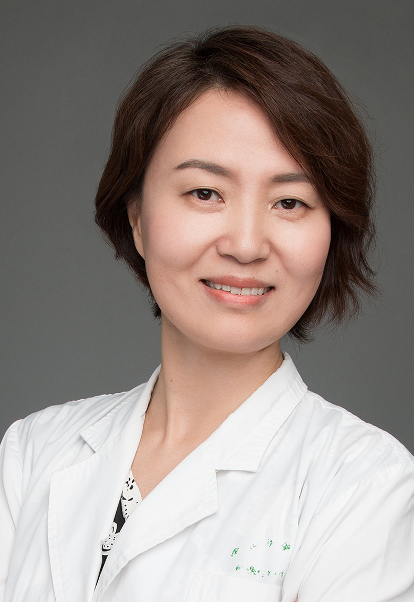

<!-- AUTO-GENERATED-BY: work/generate_obsidian_profiles.py -->

<!-- TEMPLATE: D:\workspace\信息收集整理\医生画像仓库\模板\医生画像模板.md -->

# 王梅

## 基础信息

| 字段 | 内容 |
|---|---|
| 姓名 | 王梅 |
| 医院 | 中山大学孙逸仙纪念医院 |
| 科室 | 眼科 |
| 职称/身份 | 主任医师 |
| 来源链接 | [官网原文](https://www.gzsys.org.cn/node/14593) |
| 采集日期 | 2026-08-13 |

## 简介/擅长

## 教育与进修经历

- 王梅，医学博士，主任医师，硕士研究生导师，意大利米兰大学附属 FondazioneCaGranda医院访问学者，中山大学孙逸仙纪念医院眼科副主任，广东眼科医师协会白内障学组委员，广东省视光学学会视力保健专业委员会常务委员，广东省视光学学会白内障复明专业委员会委员，广东省医学 会医学鉴定专家组成员，临床上主要擅长甲状腺相关眼病的诊治、白内障的手术治疗、青光眼的诊断与手术治疗、糖尿病视网膜病变的诊治等等。

## 科研项目与成果

- 曾主持与作为主要参与者开展多项国家、省市级科研基金项目。

## 论文与学术产出

- 以第一作者及主要参与者发表sci论文及核心期刊数十篇

## 可包装亮点

- 王梅，医学博士，主任医师，硕士研究生导师，意大利米兰大学附属 FondazioneCaGranda医院访问学者，中山大学孙逸仙纪念医院眼科副主任，广东眼科医师协会白内障学组委员，广东省视光学学会视力保健专业委员会常务委员，广东省视光学学会白内障复明专业委员会委员，广东省医学 会医学鉴定专家组成员，临床上主要擅长甲状腺相关眼病的诊治、白内障的手术治疗、青光眼…
- 作为主要成员曾获得广东省科学技术奖励三等奖。
- 以第一作者及主要参与者发表sci论文及核心期刊数十篇

## 重点疾病/人群标签

- 慢性病：糖尿病
- 肿瘤：
- 生殖疾病：
- 免疫/风湿：
- 术后恢复/康复：
- 疑难重症：

## 证据摘录

> 只摘录官网公开信息中的短句或关键字段，不复制大段原文。

- 官网身份字段：主任医师
- 官网亮眼经历线索：王梅，医学博士，主任医师，硕士研究生导师，意大利米兰大学附属 FondazioneCaGranda医院访问学者，中山大学孙逸仙纪念医院眼科副主任，广东眼科医师协会白内障学组委员，广东省视光学学会视力保健专业委员会常务委员，广东省视光学学会白内障复明专业委员会委员，广东省医学 会医学鉴定专家组成员，临床上主要擅长甲状腺相关眼病的诊治、白内障的手术治疗、青光眼的诊断与手术治疗、糖尿病视网膜病变的诊治等等。 作为主要成员曾获得广东省科学技术…
- 来源链接：https://www.gzsys.org.cn/node/14593

## BD 画像摘要

王梅医生可作为慢性病方向的基础画像候选。后续 BD 使用应继续以官网来源和人工复核为准，不添加疗效承诺或无来源包装。

## 合规边界

- 仅使用医院官网、官方公众号、官方小程序等公开渠道。
- 不采集私人电话、私人微信、家庭住址、患者隐私或非公开排班信息。
- 不写“保证治愈”“疗效第一”“包治疑难杂症”等无法由官网证明的表述。
