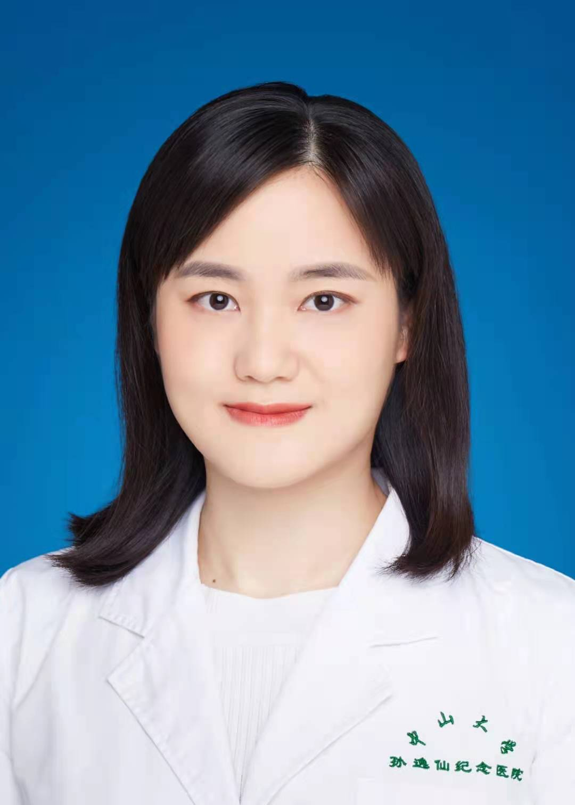

<!-- AUTO-GENERATED-BY: work/generate_obsidian_profiles.py -->

<!-- TEMPLATE: D:\workspace\信息收集整理\医生画像仓库\模板\医生画像模板.md -->

# 王澄

## 基础信息

| 字段 | 内容 |
|---|---|
| 姓名 | 王澄 |
| 医院 | 中山大学孙逸仙纪念医院 |
| 科室 | 临床营养科 |
| 职称/身份 | 主管医师 |
| 来源链接 | [官网原文](https://www.gzsys.org.cn/node/16772) |
| 采集日期 | 2026-08-13 |

## 简介/擅长

## 教育与进修经历

- 医学博士，毕业于中山大学流行病与卫生统计学专业，主要研究方向是心血管疾病和糖尿病的营养防治。

## 科研项目与成果

- 主持国家自然科学基金和广东省自然科学基金各1项，主要参与5项国家级科研课题。

## 论文与学术产出

- 擅长“三高”包括高血糖（糖尿病）、高血脂（血脂异常）、高尿酸（痛风）等营养调理和体重的营养管理（减重、减脂、增重），在相关领域发表专业论著20余篇，其中SCI 收录14篇；

## 可包装亮点

- 擅长“三高”包括高血糖（糖尿病）、高血脂（血脂异常）、高尿酸（痛风）等营养调理和体重的营养管理（减重、减脂、增重），在相关领域发表专业论著20余篇，其中SCI 收录14篇；
- 主持国家自然科学基金和广东省自然科学基金各1项，主要参与5项国家级科研课题。
- 社会职务：广东省健康管理学会食品安全与营养健康专委会常务委员。

## 重点疾病/人群标签

- 慢性病：糖尿病、营养
- 肿瘤：
- 生殖疾病：
- 免疫/风湿：
- 术后恢复/康复：糖尿病、营养
- 疑难重症：

## 证据摘录

> 只摘录官网公开信息中的短句或关键字段，不复制大段原文。

- 官网身份字段：主管医师
- 官网亮眼经历线索：擅长“三高”包括高血糖（糖尿病）、高血脂（血脂异常）、高尿酸（痛风）等营养调理和体重的营养管理（减重、减脂、增重），在相关领域发表专业论著20余篇，其中SCI 收录14篇； 主持国家自然科学基金和广东省自然科学基金各1项，主要参与5项国家级科研课题。 社会职务：广东省健康管理学会食品安全与营养健康专委会常务委员。
- 来源链接：https://www.gzsys.org.cn/node/16772

## BD 画像摘要

王澄医生可作为慢性病、术后恢复/康复方向的基础画像候选。后续 BD 使用应继续以官网来源和人工复核为准，不添加疗效承诺或无来源包装。

## 合规边界

- 仅使用医院官网、官方公众号、官方小程序等公开渠道。
- 不采集私人电话、私人微信、家庭住址、患者隐私或非公开排班信息。
- 不写“保证治愈”“疗效第一”“包治疑难杂症”等无法由官网证明的表述。
