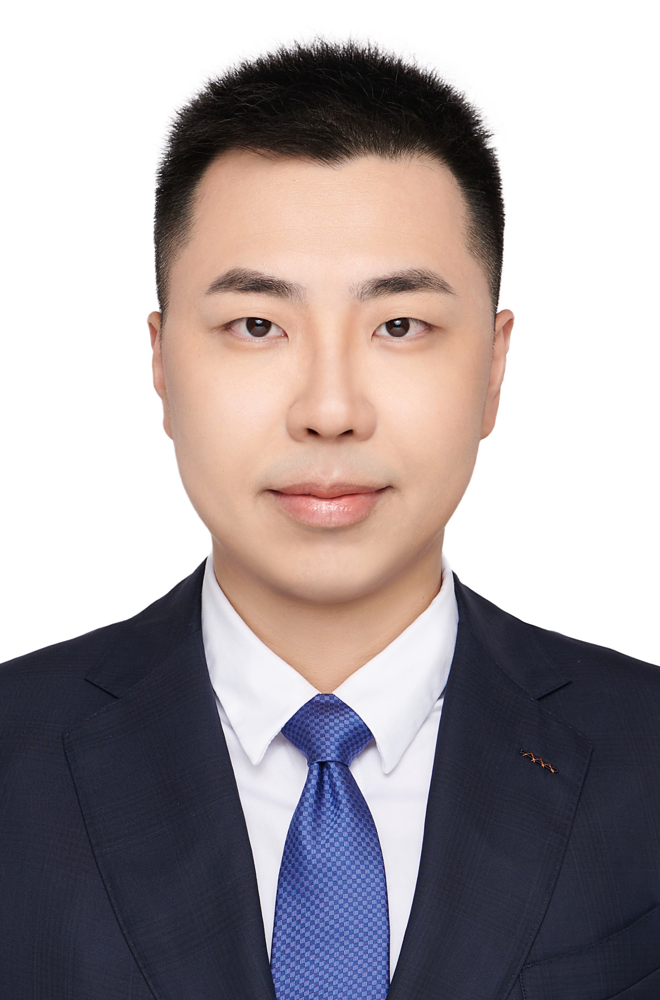

<!-- AUTO-GENERATED-BY: work/generate_obsidian_profiles.py -->

<!-- TEMPLATE: D:\workspace\信息收集整理\医生画像仓库\模板\医生画像模板.md -->

# 王靖淞

## 基础信息

| 字段 | 内容 |
|---|---|
| 姓名 | 王靖淞 |
| 医院 | 中山大学孙逸仙纪念医院 |
| 科室 | 骨外科 |
| 职称/身份 | 医师 |
| 来源链接 | [官网原文](https://www.gzsys.org.cn/node/24151) |
| 采集日期 | 2026-08-13 |

## 简介/擅长

## 教育与进修经历

- 王靖淞，医学博士，中山大学博士后，助理研究员。
- 国家公派英国留学博士研究生，获英国牛津大学-基尔大学全额奖学金联合培养。

## 论文与学术产出

- 擅长各种运动创伤和膝、踝、肩关节病的诊治和康复，同时致力于软骨及半月板细胞组织工程相关基础研究，目前发表SCI论文10篇。

## 可包装亮点

- 国家公派英国留学博士研究生，获英国牛津大学-基尔大学全额奖学金联合培养。
- 擅长各种运动创伤和膝、踝、肩关节病的诊治和康复，同时致力于软骨及半月板细胞组织工程相关基础研究，目前发表SCI论文10篇。

## 重点疾病/人群标签

- 慢性病：
- 肿瘤：
- 生殖疾病：
- 免疫/风湿：
- 术后恢复/康复：康复
- 疑难重症：

## 证据摘录

> 只摘录官网公开信息中的短句或关键字段，不复制大段原文。

- 官网身份字段：医师
- 官网亮眼经历线索：国家公派英国留学博士研究生，获英国牛津大学-基尔大学全额奖学金联合培养。 擅长各种运动创伤和膝、踝、肩关节病的诊治和康复，同时致力于软骨及半月板细胞组织工程相关基础研究，目前发表SCI论文10篇。
- 来源链接：https://www.gzsys.org.cn/node/24151

## BD 画像摘要

王靖淞医生可作为术后恢复/康复方向的基础画像候选。后续 BD 使用应继续以官网来源和人工复核为准，不添加疗效承诺或无来源包装。

## 合规边界

- 仅使用医院官网、官方公众号、官方小程序等公开渠道。
- 不采集私人电话、私人微信、家庭住址、患者隐私或非公开排班信息。
- 不写“保证治愈”“疗效第一”“包治疑难杂症”等无法由官网证明的表述。
