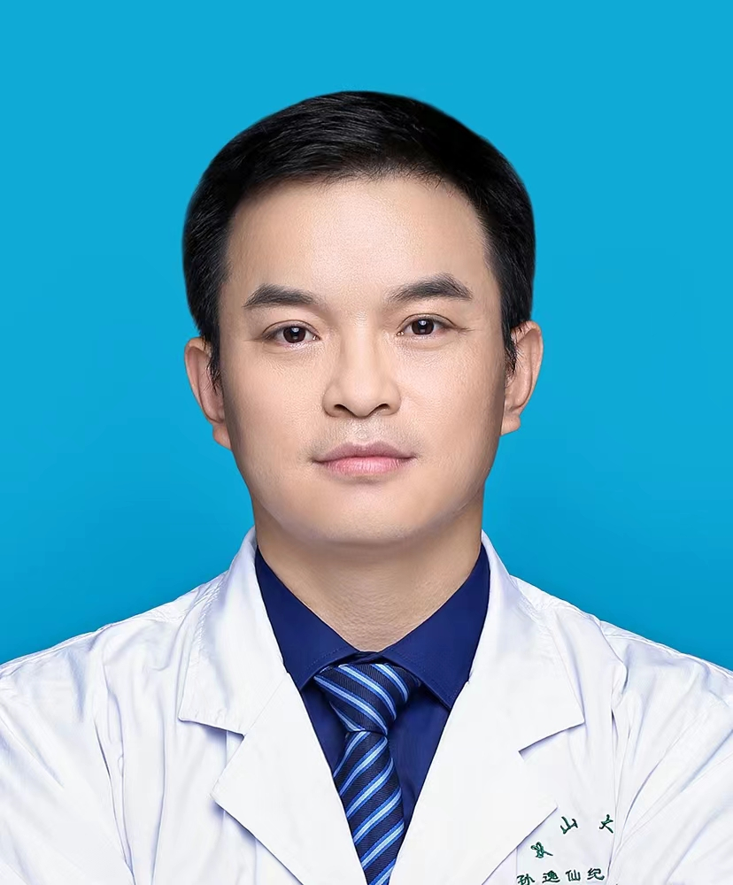

<!-- AUTO-GENERATED-BY: work/generate_obsidian_profiles.py -->

<!-- TEMPLATE: D:\workspace\信息收集整理\医生画像仓库\模板\医生画像模板.md -->

# 田鹏

## 基础信息

| 字段 | 内容 |
|---|---|
| 姓名 | 田鹏 |
| 医院 | 中山大学孙逸仙纪念医院 |
| 科室 | 耳鼻喉科 |
| 职称/身份 | 主任医师 |
| 来源链接 | [官网原文](https://www.gzsys.org.cn/doctor/15299) |
| 采集日期 | 2026-08-13 |

## 简介/擅长

## 教育与进修经历

- 毕业于中山大学中山医学院，临床方向为鼻病及鼻面部修复，对鼻炎、鼻窦炎、鼻外伤、鼻肿瘤、鼻眼相关疾病、鼻颅底相关疾病等有深入研究。

## 科研项目与成果

- 近5年主持国家自然科学基金青年基金项目1项，广东省自然科学基金项目1项。
- 参与多项省级基金项目。

## 论文与学术产出

- 近年发表SCI论文10余篇。

## 可包装亮点

- 近5年主持国家自然科学基金青年基金项目1项，广东省自然科学基金项目1项。
- 近年发表SCI论文10余篇。
- 并兼任：广东省变态反应学会青年委员；
- 广东省医师协会耳鼻咽喉头颈外科学组鼻科组成员；

## 重点疾病/人群标签

- 慢性病：
- 肿瘤：肿瘤、癌、术后、康复
- 生殖疾病：
- 免疫/风湿：
- 术后恢复/康复：肿瘤、癌、术后、康复
- 疑难重症：

## 证据摘录

> 只摘录官网公开信息中的短句或关键字段，不复制大段原文。

- 官网身份字段：主任医师
- 官网亮眼经历线索：近5年主持国家自然科学基金青年基金项目1项，广东省自然科学基金项目1项。 近年发表SCI论文10余篇。 并兼任：广东省变态反应学会青年委员； 广东省医师协会耳鼻咽喉头颈外科学组鼻科组成员；
- 来源链接：https://www.gzsys.org.cn/doctor/15299

## BD 画像摘要

田鹏医生可作为肿瘤、术后恢复/康复方向的基础画像候选。后续 BD 使用应继续以官网来源和人工复核为准，不添加疗效承诺或无来源包装。

## 合规边界

- 仅使用医院官网、官方公众号、官方小程序等公开渠道。
- 不采集私人电话、私人微信、家庭住址、患者隐私或非公开排班信息。
- 不写“保证治愈”“疗效第一”“包治疑难杂症”等无法由官网证明的表述。
