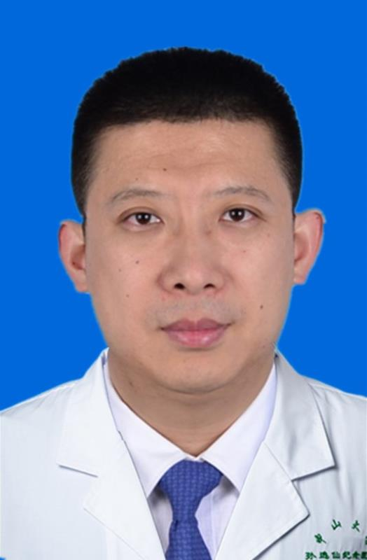

<!-- AUTO-GENERATED-BY: work/generate_obsidian_profiles.py -->

<!-- TEMPLATE: D:\workspace\信息收集整理\医生画像仓库\模板\医生画像模板.md -->

# 石忠松

## 基础信息

| 字段 | 内容 |
|---|---|
| 姓名 | 石忠松 |
| 医院 | 中山大学孙逸仙纪念医院 |
| 科室 | 神经外科 |
| 职称/身份 | 教授, 主任医师, 研究员 |
| 来源链接 | [官网原文](https://www.gzsys.org.cn/node/14771) |
| 采集日期 | 2026-08-13 |

## 简介/擅长

## 教育与进修经历

- 现任广东省健康管理学会脑血管病防治和健康促进专业委员会主任委员、中国人体健康科技促进会临床神经科学技术转化专业委员会副主任委员、中国留学人员联谊会医师协会脑血管病分会副主任委员、国家脑卒中防治委员会缺血性卒中外科分会常务委员、中国卒中学会转化医学分会常务委员、中国卒中学会神经介入分会委员、广东省健康管理学会常务理事、国家自然科学基金委学科评审组终审专家。

## 科研项目与成果

- 现任广东省健康管理学会脑血管病防治和健康促进专业委员会主任委员、中国人体健康科技促进会临床神经科学技术转化专业委员会副主任委员、中国留学人员联谊会医师协会脑血管病分会副主任委员、国家脑卒中防治委员会缺血性卒中外科分会常务委员、中国卒中学会转化医学分会常务委员、中国卒中学会神经介入分会委员、广东省健康管理学会常务理事、国家自然科学基金委学科评审组终审专家。
- 主持5项国家自然科学基金项目（包括重点国际合作项目），是国家心脑血管病联盟等平台的分中心负责人。
- 在Stroke和Neurosurgery等国际主流期刊发表30余篇SCI论文，主编出版英文著作1部，学术成果被欧美学会制定的脑血管病治疗指南采用。

## 论文与学术产出

- 在Stroke和Neurosurgery等国际主流期刊发表30余篇SCI论文，主编出版英文著作1部，学术成果被欧美学会制定的脑血管病治疗指南采用。

## 可包装亮点

- 神经外科副主任，国家教育部新世纪优秀人才。
- 现任广东省健康管理学会脑血管病防治和健康促进专业委员会主任委员、中国人体健康科技促进会临床神经科学技术转化专业委员会副主任委员、中国留学人员联谊会医师协会脑血管病分会副主任委员、国家脑卒中防治委员会缺血性卒中外科分会常务委员、中国卒中学会转化医学分会常务委员、中国卒中学会神经介入分会委员、广东省健康管理学会常务理事、国家自然科学基金委学科评审组终审专家。
- 从事神经外科临床、教学和科学研究工作20余年，曾在美国UCLA医学中心师从世界神经介入治疗学会主席Vinuela Fernando教授。
- 擅长脑血管病、颅脑肿瘤、颅脑损伤等神经外科常见病的精准诊断和手术治疗，尤其精通脑动脉瘤、脑脊髓血管畸形、急性脑梗塞、脑颈动脉狭窄和脑出血等脑血管病的微创介入和外科手术治疗。

## 重点疾病/人群标签

- 慢性病：
- 肿瘤：肿瘤、瘤
- 生殖疾病：
- 免疫/风湿：
- 术后恢复/康复：
- 疑难重症：

## 证据摘录

> 只摘录官网公开信息中的短句或关键字段，不复制大段原文。

- 官网身份字段：教授, 主任医师, 研究员
- 官网亮眼经历线索：神经外科副主任，国家教育部新世纪优秀人才。 现任广东省健康管理学会脑血管病防治和健康促进专业委员会主任委员、中国人体健康科技促进会临床神经科学技术转化专业委员会副主任委员、中国留学人员联谊会医师协会脑血管病分会副主任委员、国家脑卒中防治委员会缺血性卒中外科分会常务委员、中国卒中学会转化医学分会常务委员、中国卒中学会神经介入分会委员、广东省健康管理学会常务理事、国家自然科学基金委学科评审组终审专家。 从事神经外科临床、教学和科学研究工作…
- 来源链接：https://www.gzsys.org.cn/node/14771

## BD 画像摘要

石忠松医生可作为肿瘤方向的基础画像候选。后续 BD 使用应继续以官网来源和人工复核为准，不添加疗效承诺或无来源包装。

## 合规边界

- 仅使用医院官网、官方公众号、官方小程序等公开渠道。
- 不采集私人电话、私人微信、家庭住址、患者隐私或非公开排班信息。
- 不写“保证治愈”“疗效第一”“包治疑难杂症”等无法由官网证明的表述。
