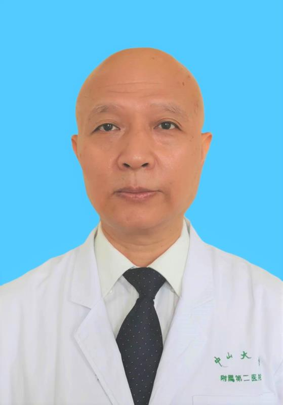

<!-- AUTO-GENERATED-BY: work/generate_obsidian_profiles.py -->

<!-- TEMPLATE: D:\workspace\信息收集整理\医生画像仓库\模板\医生画像模板.md -->

# 罗葆明

## 基础信息

| 字段 | 内容 |
|---|---|
| 姓名 | 罗葆明 |
| 医院 | 中山大学孙逸仙纪念医院 |
| 科室 | 超声科 |
| 职称/身份 | 教授, 主任医师 |
| 来源链接 | [官网原文](https://www.gzsys.org.cn/node/14614) |
| 采集日期 | 2026-08-13 |

## 简介/擅长

## 科研项目与成果

- 主持多项国家自然科学基金及省部级以上项目研究，发表专业学术论文200余篇，其中SCI收录论文40余篇，主编、主译及参编专著23部，获广东省科技成果二等奖2项、教育部科技成果二等奖1项。

## 论文与学术产出

- 主持多项国家自然科学基金及省部级以上项目研究，发表专业学术论文200余篇，其中SCI收录论文40余篇，主编、主译及参编专著23部，获广东省科技成果二等奖2项、教育部科技成果二等奖1项。

## 可包装亮点

- 超声科主任、超声教研室主任，教授、主任医师、博士生导师。
- 社会兼职：中国医师协会浅表器官超声专业委员会主任委员、中华医学会超声医学分会常委暨浅表器官和血管超声学组副组长、中国研究型医院学会超声专委会副主任委员、中国研究型医院学会肌骨及浅表超声专委会副主任委员、广东省医师协会超声医师分会主任委员、广东省医学会超声医学分会前任主任委员、广东省健康管理学会超声医学分会主任委员、粤港澳大湾区超声医师联盟主任。
- 主持多项国家自然科学基金及省部级以上项目研究，发表专业学术论文200余篇，其中SCI收录论文40余篇，主编、主译及参编专著23部，获广东省科技成果二等奖2项、教育部科技成果二等奖1项。
- 获“国之名医”称号。

## 重点疾病/人群标签

- 慢性病：
- 肿瘤：
- 生殖疾病：
- 免疫/风湿：
- 术后恢复/康复：
- 疑难重症：

## 证据摘录

> 只摘录官网公开信息中的短句或关键字段，不复制大段原文。

- 官网身份字段：教授, 主任医师
- 官网亮眼经历线索：超声科主任、超声教研室主任，教授、主任医师、博士生导师。 社会兼职：中国医师协会浅表器官超声专业委员会主任委员、中华医学会超声医学分会常委暨浅表器官和血管超声学组副组长、中国研究型医院学会超声专委会副主任委员、中国研究型医院学会肌骨及浅表超声专委会副主任委员、广东省医师协会超声医师分会主任委员、广东省医学会超声医学分会前任主任委员、广东省健康管理学会超声医学分会主任委员、粤港澳大湾区超声医师联盟主任。 主持多项国家自然科学基金及省部级…
- 来源链接：https://www.gzsys.org.cn/node/14614

## BD 画像摘要

罗葆明医生可作为中山大学孙逸仙纪念医院超声科的基础医生资料入库。当前重点方向以总底表标签为准，官网未展示的信息保持空白。

## 合规边界

- 仅使用医院官网、官方公众号、官方小程序等公开渠道。
- 不采集私人电话、私人微信、家庭住址、患者隐私或非公开排班信息。
- 不写“保证治愈”“疗效第一”“包治疑难杂症”等无法由官网证明的表述。
