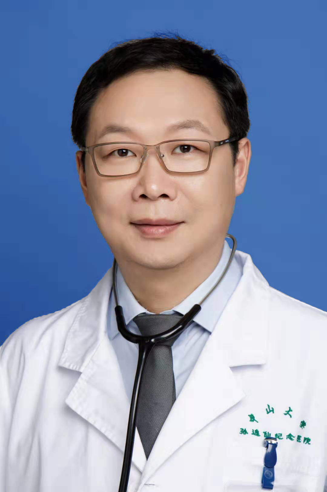

<!-- AUTO-GENERATED-BY: work/generate_obsidian_profiles.py -->

<!-- TEMPLATE: D:\workspace\信息收集整理\医生画像仓库\模板\医生画像模板.md -->

# 耿登峰

## 基础信息

| 字段 | 内容 |
|---|---|
| 姓名 | 耿登峰 |
| 医院 | 中山大学孙逸仙纪念医院 |
| 科室 | 心血管内科 |
| 职称/身份 | 主任医师 |
| 来源链接 | [官网原文](https://www.gzsys.org.cn/doctor/14823) |
| 采集日期 | 2026-08-13 |

## 简介/擅长

## 教育与进修经历

- 医学博士，主任医师，博士生导师 美国西北大学Feinberg医学院访问学者 国家卫健委冠心病介入培训导师 学术任职：广东省康复医学会心血管病分会 副会长；

## 科研项目与成果

- 中华医学会心血管病学分会心脏康复学组 委员 广东省医学会心血管病学分会心力衰竭学组 委员等 学术研究：主持及参与国家级及省厅级基金十余项；

## 论文与学术产出

- 发表SCI论著20余篇；

## 可包装亮点

- 医学博士，主任医师，博士生导师 美国西北大学Feinberg医学院访问学者 国家卫健委冠心病介入培训导师 学术任职：广东省康复医学会心血管病分会 副会长；
- 广东省老年保健协会ASCVD防治分会 副主委；
- 中华医学会心血管病学分会心脏康复学组 委员 广东省医学会心血管病学分会心力衰竭学组 委员等 学术研究：主持及参与国家级及省厅级基金十余项；
- 发表SCI论著20余篇；

## 重点疾病/人群标签

- 慢性病：高血压、冠心病、心力衰竭、康复
- 肿瘤：
- 生殖疾病：
- 免疫/风湿：
- 术后恢复/康复：高血压、冠心病、心力衰竭、康复
- 疑难重症：

## 证据摘录

> 只摘录官网公开信息中的短句或关键字段，不复制大段原文。

- 官网身份字段：主任医师
- 官网亮眼经历线索：医学博士，主任医师，博士生导师 美国西北大学Feinberg医学院访问学者 国家卫健委冠心病介入培训导师 学术任职：广东省康复医学会心血管病分会 副会长； 广东省老年保健协会ASCVD防治分会 副主委； 中华医学会心血管病学分会心脏康复学组 委员 广东省医学会心血管病学分会心力衰竭学组 委员等 学术研究：主持及参与国家级及省厅级基金十余项； 发表SCI论著20余篇；
- 来源链接：https://www.gzsys.org.cn/doctor/14823

## BD 画像摘要

耿登峰医生可作为慢性病、术后恢复/康复方向的基础画像候选。后续 BD 使用应继续以官网来源和人工复核为准，不添加疗效承诺或无来源包装。

## 合规边界

- 仅使用医院官网、官方公众号、官方小程序等公开渠道。
- 不采集私人电话、私人微信、家庭住址、患者隐私或非公开排班信息。
- 不写“保证治愈”“疗效第一”“包治疑难杂症”等无法由官网证明的表述。
