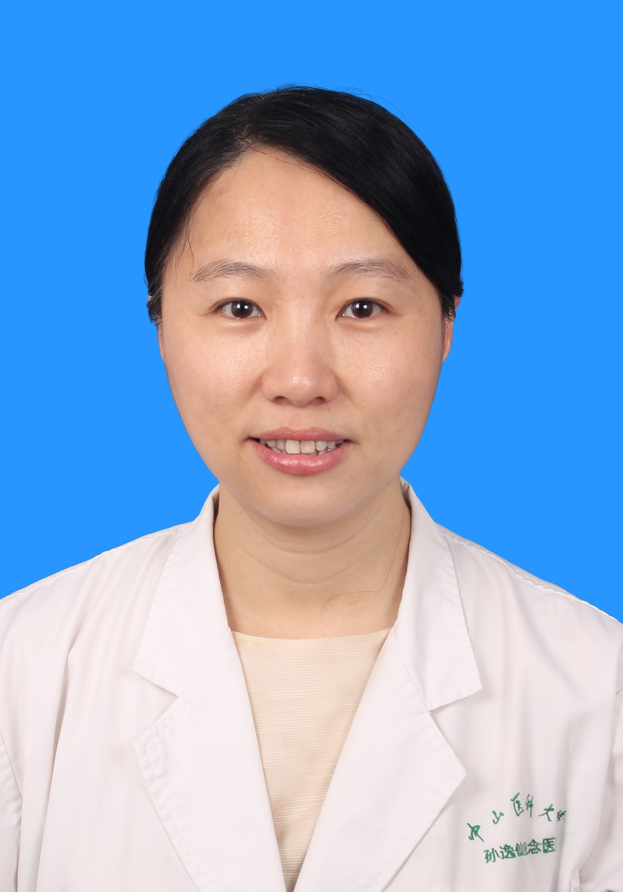

<!-- AUTO-GENERATED-BY: work/generate_obsidian_profiles.py -->

<!-- TEMPLATE: D:\workspace\信息收集整理\医生画像仓库\模板\医生画像模板.md -->

# 肖剑晖

## 基础信息

| 字段 | 内容 |
|---|---|
| 姓名 | 肖剑晖 |
| 医院 | 中山大学孙逸仙纪念医院 |
| 科室 | 眼科 |
| 职称/身份 | 主任医师 |
| 来源链接 | [官网原文](https://www.gzsys.org.cn/node/14638) |
| 采集日期 | 2026-08-13 |

## 简介/擅长

## 教育与进修经历

- 中山大学孙逸仙纪念医院眼科主任医师，医学博士，硕士生导师，美国密歇根大学Kellogg 眼科中心访问学者，广东省医师协会眼科专业委员会青年委员，广东省医协眼科分会眼底病专业组委员，广东省视光学学会眼底影像专业委会常务委员， 广东省中西医结合眼科专业委员会委员，广东省眼健康协会眼与全身病专委会副主任委员。

## 论文与学术产出

- 2013年广东省优秀博士论文获得者。
- 参与组织工程角膜和眼底黄斑病变基础研究，并以第一作者/通讯zuow在Biomaterials，IOVS及retina等发表文章，参与发表SCI论文共10余篇。

## 可包装亮点

- 中山大学孙逸仙纪念医院眼科主任医师，医学博士，硕士生导师，美国密歇根大学Kellogg 眼科中心访问学者，广东省医师协会眼科专业委员会青年委员，广东省医协眼科分会眼底病专业组委员，广东省视光学学会眼底影像专业委会常务委员， 广东省中西医结合眼科专业委员会委员，广东省眼健康协会眼与全身病专委会副主任委员。
- 参与组织工程角膜和眼底黄斑病变基础研究，并以第一作者/通讯zuow在Biomaterials，IOVS及retina等发表文章，参与发表SCI论文共10余篇。

## 重点疾病/人群标签

- 慢性病：
- 肿瘤：
- 生殖疾病：
- 免疫/风湿：
- 术后恢复/康复：
- 疑难重症：

## 证据摘录

> 只摘录官网公开信息中的短句或关键字段，不复制大段原文。

- 官网身份字段：主任医师
- 官网亮眼经历线索：中山大学孙逸仙纪念医院眼科主任医师，医学博士，硕士生导师，美国密歇根大学Kellogg 眼科中心访问学者，广东省医师协会眼科专业委员会青年委员，广东省医协眼科分会眼底病专业组委员，广东省视光学学会眼底影像专业委会常务委员， 广东省中西医结合眼科专业委员会委员，广东省眼健康协会眼与全身病专委会副主任委员。 参与组织工程角膜和眼底黄斑病变基础研究，并以第一作者/通讯zuow在Biomaterials，IOVS及retina等发表文章，参与…
- 来源链接：https://www.gzsys.org.cn/node/14638

## BD 画像摘要

肖剑晖医生可作为中山大学孙逸仙纪念医院眼科的基础医生资料入库。当前重点方向以总底表标签为准，官网未展示的信息保持空白。

## 合规边界

- 仅使用医院官网、官方公众号、官方小程序等公开渠道。
- 不采集私人电话、私人微信、家庭住址、患者隐私或非公开排班信息。
- 不写“保证治愈”“疗效第一”“包治疑难杂症”等无法由官网证明的表述。
