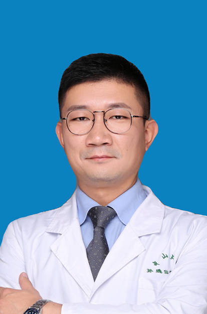

<!-- AUTO-GENERATED-BY: work/generate_obsidian_profiles.py -->

<!-- TEMPLATE: D:\workspace\信息收集整理\医生画像仓库\模板\医生画像模板.md -->

# 肖治宇

## 基础信息

| 字段 | 内容 |
|---|---|
| 姓名 | 肖治宇 |
| 医院 | 中山大学孙逸仙纪念医院 |
| 科室 | 肝胆外科 |
| 职称/身份 | 主任医师 |
| 来源链接 | [官网原文](https://www.gzsys.org.cn/node/15246) |
| 采集日期 | 2026-08-13 |

## 简介/擅长

## 教育与进修经历

- 国际肝胆胰协会会员 亚太肝胆胰协会会员 美国临床肿瘤学会会员 美国肝病协会会员 美国宾夕法尼亚大学访问学者 欧美同学会肝胆医师分会委员 国际肝胆胰协会中国分会肝胆胰MDT学组委员 中国医师协会机器人外科医师分会肝胆胰外科专业委员会委员 中国研究型医院协会肝胆外科分会肝癌学组委员 中国医师协会外科分会MDT青年委员会委员 广东省医师协会肝胆外科医师分会常委、秘书 青年委员会执行主委 肝胆肿瘤MDT学组副组长 广东省医学会胆道外科学组委员、秘书 广东省老年保健协会肝胆胰消化系疾病专业委员会副主任委员 广东省医疗行业协…

## 科研项目与成果

- 长期致力于消化系统恶性肿瘤的临床与基础研究，主持国家自然科学基金三项、省部级基金多项，发表专业学术论文30余篇。

## 论文与学术产出

- 长期致力于消化系统恶性肿瘤的临床与基础研究，主持国家自然科学基金三项、省部级基金多项，发表专业学术论文30余篇。

## 可包装亮点

- 国际肝胆胰协会会员 亚太肝胆胰协会会员 美国临床肿瘤学会会员 美国肝病协会会员 美国宾夕法尼亚大学访问学者 欧美同学会肝胆医师分会委员 国际肝胆胰协会中国分会肝胆胰MDT学组委员 中国医师协会机器人外科医师分会肝胆胰外科专业委员会委员 中国研究型医院协会肝胆外科分会肝癌学组委员 中国医师协会外科分会MDT青年委员会委员 广东省医师协会肝胆外科医师分会常委…
- 每年完成各类肝胆胰手术超过300例，其中超过90%为3、4级的疑难手术。
- ...

## 重点疾病/人群标签

- 慢性病：
- 肿瘤：肿瘤、癌、肝癌、疑难、MDT
- 生殖疾病：
- 免疫/风湿：
- 术后恢复/康复：
- 疑难重症：肿瘤、癌、肝癌、疑难、MDT

## 证据摘录

> 只摘录官网公开信息中的短句或关键字段，不复制大段原文。

- 官网身份字段：主任医师
- 官网亮眼经历线索：国际肝胆胰协会会员 亚太肝胆胰协会会员 美国临床肿瘤学会会员 美国肝病协会会员 美国宾夕法尼亚大学访问学者 欧美同学会肝胆医师分会委员 国际肝胆胰协会中国分会肝胆胰MDT学组委员 中国医师协会机器人外科医师分会肝胆胰外科专业委员会委员 中国研究型医院协会肝胆外科分会肝癌学组委员 中国医师协会外科分会MDT青年委员会委员 广东省医师协会肝胆外科医师分会常委、秘书 青年委员会执行主委 肝胆肿瘤MDT学组副组长 广东省医学会胆道外科学组委员…
- 来源链接：https://www.gzsys.org.cn/node/15246

## BD 画像摘要

肖治宇医生可作为肿瘤、疑难重症方向的基础画像候选。后续 BD 使用应继续以官网来源和人工复核为准，不添加疗效承诺或无来源包装。

## 合规边界

- 仅使用医院官网、官方公众号、官方小程序等公开渠道。
- 不采集私人电话、私人微信、家庭住址、患者隐私或非公开排班信息。
- 不写“保证治愈”“疗效第一”“包治疑难杂症”等无法由官网证明的表述。
