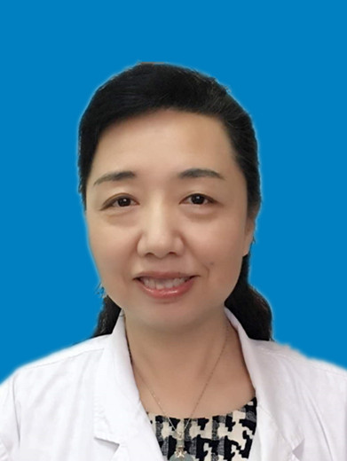

<!-- AUTO-GENERATED-BY: work/generate_obsidian_profiles.py -->

<!-- TEMPLATE: D:\workspace\信息收集整理\医生画像仓库\模板\医生画像模板.md -->

# 蓝育青

## 基础信息

| 字段 | 内容 |
|---|---|
| 姓名 | 蓝育青 |
| 医院 | 中山大学孙逸仙纪念医院 |
| 科室 | 眼科 |
| 职称/身份 | 教授, 主任医师 |
| 来源链接 | [官网原文](https://www.gzsys.org.cn/node/14592) |
| 采集日期 | 2026-08-13 |

## 简介/擅长

## 教育与进修经历

- 教授/主任医师，医学博士，眼科主任，博士生导师，美国耶鲁大学眼科中心访问学者 中国医师协会中西医结合眼科专业委员会常委，广东省医师协会眼科分会副主任委员会及眼与全身病专业组组长。

## 科研项目与成果

- 国家自然科学基金、广东省自然科学基金、广州市科技计划项目评委、江西省自然科学基金评审专家、山东省自然科学基金评委。
- 近年来主持国家自然科学基金、广东省自然科学基金等10多项课题研究，曾获广东省科技进步三等奖，主编《现代激光角膜屈光手术》，副主编《现代晶状体屈光手术》，参编论著6本，发表专业论文80多篇，其中SCI论文20多篇，申请国家专利1项，负责临床药物试验4项。

## 论文与学术产出

- 近年来主持国家自然科学基金、广东省自然科学基金等10多项课题研究，曾获广东省科技进步三等奖，主编《现代激光角膜屈光手术》，副主编《现代晶状体屈光手术》，参编论著6本，发表专业论文80多篇，其中SCI论文20多篇，申请国家专利1项，负责临床药物试验4项。

## 可包装亮点

- 教授/主任医师，医学博士，眼科主任，博士生导师，美国耶鲁大学眼科中心访问学者 中国医师协会中西医结合眼科专业委员会常委，广东省医师协会眼科分会副主任委员会及眼与全身病专业组组长。
- 国家自然科学基金、广东省自然科学基金、广州市科技计划项目评委、江西省自然科学基金评审专家、山东省自然科学基金评委。
- 近年来主持国家自然科学基金、广东省自然科学基金等10多项课题研究，曾获广东省科技进步三等奖，主编《现代激光角膜屈光手术》，副主编《现代晶状体屈光手术》，参编论著6本，发表专业论文80多篇，其中SCI论文20多篇，申请国家专利1项，负责临床药物试验4项。

## 重点疾病/人群标签

- 慢性病：糖尿病、难治、复杂
- 肿瘤：
- 生殖疾病：
- 免疫/风湿：
- 术后恢复/康复：
- 疑难重症：糖尿病、难治、复杂

## 证据摘录

> 只摘录官网公开信息中的短句或关键字段，不复制大段原文。

- 官网身份字段：教授, 主任医师
- 官网亮眼经历线索：教授/主任医师，医学博士，眼科主任，博士生导师，美国耶鲁大学眼科中心访问学者 中国医师协会中西医结合眼科专业委员会常委，广东省医师协会眼科分会副主任委员会及眼与全身病专业组组长。 国家自然科学基金、广东省自然科学基金、广州市科技计划项目评委、江西省自然科学基金评审专家、山东省自然科学基金评委。 近年来主持国家自然科学基金、广东省自然科学基金等10多项课题研究，曾获广东省科技进步三等奖，主编《现代激光角膜屈光手术》，副主编《现代晶状体屈…
- 来源链接：https://www.gzsys.org.cn/node/14592

## BD 画像摘要

蓝育青医生可作为慢性病、疑难重症方向的基础画像候选。后续 BD 使用应继续以官网来源和人工复核为准，不添加疗效承诺或无来源包装。

## 合规边界

- 仅使用医院官网、官方公众号、官方小程序等公开渠道。
- 不采集私人电话、私人微信、家庭住址、患者隐私或非公开排班信息。
- 不写“保证治愈”“疗效第一”“包治疑难杂症”等无法由官网证明的表述。
