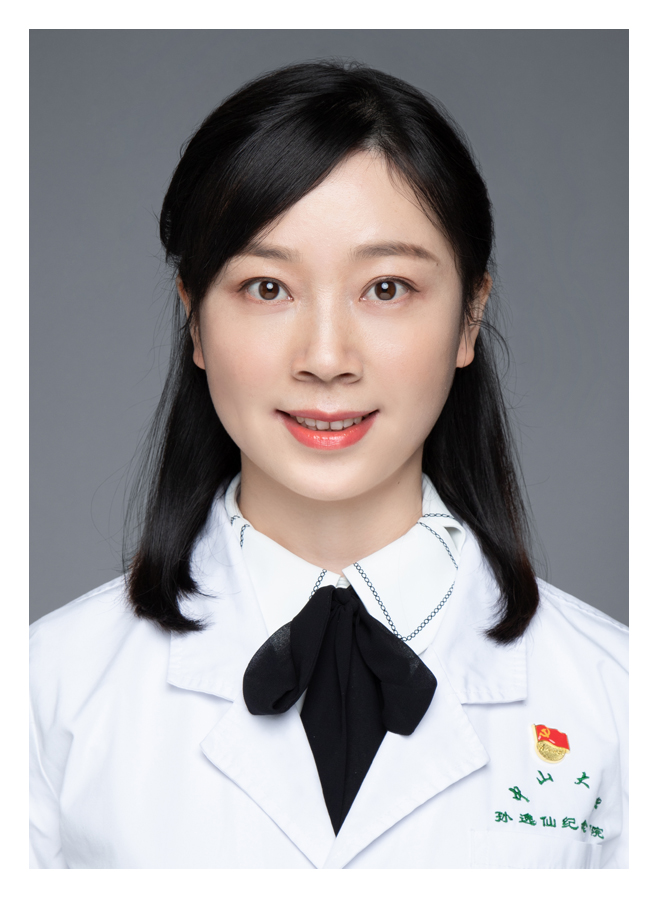

<!-- AUTO-GENERATED-BY: work/generate_obsidian_profiles.py -->

<!-- TEMPLATE: D:\workspace\信息收集整理\医生画像仓库\模板\医生画像模板.md -->

# 蔡雷琴

## 基础信息

| 字段 | 内容 |
|---|---|
| 姓名 | 蔡雷琴 |
| 医院 | 中山大学孙逸仙纪念医院 |
| 科室 | 内分泌内科 |
| 职称/身份 | 主治医师 |
| 来源链接 | [官网原文](https://www.gzsys.org.cn/doctor/31031) |
| 采集日期 | 2026-08-13 |

## 简介/擅长

## 科研项目与成果

- 主持并参与多项国家自然科学基金，在国内外杂志发表学术论文10余篇。

## 论文与学术产出

- 主持并参与多项国家自然科学基金，在国内外杂志发表学术论文10余篇。

## 可包装亮点

- 主持并参与多项国家自然科学基金，在国内外杂志发表学术论文10余篇。

## 重点疾病/人群标签

- 慢性病：高血压、糖尿病、代谢
- 肿瘤：
- 生殖疾病：
- 免疫/风湿：
- 术后恢复/康复：
- 疑难重症：

## 证据摘录

> 只摘录官网公开信息中的短句或关键字段，不复制大段原文。

- 官网身份字段：主治医师
- 官网亮眼经历线索：主持并参与多项国家自然科学基金，在国内外杂志发表学术论文10余篇。
- 来源链接：https://www.gzsys.org.cn/doctor/31031

## BD 画像摘要

蔡雷琴医生可作为慢性病方向的基础画像候选。后续 BD 使用应继续以官网来源和人工复核为准，不添加疗效承诺或无来源包装。

## 合规边界

- 仅使用医院官网、官方公众号、官方小程序等公开渠道。
- 不采集私人电话、私人微信、家庭住址、患者隐私或非公开排班信息。
- 不写“保证治愈”“疗效第一”“包治疑难杂症”等无法由官网证明的表述。
