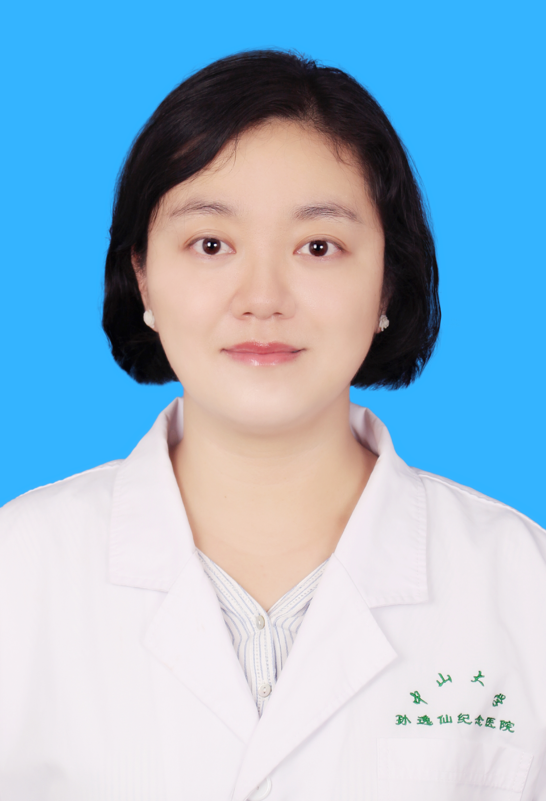

<!-- AUTO-GENERATED-BY: work/generate_obsidian_profiles.py -->

<!-- TEMPLATE: D:\workspace\信息收集整理\医生画像仓库\模板\医生画像模板.md -->

# 袁萍

## 基础信息

| 字段 | 内容 |
|---|---|
| 姓名 | 袁萍 |
| 医院 | 中山大学孙逸仙纪念医院 |
| 科室 | 妇科生殖内分泌专科 |
| 职称/身份 | 副研究员 |
| 来源链接 | [官网原文](https://www.gzsys.org.cn/doctor/18541) |
| 采集日期 | 2026-08-13 |

## 简介/擅长

## 教育与进修经历

- 2007年和2012年毕业于中山大学中山医学院，分别获临床医学学士和分子医学博士学位。

## 科研项目与成果

- 现从事遗传咨询，植入前胚胎遗传学诊断和胚胎实验室工作，主要研究领域为生殖遗传相关研究。
- 主持国家自然科学基金、广东省自然基金、中华医学会生殖医学、中山大学青年教师重大交叉/培育项目等多项科研基金，参与国家自然科学基金、广州市科技计划项目等多项科研基金。

## 论文与学术产出

- 已发表学术论文35篇（包括SCI收录论文22篇），其中第一作者（含并列）发表文章18篇。

## 可包装亮点

- 医学博士，硕士生导师。
- 2018年获郑裕彤奖助金资助在香港大学玛丽医院生殖中心访问学习。
- 已发表学术论文35篇（包括SCI收录论文22篇），其中第一作者（含并列）发表文章18篇。
- 主持国家自然科学基金、广东省自然基金、中华医学会生殖医学、中山大学青年教师重大交叉/培育项目等多项科研基金，参与国家自然科学基金、广州市科技计划项目等多项科研基金。

## 重点疾病/人群标签

- 慢性病：
- 肿瘤：
- 生殖疾病：生殖、辅助生殖、胚胎
- 免疫/风湿：
- 术后恢复/康复：
- 疑难重症：

## 证据摘录

> 只摘录官网公开信息中的短句或关键字段，不复制大段原文。

- 官网身份字段：副研究员
- 官网亮眼经历线索：医学博士，硕士生导师。 2018年获郑裕彤奖助金资助在香港大学玛丽医院生殖中心访问学习。 已发表学术论文35篇（包括SCI收录论文22篇），其中第一作者（含并列）发表文章18篇。 主持国家自然科学基金、广东省自然基金、中华医学会生殖医学、中山大学青年教师重大交叉/培育项目等多项科研基金，参与国家自然科学基金、广州市科技计划项目等多项科研基金。
- 来源链接：https://www.gzsys.org.cn/doctor/18541

## BD 画像摘要

袁萍医生可作为生殖疾病方向的基础画像候选。后续 BD 使用应继续以官网来源和人工复核为准，不添加疗效承诺或无来源包装。

## 合规边界

- 仅使用医院官网、官方公众号、官方小程序等公开渠道。
- 不采集私人电话、私人微信、家庭住址、患者隐私或非公开排班信息。
- 不写“保证治愈”“疗效第一”“包治疑难杂症”等无法由官网证明的表述。
