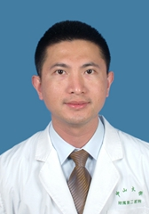

<!-- AUTO-GENERATED-BY: work/generate_obsidian_profiles.py -->

<!-- TEMPLATE: D:\workspace\信息收集整理\医生画像仓库\模板\医生画像模板.md -->

# 许吕宏

## 基础信息

| 字段 | 内容 |
|---|---|
| 姓名 | 许吕宏 |
| 医院 | 中山大学孙逸仙纪念医院 |
| 科室 | 儿科血液专科 |
| 职称/身份 | 主任医师 |
| 来源链接 | [官网原文](https://www.gzsys.org.cn/node/14738) |
| 采集日期 | 2026-08-13 |

## 简介/擅长

慢性咳嗽、支气管肺炎、腹泻、贫血、血小板减少以及白血病等。

## 教育与进修经历

- 中山大学毕业后一直从事儿科临床医疗、教学及科研工作。
- 获国家留学基金委项目资助,先后赴美国哈佛大学Boston Children’s Hospital和Brigham and Women's Hospital访学。

## 科研项目与成果

- 中山大学毕业后一直从事儿科临床医疗、教学及科研工作。
- 作为项目负责人承担国家自然科学基金、广东省自然科学基金、广东省科技计划等项目，以第一作者或通讯作者发表SCI论文10余篇。
- 获国家留学基金委项目资助,先后赴美国哈佛大学Boston Children’s Hospital和Brigham and Women's Hospital访学。

## 论文与学术产出

- 作为项目负责人承担国家自然科学基金、广东省自然科学基金、广东省科技计划等项目，以第一作者或通讯作者发表SCI论文10余篇。

## 可包装亮点

- 参与执笔制定我国重型β地中海贫血诊断和治疗指南，开展华南地区儿童白血病多中心前瞻性临床研究。
- 作为项目负责人承担国家自然科学基金、广东省自然科学基金、广东省科技计划等项目，以第一作者或通讯作者发表SCI论文10余篇。
- 获国家留学基金委项目资助,先后赴美国哈佛大学Boston Children’s Hospital和Brigham and Women's Hospital访学。
- 2012年4月获评为中山大学孙逸仙纪念医院“逸仙优秀医学人才”。

## 重点疾病/人群标签

- 慢性病：慢性、白血病、免疫
- 肿瘤：慢性、白血病、免疫
- 生殖疾病：
- 免疫/风湿：慢性、白血病、免疫
- 术后恢复/康复：
- 疑难重症：

## 证据摘录

> 只摘录官网公开信息中的短句或关键字段，不复制大段原文。

- 官网身份字段：主任医师
- 官网简介/擅长：慢性咳嗽、支气管肺炎、腹泻、贫血、血小板减少以及白血病等。
- 官网亮眼经历线索：参与执笔制定我国重型β地中海贫血诊断和治疗指南，开展华南地区儿童白血病多中心前瞻性临床研究。 作为项目负责人承担国家自然科学基金、广东省自然科学基金、广东省科技计划等项目，以第一作者或通讯作者发表SCI论文10余篇。 获国家留学基金委项目资助,先后赴美国哈佛大学Boston Children’s Hospital和Brigham and Women's Hospital访学。 2012年4月获评为中山大学孙逸仙纪念医院“逸仙优秀医学人…
- 来源链接：https://www.gzsys.org.cn/node/14738

## BD 画像摘要

许吕宏医生可作为慢性病、肿瘤、免疫/风湿/感染方向的基础画像候选。后续 BD 使用应继续以官网来源和人工复核为准，不添加疗效承诺或无来源包装。

## 合规边界

- 仅使用医院官网、官方公众号、官方小程序等公开渠道。
- 不采集私人电话、私人微信、家庭住址、患者隐私或非公开排班信息。
- 不写“保证治愈”“疗效第一”“包治疑难杂症”等无法由官网证明的表述。
