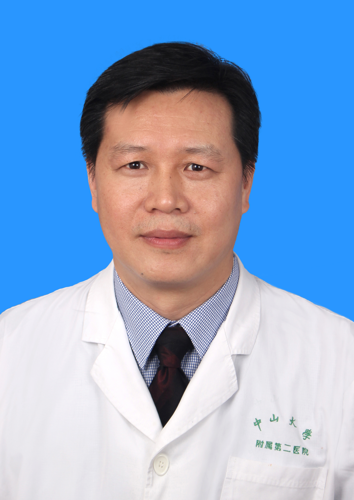

<!-- AUTO-GENERATED-BY: work/generate_obsidian_profiles.py -->

<!-- TEMPLATE: D:\workspace\信息收集整理\医生画像仓库\模板\医生画像模板.md -->

# 许林锋

## 基础信息

| 字段 | 内容 |
|---|---|
| 姓名 | 许林锋 |
| 医院 | 中山大学孙逸仙纪念医院 |
| 科室 | 放射科介入专科 |
| 职称/身份 | 主任医师 |
| 来源链接 | [官网原文](https://www.gzsys.org.cn/node/14671) |
| 采集日期 | 2026-08-13 |

## 简介/擅长

## 教育与进修经历

- 1986年毕业于同济医科大学医学系（现华中科技大学同济医学院）；
- 1991年获临床医学硕士学位；
- 1998年6月获日本国金泽医科大学医学博士学位，学位论文获第10届日本放射肿瘤学会会长奖。

## 论文与学术产出

- 1998年6月获日本国金泽医科大学医学博士学位，学位论文获第10届日本放射肿瘤学会会长奖。

## 可包装亮点

- 医学博士、主任医师/教授、现任放射介入专科主任。
- 1998年6月获日本国金泽医科大学医学博士学位，学位论文获第10届日本放射肿瘤学会会长奖。
- 一直在大学附属医院从事医、教、研工作，具有三级以上的神经、血管及综合介入诊疗手术技术资格，至今已完成各类介入手术过万台，在肿瘤性疾病的诊断及介入栓塞化疗、各种消融技术（微波、射频、冷冻、纳米刀）、放射性粒子植入治疗、分子靶向治疗、免疫治疗等综合治疗方面取得了显著的成绩，尤其擅长疑难病例的介入治疗。
- 现担任中华医学会放射学分会介入学组全国委员；

## 重点疾病/人群标签

- 慢性病：
- 肿瘤：肿瘤、癌、化疗、靶向、免疫、疑难、转化治疗
- 生殖疾病：
- 免疫/风湿：肿瘤、癌、化疗、靶向、免疫、疑难、转化治疗
- 术后恢复/康复：
- 疑难重症：肿瘤、癌、化疗、靶向、免疫、疑难、转化治疗

## 证据摘录

> 只摘录官网公开信息中的短句或关键字段，不复制大段原文。

- 官网身份字段：主任医师
- 官网亮眼经历线索：医学博士、主任医师/教授、现任放射介入专科主任。 1998年6月获日本国金泽医科大学医学博士学位，学位论文获第10届日本放射肿瘤学会会长奖。 一直在大学附属医院从事医、教、研工作，具有三级以上的神经、血管及综合介入诊疗手术技术资格，至今已完成各类介入手术过万台，在肿瘤性疾病的诊断及介入栓塞化疗、各种消融技术（微波、射频、冷冻、纳米刀）、放射性粒子植入治疗、分子靶向治疗、免疫治疗等综合治疗方面取得了显著的成绩，尤其擅长疑难病例的介入治疗…
- 来源链接：https://www.gzsys.org.cn/node/14671

## BD 画像摘要

许林锋医生可作为肿瘤、免疫/风湿/感染、疑难重症方向的基础画像候选。后续 BD 使用应继续以官网来源和人工复核为准，不添加疗效承诺或无来源包装。

## 合规边界

- 仅使用医院官网、官方公众号、官方小程序等公开渠道。
- 不采集私人电话、私人微信、家庭住址、患者隐私或非公开排班信息。
- 不写“保证治愈”“疗效第一”“包治疑难杂症”等无法由官网证明的表述。
