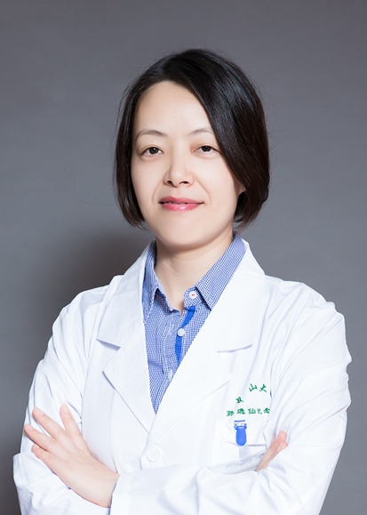

<!-- AUTO-GENERATED-BY: work/generate_obsidian_profiles.py -->

<!-- TEMPLATE: D:\workspace\信息收集整理\医生画像仓库\模板\医生画像模板.md -->

# 贾卫娟

## 基础信息

| 字段 | 内容 |
|---|---|
| 姓名 | 贾卫娟 |
| 医院 | 中山大学孙逸仙纪念医院 |
| 科室 | 乳腺外科 |
| 职称/身份 | 主任医师 |
| 来源链接 | [官网原文](https://www.gzsys.org.cn/node/14902) |
| 采集日期 | 2026-08-13 |

## 简介/擅长

## 教育与进修经历

- 英国Cardiff大学访问学者。

## 科研项目与成果

- 主持和参加了6项国家自然科学基金。
- 作为副主编参加编写了《乳腺癌内科治疗》和《乳腺癌保乳治疗》，作为编委参加编写《妇科内分泌疾病检查项目及应用》和《小分子RNA的基础和临床研究》等专著。
- 从事乳腺疾病临床、教学和科研工作20年。

## 论文与学术产出

- 发表SCI论文和核心期刊论文40余篇。
- 作为副主编参加编写了《乳腺癌内科治疗》和《乳腺癌保乳治疗》，作为编委参加编写《妇科内分泌疾病检查项目及应用》和《小分子RNA的基础和临床研究》等专著。

## 可包装亮点

- 广东省医学会乳腺病学分会常委；
- 广东省医师协会乳腺专科医师工作委员会常委；
- 英国Cardiff大学访问学者。
- 主持和参加了6项国家自然科学基金。

## 重点疾病/人群标签

- 慢性病：
- 肿瘤：化疗、靶向、乳腺癌、妇科内分泌、术后
- 生殖疾病：化疗、靶向、乳腺癌、妇科内分泌、术后
- 免疫/风湿：
- 术后恢复/康复：化疗、靶向、乳腺癌、妇科内分泌、术后
- 疑难重症：

## 证据摘录

> 只摘录官网公开信息中的短句或关键字段，不复制大段原文。

- 官网身份字段：主任医师
- 官网亮眼经历线索：广东省医学会乳腺病学分会常委； 广东省医师协会乳腺专科医师工作委员会常委； 英国Cardiff大学访问学者。 主持和参加了6项国家自然科学基金。
- 来源链接：https://www.gzsys.org.cn/node/14902

## BD 画像摘要

贾卫娟医生可作为肿瘤、生殖疾病、术后恢复/康复方向的基础画像候选。后续 BD 使用应继续以官网来源和人工复核为准，不添加疗效承诺或无来源包装。

## 合规边界

- 仅使用医院官网、官方公众号、官方小程序等公开渠道。
- 不采集私人电话、私人微信、家庭住址、患者隐私或非公开排班信息。
- 不写“保证治愈”“疗效第一”“包治疑难杂症”等无法由官网证明的表述。
