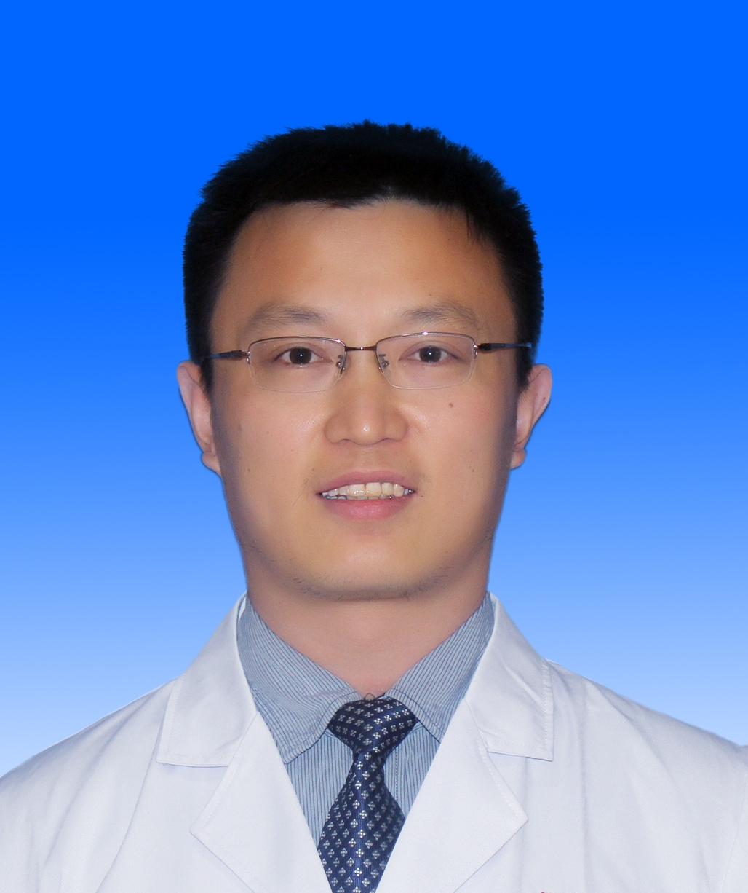

<!-- AUTO-GENERATED-BY: work/generate_obsidian_profiles.py -->

<!-- TEMPLATE: D:\workspace\信息收集整理\医生画像仓库\模板\医生画像模板.md -->

# 赵新保

## 基础信息

| 字段 | 内容 |
|---|---|
| 姓名 | 赵新保 |
| 医院 | 中山大学孙逸仙纪念医院 |
| 科室 | 超声科 |
| 职称/身份 | 副主任医师 |
| 来源链接 | [官网原文](https://www.gzsys.org.cn/node/14749) |
| 采集日期 | 2026-08-13 |

## 简介/擅长

## 科研项目与成果

- 擅长浅表小器官的超声诊断与介入治疗，主持和参与广东省科技计划项目、国家自然科学基金多项，作为完成之一获得广东省科技进步二等奖及及专利。

## 可包装亮点

- 擅长浅表小器官的超声诊断与介入治疗，主持和参与广东省科技计划项目、国家自然科学基金多项，作为完成之一获得广东省科技进步二等奖及及专利。
- 广东省医学会超声分会秘书，广东省医师协会超声医师分会青年委员，广东省健康管理学会超声分会常委，

## 重点疾病/人群标签

- 慢性病：
- 肿瘤：
- 生殖疾病：
- 免疫/风湿：
- 术后恢复/康复：
- 疑难重症：

## 证据摘录

> 只摘录官网公开信息中的短句或关键字段，不复制大段原文。

- 官网身份字段：副主任医师
- 官网亮眼经历线索：擅长浅表小器官的超声诊断与介入治疗，主持和参与广东省科技计划项目、国家自然科学基金多项，作为完成之一获得广东省科技进步二等奖及及专利。 广东省医学会超声分会秘书，广东省医师协会超声医师分会青年委员，广东省健康管理学会超声分会常委，
- 来源链接：https://www.gzsys.org.cn/node/14749

## BD 画像摘要

赵新保医生可作为中山大学孙逸仙纪念医院超声科的基础医生资料入库。当前重点方向以总底表标签为准，官网未展示的信息保持空白。

## 合规边界

- 仅使用医院官网、官方公众号、官方小程序等公开渠道。
- 不采集私人电话、私人微信、家庭住址、患者隐私或非公开排班信息。
- 不写“保证治愈”“疗效第一”“包治疑难杂症”等无法由官网证明的表述。
