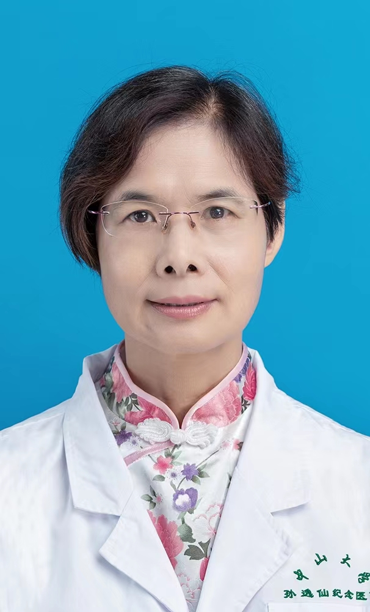

<!-- AUTO-GENERATED-BY: work/generate_obsidian_profiles.py -->

<!-- TEMPLATE: D:\workspace\信息收集整理\医生画像仓库\模板\医生画像模板.md -->

# 邹华

## 基础信息

| 字段 | 内容 |
|---|---|
| 姓名 | 邹华 |
| 医院 | 中山大学孙逸仙纪念医院 |
| 科室 | 耳鼻喉科 |
| 职称/身份 | 主任医师 |
| 来源链接 | [官网原文](https://www.gzsys.org.cn/node/15282) |
| 采集日期 | 2026-08-13 |

## 简介/擅长

## 教育与进修经历

- 1984年中山大学医学专业毕业，长期从事耳鼻咽喉头颈外科的临床、科研、教学工作30多年，具有丰富的临床经验，熟悉掌握耳鼻喉疾病诊治，擅长鼻科疾病及儿童耳鼻喉疾病的诊治，各种内镜手术，鼻窦炎、鼻眼相关手术，小儿鼾症手术，尤其对鼻窦炎鼻息肉、过敏性鼻炎，小儿鼾症有深入的研究。

## 科研项目与成果

- 1984年中山大学医学专业毕业，长期从事耳鼻咽喉头颈外科的临床、科研、教学工作30多年，具有丰富的临床经验，熟悉掌握耳鼻喉疾病诊治，擅长鼻科疾病及儿童耳鼻喉疾病的诊治，各种内镜手术，鼻窦炎、鼻眼相关手术，小儿鼾症手术，尤其对鼻窦炎鼻息肉、过敏性鼻炎，小儿鼾症有深入的研究。

## 可包装亮点

- 主任医师、博士生导师，广东省医师协会耳鼻咽喉科分会副主任委员；
- 广东省医学会耳鼻咽喉科分会鼻科学组副组长；
- 广东省医学会变态反应学分会常务委员；
- 广东省药学会耳鼻咽喉头颈外科用药专家委员会常务委员等。

## 重点疾病/人群标签

- 慢性病：
- 肿瘤：
- 生殖疾病：
- 免疫/风湿：
- 术后恢复/康复：
- 疑难重症：

## 证据摘录

> 只摘录官网公开信息中的短句或关键字段，不复制大段原文。

- 官网身份字段：主任医师
- 官网亮眼经历线索：主任医师、博士生导师，广东省医师协会耳鼻咽喉科分会副主任委员； 广东省医学会耳鼻咽喉科分会鼻科学组副组长； 广东省医学会变态反应学分会常务委员； 广东省药学会耳鼻咽喉头颈外科用药专家委员会常务委员等。
- 来源链接：https://www.gzsys.org.cn/node/15282

## BD 画像摘要

邹华医生可作为中山大学孙逸仙纪念医院耳鼻喉科的基础医生资料入库。当前重点方向以总底表标签为准，官网未展示的信息保持空白。

## 合规边界

- 仅使用医院官网、官方公众号、官方小程序等公开渠道。
- 不采集私人电话、私人微信、家庭住址、患者隐私或非公开排班信息。
- 不写“保证治愈”“疗效第一”“包治疑难杂症”等无法由官网证明的表述。
