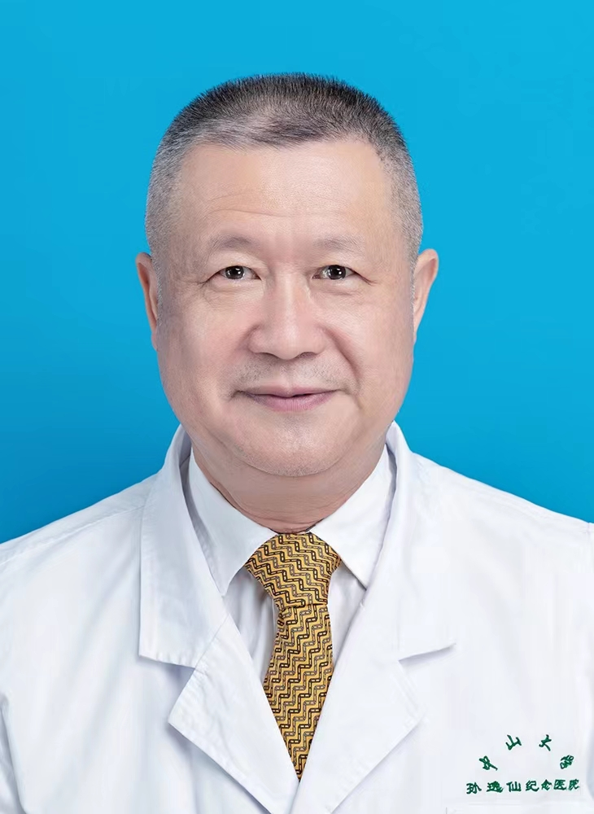

<!-- AUTO-GENERATED-BY: work/generate_obsidian_profiles.py -->

<!-- TEMPLATE: D:\workspace\信息收集整理\医生画像仓库\模板\医生画像模板.md -->

# 郑亿庆

## 基础信息

| 字段 | 内容 |
|---|---|
| 姓名 | 郑亿庆 |
| 医院 | 中山大学孙逸仙纪念医院 |
| 科室 | 耳鼻喉科 |
| 职称/身份 | 教授, 主任医师 |
| 来源链接 | [官网原文](https://www.gzsys.org.cn/node/15304) |
| 采集日期 | 2026-08-13 |

## 简介/擅长

## 教育与进修经历

- 毕业于中山医科大学医疗系，曾到美国明尼苏达大学医学院进修学习，有丰富的临床经验，擅长耳鼻咽喉科疑难疾病的诊断和治疗，尤其是对人工听觉植入、咽鼓管相关疾病、中耳炎、外中耳畸形、面神经疾病、耳硬化症、颞骨肿瘤、听神经瘤以及耳鸣、耳聋、眩晕、头颈肿瘤及嗓音疾病的诊治有丰富的经验。

## 科研项目与成果

- 一直以来主要从事耳科基础研究工作，近10年先后主持包括国家自然科学基金、国家及省级科技计划、省科委、省卫生厅、市重大项目在内的各类基金11项，以第一作者或通讯作者发表论文100篇余，其中SCI53篇。

## 论文与学术产出

- 一直以来主要从事耳科基础研究工作，近10年先后主持包括国家自然科学基金、国家及省级科技计划、省科委、省卫生厅、市重大项目在内的各类基金11项，以第一作者或通讯作者发表论文100篇余，其中SCI53篇。
- 参编专著6部，其中副主编及以上4部。

## 可包装亮点

- 教授、主任医师、博士生导师，中山大学名医，广东医师奖获得者。
- 毕业于中山医科大学医疗系，曾到美国明尼苏达大学医学院进修学习，有丰富的临床经验，擅长耳鼻咽喉科疑难疾病的诊断和治疗，尤其是对人工听觉植入、咽鼓管相关疾病、中耳炎、外中耳畸形、面神经疾病、耳硬化症、颞骨肿瘤、听神经瘤以及耳鸣、耳聋、眩晕、头颈肿瘤及嗓音疾病的诊治有丰富的经验。
- 任中山大学听力与言语研究所所长，中山大学新华学院听力与言语科学系主任，广东省医学会耳鼻咽喉科学会前主任委员，广东省医师协会耳鼻喉分会名誉主委，中国医师协会耳鼻咽喉分会常务理事，中华医学会耳鼻咽喉分会委员，中国医促会听力分会副主委。
- 一直以来主要从事耳科基础研究工作，近10年先后主持包括国家自然科学基金、国家及省级科技计划、省科委、省卫生厅、市重大项目在内的各类基金11项，以第一作者或通讯作者发表论文100篇余，其中SCI53篇。

## 重点疾病/人群标签

- 慢性病：
- 肿瘤：肿瘤、瘤、疑难
- 生殖疾病：
- 免疫/风湿：
- 术后恢复/康复：
- 疑难重症：肿瘤、瘤、疑难

## 证据摘录

> 只摘录官网公开信息中的短句或关键字段，不复制大段原文。

- 官网身份字段：教授, 主任医师
- 官网亮眼经历线索：教授、主任医师、博士生导师，中山大学名医，广东医师奖获得者。 毕业于中山医科大学医疗系，曾到美国明尼苏达大学医学院进修学习，有丰富的临床经验，擅长耳鼻咽喉科疑难疾病的诊断和治疗，尤其是对人工听觉植入、咽鼓管相关疾病、中耳炎、外中耳畸形、面神经疾病、耳硬化症、颞骨肿瘤、听神经瘤以及耳鸣、耳聋、眩晕、头颈肿瘤及嗓音疾病的诊治有丰富的经验。 任中山大学听力与言语研究所所长，中山大学新华学院听力与言语科学系主任，广东省医学会耳鼻咽喉科学会前主…
- 来源链接：https://www.gzsys.org.cn/node/15304

## BD 画像摘要

郑亿庆医生可作为肿瘤、疑难重症方向的基础画像候选。后续 BD 使用应继续以官网来源和人工复核为准，不添加疗效承诺或无来源包装。

## 合规边界

- 仅使用医院官网、官方公众号、官方小程序等公开渠道。
- 不采集私人电话、私人微信、家庭住址、患者隐私或非公开排班信息。
- 不写“保证治愈”“疗效第一”“包治疑难杂症”等无法由官网证明的表述。
