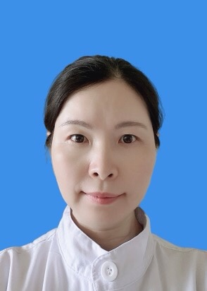

<!-- AUTO-GENERATED-BY: work/generate_obsidian_profiles.py -->

<!-- TEMPLATE: D:\workspace\信息收集整理\医生画像仓库\模板\医生画像模板.md -->

# 郑美华

## 基础信息

| 字段 | 内容 |
|---|---|
| 姓名 | 郑美华 |
| 医院 | 中山大学孙逸仙纪念医院 |
| 科室 | 口腔科 |
| 职称/身份 | 副主任医师 |
| 来源链接 | [官网原文](https://www.gzsys.org.cn/node/14589) |
| 采集日期 | 2026-08-13 |

## 简介/擅长

## 教育与进修经历

- 1990年6月毕业于中山医科大学口腔系，毕业后一直在孙逸仙纪念医院口腔科工作，期间在职完成口腔临床医学硕士学位攻读，2004年12月获聘为副主任医师，2005年获得硕士生导师资格，2006年起开始指导口腔修复专业的硕士研究生。

## 科研项目与成果

- 广东省口腔修复专业委员会 常委 广东省口腔全科专业委员会 常委 广东省口腔医师协会 理事 广东省科技厅基金项目评审专家 广州市医学会医疗事故技术鉴定专家库专家成员 从事口腔专业医教研30年，崇尚人文医学和适度治疗。
- 主持省市级基金4项，院级基金1项，以第一作者和通讯作者发表学术论文30余篇。

## 论文与学术产出

- 主持省市级基金4项，院级基金1项，以第一作者和通讯作者发表学术论文30余篇。

## 可包装亮点

- 广东省口腔修复专业委员会 常委 广东省口腔全科专业委员会 常委 广东省口腔医师协会 理事 广东省科技厅基金项目评审专家 广州市医学会医疗事故技术鉴定专家库专家成员 从事口腔专业医教研30年，崇尚人文医学和适度治疗。
- 1990年6月毕业于中山医科大学口腔系，毕业后一直在孙逸仙纪念医院口腔科工作，期间在职完成口腔临床医学硕士学位攻读，2004年12月获聘为副主任医师，2005年获得硕士生导师资格，2006年起开始指导口腔修复专业的硕士研究生。
- 主持省市级基金4项，院级基金1项，以第一作者和通讯作者发表学术论文30余篇。

## 重点疾病/人群标签

- 慢性病：
- 肿瘤：肿瘤、术后
- 生殖疾病：
- 免疫/风湿：
- 术后恢复/康复：肿瘤、术后
- 疑难重症：

## 证据摘录

> 只摘录官网公开信息中的短句或关键字段，不复制大段原文。

- 官网身份字段：副主任医师
- 官网亮眼经历线索：广东省口腔修复专业委员会 常委 广东省口腔全科专业委员会 常委 广东省口腔医师协会 理事 广东省科技厅基金项目评审专家 广州市医学会医疗事故技术鉴定专家库专家成员 从事口腔专业医教研30年，崇尚人文医学和适度治疗。 1990年6月毕业于中山医科大学口腔系，毕业后一直在孙逸仙纪念医院口腔科工作，期间在职完成口腔临床医学硕士学位攻读，2004年12月获聘为副主任医师，2005年获得硕士生导师资格，2006年起开始指导口腔修复专业的硕士研究…
- 来源链接：https://www.gzsys.org.cn/node/14589

## BD 画像摘要

郑美华医生可作为肿瘤、术后恢复/康复方向的基础画像候选。后续 BD 使用应继续以官网来源和人工复核为准，不添加疗效承诺或无来源包装。

## 合规边界

- 仅使用医院官网、官方公众号、官方小程序等公开渠道。
- 不采集私人电话、私人微信、家庭住址、患者隐私或非公开排班信息。
- 不写“保证治愈”“疗效第一”“包治疑难杂症”等无法由官网证明的表述。
