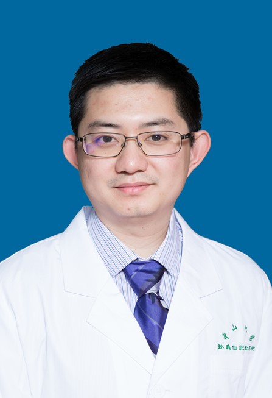

<!-- AUTO-GENERATED-BY: work/generate_obsidian_profiles.py -->

<!-- TEMPLATE: D:\workspace\信息收集整理\医生画像仓库\模板\医生画像模板.md -->

# 金亮

## 基础信息

| 字段 | 内容 |
|---|---|
| 姓名 | 金亮 |
| 医院 | 中山大学孙逸仙纪念医院 |
| 科室 | 乳腺外科 |
| 职称/身份 | 副主任医师 |
| 来源链接 | [官网原文](https://www.gzsys.org.cn/doctor/15370) |
| 采集日期 | 2026-08-13 |

## 简介/擅长

## 教育与进修经历

- 2016-2017年获国家留学基金委资助到英国卡迪夫大学访学一年。

## 科研项目与成果

- 2016-2017年获国家留学基金委资助到英国卡迪夫大学访学一年。

## 论文与学术产出

- 目前共发表了高水平论文20余篇，论文发表的杂志包括《Oncologist》、《Nature communications》、《Breast Cancer Research and Treatment》等；

## 可包装亮点

- 金亮，男，中山大学医学博士，中山大学逸仙乳腺肿瘤医院主治医师，乳腺二区区长，硕士生导师，广东省医师协会乳腺专科医师分会第二届委员会外科专业组副组长，南方护骨联盟成员。
- 2016-2017年获国家留学基金委资助到英国卡迪夫大学访学一年。
- 目前共发表了高水平论文20余篇，论文发表的杂志包括《Oncologist》、《Nature communications》、《Breast Cancer Research and Treatment》等；

## 重点疾病/人群标签

- 慢性病：
- 肿瘤：肿瘤、乳腺癌
- 生殖疾病：
- 免疫/风湿：
- 术后恢复/康复：
- 疑难重症：

## 证据摘录

> 只摘录官网公开信息中的短句或关键字段，不复制大段原文。

- 官网身份字段：副主任医师
- 官网亮眼经历线索：金亮，男，中山大学医学博士，中山大学逸仙乳腺肿瘤医院主治医师，乳腺二区区长，硕士生导师，广东省医师协会乳腺专科医师分会第二届委员会外科专业组副组长，南方护骨联盟成员。 2016-2017年获国家留学基金委资助到英国卡迪夫大学访学一年。 目前共发表了高水平论文20余篇，论文发表的杂志包括《Oncologist》、《Nature communications》、《Breast Cancer Research and Treatment》等；
- 来源链接：https://www.gzsys.org.cn/doctor/15370

## BD 画像摘要

金亮医生可作为肿瘤方向的基础画像候选。后续 BD 使用应继续以官网来源和人工复核为准，不添加疗效承诺或无来源包装。

## 合规边界

- 仅使用医院官网、官方公众号、官方小程序等公开渠道。
- 不采集私人电话、私人微信、家庭住址、患者隐私或非公开排班信息。
- 不写“保证治愈”“疗效第一”“包治疑难杂症”等无法由官网证明的表述。
