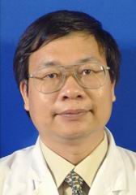

<!-- AUTO-GENERATED-BY: work/generate_obsidian_profiles.py -->

<!-- TEMPLATE: D:\workspace\信息收集整理\医生画像仓库\模板\医生画像模板.md -->

# 钟英强

## 基础信息

| 字段 | 内容 |
|---|---|
| 姓名 | 钟英强 |
| 医院 | 中山大学孙逸仙纪念医院 |
| 科室 | 消化内科 |
| 职称/身份 | 教授, 主任医师 |
| 来源链接 | [官网原文](https://www.gzsys.org.cn/doctor/14814) |
| 采集日期 | 2026-08-13 |

## 简介/擅长

## 教育与进修经历

- AOCC（亚洲克罗恩病与结肠炎组织）委员， 中国教育部学位评审专家，中华医学会消化病分会IBD协作组委员，中国医药教育协会IBD专委会常务委员，北京医学奖励基金会IBD专委会常务委员，吴阶平医学基金会IBD专委会常务委员，逸仙IBD联盟主任，广东省医学会消化病分会IBD学组副组长，中华医学科技奖评审委员会委员，广东省科技评审专家，广东省医学会消化病分会委员，广东省医师协会消化病分会委员，广东省港澳大湾区消化病协会委员 获得广东省科学技术奖三等奖1项，分别获得岭南医学院、中山大学、卫生部的优秀教师称号。

## 科研项目与成果

- AOCC（亚洲克罗恩病与结肠炎组织）委员， 中国教育部学位评审专家，中华医学会消化病分会IBD协作组委员，中国医药教育协会IBD专委会常务委员，北京医学奖励基金会IBD专委会常务委员，吴阶平医学基金会IBD专委会常务委员，逸仙IBD联盟主任，广东省医学会消化病分会IBD学组副组长，中华医学科技奖评审委员会委员，广东省科技评审专家，广东省医学会消化病分会委员，广东省医师协会消化病分会委员，广东省港澳大湾区消化病协会委员 获得广东省科学技术奖三等奖1项，分别获得岭南医学院、中山大学、卫生部的优秀教师称号。

## 可包装亮点

- 消化内科主任医师、教授，医学博士，博士生导师，胃肠内科主任，IBD首席专家。
- AOCC（亚洲克罗恩病与结肠炎组织）委员， 中国教育部学位评审专家，中华医学会消化病分会IBD协作组委员，中国医药教育协会IBD专委会常务委员，北京医学奖励基金会IBD专委会常务委员，吴阶平医学基金会IBD专委会常务委员，逸仙IBD联盟主任，广东省医学会消化病分会IBD学组副组长，中华医学科技奖评审委员会委员，广东省科技评审专家，广东省医学会消化病分会委员…

## 重点疾病/人群标签

- 慢性病：
- 肿瘤：肿瘤、免疫
- 生殖疾病：
- 免疫/风湿：肿瘤、免疫
- 术后恢复/康复：
- 疑难重症：

## 证据摘录

> 只摘录官网公开信息中的短句或关键字段，不复制大段原文。

- 官网身份字段：教授, 主任医师
- 官网亮眼经历线索：消化内科主任医师、教授，医学博士，博士生导师，胃肠内科主任，IBD首席专家。 AOCC（亚洲克罗恩病与结肠炎组织）委员， 中国教育部学位评审专家，中华医学会消化病分会IBD协作组委员，中国医药教育协会IBD专委会常务委员，北京医学奖励基金会IBD专委会常务委员，吴阶平医学基金会IBD专委会常务委员，逸仙IBD联盟主任，广东省医学会消化病分会IBD学组副组长，中华医学科技奖评审委员会委员，广东省科技评审专家，广东省医学会消化病分会委员…
- 来源链接：https://www.gzsys.org.cn/doctor/14814

## BD 画像摘要

钟英强医生可作为肿瘤、免疫/风湿/感染方向的基础画像候选。后续 BD 使用应继续以官网来源和人工复核为准，不添加疗效承诺或无来源包装。

## 合规边界

- 仅使用医院官网、官方公众号、官方小程序等公开渠道。
- 不采集私人电话、私人微信、家庭住址、患者隐私或非公开排班信息。
- 不写“保证治愈”“疗效第一”“包治疑难杂症”等无法由官网证明的表述。
