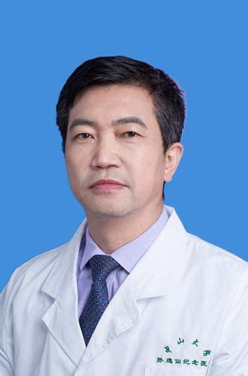

<!-- AUTO-GENERATED-BY: work/generate_obsidian_profiles.py -->

<!-- TEMPLATE: D:\workspace\信息收集整理\医生画像仓库\模板\医生画像模板.md -->

# 闫振文

## 基础信息

| 字段 | 内容 |
|---|---|
| 姓名 | 闫振文 |
| 医院 | 中山大学孙逸仙纪念医院 |
| 科室 | 神经科 |
| 职称/身份 | 副教授, 副主任医师 |
| 来源链接 | [官网原文](https://www.gzsys.org.cn/node/14689) |
| 采集日期 | 2026-08-13 |

## 简介/擅长

## 教育与进修经历

- 副教授，副主任医师，美国匹兹堡大学博士后_x000D_，硕士生导师_x000D_。
- 2013年 中山大学青年教师授课决赛第一名 一等奖 2014年 首批广东省健康教育巡讲导师 2016年 《认识头痛 远离头痛》通过教育部 国家精品课程 中华医学会医学教育技术分会优秀成果奖 一等奖 2017年 中山大学第八届教学改革成果奖 二等奖 2017年 “叶任高-李幼姬”临床优秀中青年教师 突出贡献奖 2018年 全国住院医师规范化培训“优秀带教老师” 全国住院医师规范化培训基地国检专家

## 科研项目与成果

- 中国医师协会第二届渐冻人项目专家委员会 委员；
- 现已申请多项科研和教学基金，在《Neurology》等杂志上发表多篇学术论文，参编5部学术专著和医学教材，曾赴哈佛大学麻省总医院进行学术交流。
- 2013年 中山大学青年教师授课决赛第一名 一等奖 2014年 首批广东省健康教育巡讲导师 2016年 《认识头痛 远离头痛》通过教育部 国家精品课程 中华医学会医学教育技术分会优秀成果奖 一等奖 2017年 中山大学第八届教学改革成果奖 二等奖 2017年 “叶任高-李幼姬”临床优秀中青年教师 突出贡献奖 2018年 全国住院医师规范化培训“优秀带教老师” 全国住院医师规范化培训基地国检专家

## 论文与学术产出

- 现已申请多项科研和教学基金，在《Neurology》等杂志上发表多篇学术论文，参编5部学术专著和医学教材，曾赴哈佛大学麻省总医院进行学术交流。

## 可包装亮点

- 副教授，副主任医师，美国匹兹堡大学博士后_x000D_，硕士生导师_x000D_。
- 世界卒中学会 会员 广东省健康管理学会神经科专委会 副主任委员；
- 广东省中西医结合学会神经电生理肌肉分会 副主任委员；
- 中国医师协会第二届渐冻人项目专家委员会 委员；

## 重点疾病/人群标签

- 慢性病：
- 肿瘤：
- 生殖疾病：
- 免疫/风湿：
- 术后恢复/康复：
- 疑难重症：疑难

## 证据摘录

> 只摘录官网公开信息中的短句或关键字段，不复制大段原文。

- 官网身份字段：副教授, 副主任医师
- 官网亮眼经历线索：副教授，副主任医师，美国匹兹堡大学博士后_x000D_，硕士生导师_x000D_。 世界卒中学会 会员 广东省健康管理学会神经科专委会 副主任委员； 广东省中西医结合学会神经电生理肌肉分会 副主任委员； 中国医师协会第二届渐冻人项目专家委员会 委员；
- 来源链接：https://www.gzsys.org.cn/node/14689

## BD 画像摘要

闫振文医生可作为疑难重症方向的基础画像候选。后续 BD 使用应继续以官网来源和人工复核为准，不添加疗效承诺或无来源包装。

## 合规边界

- 仅使用医院官网、官方公众号、官方小程序等公开渠道。
- 不采集私人电话、私人微信、家庭住址、患者隐私或非公开排班信息。
- 不写“保证治愈”“疗效第一”“包治疑难杂症”等无法由官网证明的表述。
