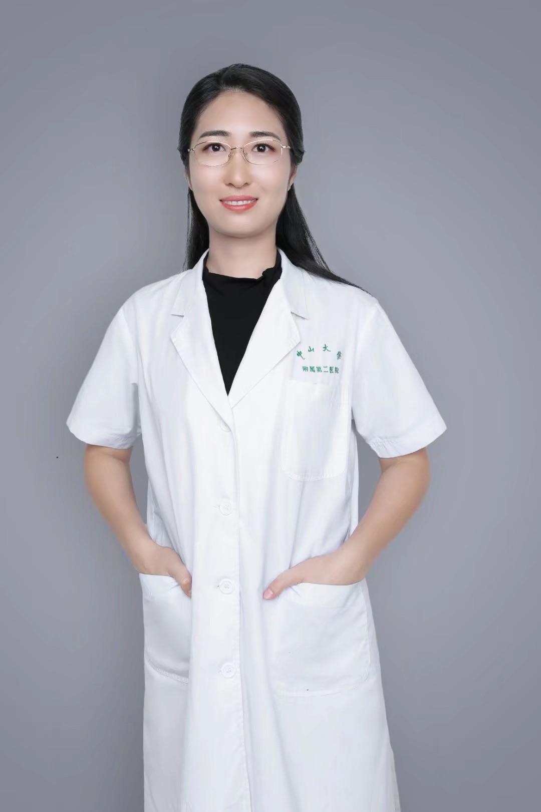

<!-- AUTO-GENERATED-BY: work/generate_obsidian_profiles.py -->

<!-- TEMPLATE: D:\workspace\信息收集整理\医生画像仓库\模板\医生画像模板.md -->

# 陈亚肖

## 基础信息

| 字段 | 内容 |
|---|---|
| 姓名 | 陈亚肖 |
| 医院 | 中山大学孙逸仙纪念医院 |
| 科室 | 普通妇科专科 |
| 职称/身份 | 副主任医师 |
| 来源链接 | [官网原文](https://www.gzsys.org.cn/node/15366) |
| 采集日期 | 2026-08-13 |

## 简介/擅长

## 科研项目与成果

- 参与及主持科研项目多个，并撰写发表科研论文数十篇。

## 论文与学术产出

- 参与及主持科研项目多个，并撰写发表科研论文数十篇。

## 可包装亮点

- 妇科副主任医师，医学博士。
- 参与及主持科研项目多个，并撰写发表科研论文数十篇。
- 现任广东省整形美容协会女性生殖整复分会秘书和广东省保健协会生殖健康分会秘书，并在广东省泌尿生殖协会盆底分会、广东省妇科委员会、广东省基层医药学会下尿路疾病专业委员会等多个学术组织单位委员一职。

## 重点疾病/人群标签

- 慢性病：慢性、癌、瘤、生殖、不孕、卵巢、妇科内分泌、多囊、月经、营养
- 肿瘤：慢性、癌、瘤、生殖、不孕、卵巢、妇科内分泌、多囊、月经、营养
- 生殖疾病：慢性、癌、瘤、生殖、不孕、卵巢、妇科内分泌、多囊、月经、营养
- 免疫/风湿：
- 术后恢复/康复：慢性、癌、瘤、生殖、不孕、卵巢、妇科内分泌、多囊、月经、营养
- 疑难重症：

## 证据摘录

> 只摘录官网公开信息中的短句或关键字段，不复制大段原文。

- 官网身份字段：副主任医师
- 官网亮眼经历线索：妇科副主任医师，医学博士。 参与及主持科研项目多个，并撰写发表科研论文数十篇。 现任广东省整形美容协会女性生殖整复分会秘书和广东省保健协会生殖健康分会秘书，并在广东省泌尿生殖协会盆底分会、广东省妇科委员会、广东省基层医药学会下尿路疾病专业委员会等多个学术组织单位委员一职。
- 来源链接：https://www.gzsys.org.cn/node/15366

## BD 画像摘要

陈亚肖医生可作为慢性病、肿瘤、生殖疾病、术后恢复/康复方向的基础画像候选。后续 BD 使用应继续以官网来源和人工复核为准，不添加疗效承诺或无来源包装。

## 合规边界

- 仅使用医院官网、官方公众号、官方小程序等公开渠道。
- 不采集私人电话、私人微信、家庭住址、患者隐私或非公开排班信息。
- 不写“保证治愈”“疗效第一”“包治疑难杂症”等无法由官网证明的表述。
