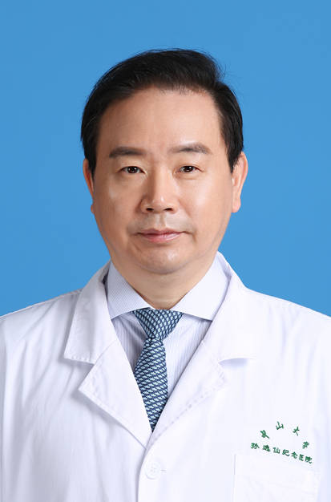

<!-- AUTO-GENERATED-BY: work/generate_obsidian_profiles.py -->

<!-- TEMPLATE: D:\workspace\信息收集整理\医生画像仓库\模板\医生画像模板.md -->

# 陈亚进

## 基础信息

| 字段 | 内容 |
|---|---|
| 姓名 | 陈亚进 |
| 医院 | 中山大学孙逸仙纪念医院 |
| 科室 | 普通外科、肝胆外科 |
| 职称/身份 | 教授, 主任医师 |
| 来源链接 | [官网原文](https://www.gzsys.org.cn/node/15238) |
| 采集日期 | 2026-08-13 |

## 简介/擅长

## 可包装亮点

- 教授，主任医师， 国际肝胆胰协会中国分会肝胆胰ERAS专业委员会主任委员、中国医师协会外科分会常务委员、广东省医师协会肝胆外科分会主任委员、国家卫健委能力建设和继续教育胆道外科专家委员会副主任委员、中国医师协会外科分会胆道专业委员会常委、中国研究型医院协会消化肿瘤分会副主任委员、中华医学会外科分会胆道外科学组委员、亚太腹腔镜肝脏手术推广委员会委员兼中国分会…
- 腹腔镜肝切除技术获得广东省科技进步二等奖 2020获评“国之名医-卓越建树”，广东医师奖获得者。
- 在肝胆胰肿瘤及胆石症诊治方面具有很高的造诣，精于肝胆胰疑难疾病以手术为主的综合治疗，具有多项领先全国的肝胆微创技术，主持和参与多项肝胆疾病全国诊疗共识的制定。

## 重点疾病/人群标签

- 慢性病：
- 肿瘤：肿瘤、疑难
- 生殖疾病：
- 免疫/风湿：
- 术后恢复/康复：
- 疑难重症：肿瘤、疑难

## 证据摘录

> 只摘录官网公开信息中的短句或关键字段，不复制大段原文。

- 官网身份字段：教授, 主任医师
- 官网亮眼经历线索：教授，主任医师， 国际肝胆胰协会中国分会肝胆胰ERAS专业委员会主任委员、中国医师协会外科分会常务委员、广东省医师协会肝胆外科分会主任委员、国家卫健委能力建设和继续教育胆道外科专家委员会副主任委员、中国医师协会外科分会胆道专业委员会常委、中国研究型医院协会消化肿瘤分会副主任委员、中华医学会外科分会胆道外科学组委员、亚太腹腔镜肝脏手术推广委员会委员兼中国分会副主任委员、国际肝胆胰协会中国分会胆道肿瘤专业委员会副主任委员、国际腹腔镜肝脏外…
- 来源链接：https://www.gzsys.org.cn/node/15238

## BD 画像摘要

陈亚进医生可作为肿瘤、疑难重症方向的基础画像候选。后续 BD 使用应继续以官网来源和人工复核为准，不添加疗效承诺或无来源包装。

## 合规边界

- 仅使用医院官网、官方公众号、官方小程序等公开渠道。
- 不采集私人电话、私人微信、家庭住址、患者隐私或非公开排班信息。
- 不写“保证治愈”“疗效第一”“包治疑难杂症”等无法由官网证明的表述。
