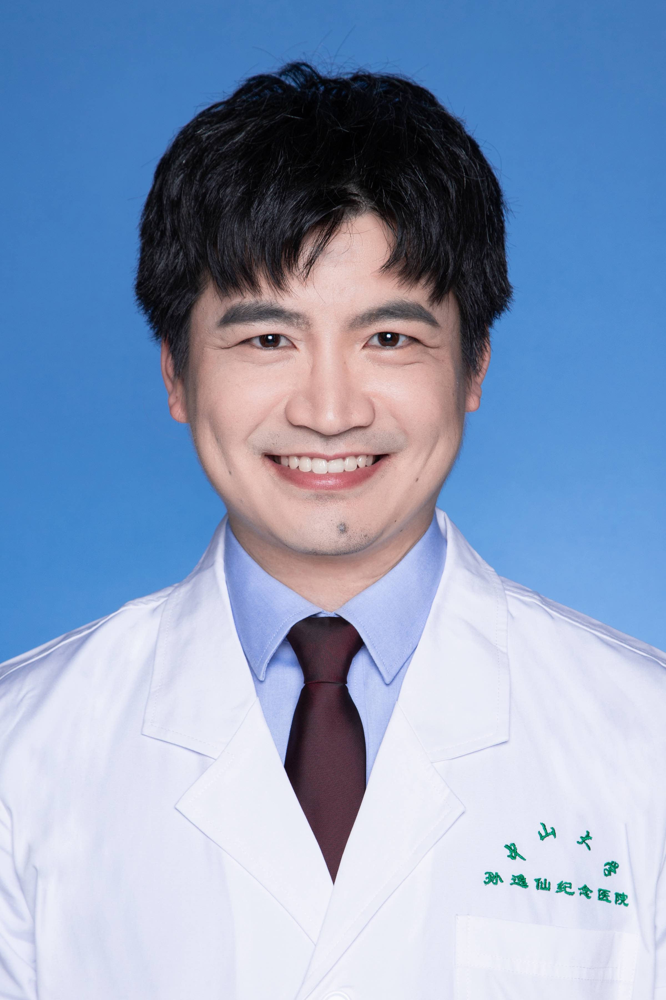

<!-- AUTO-GENERATED-BY: work/generate_obsidian_profiles.py -->

<!-- TEMPLATE: D:\workspace\信息收集整理\医生画像仓库\模板\医生画像模板.md -->

# 陈仲

## 基础信息

| 字段 | 内容 |
|---|---|
| 姓名 | 陈仲 |
| 医院 | 中山大学孙逸仙纪念医院 |
| 科室 | 骨外科 |
| 职称/身份 | 副主任医师 |
| 来源链接 | [官网原文](https://www.gzsys.org.cn/node/16995) |
| 采集日期 | 2026-08-13 |

## 简介/擅长

## 科研项目与成果

- 主持国家自然科学基金及广东省自然科学基金面上项目，长期研究关节炎滑膜炎的发病机制及核酸治疗的研究并获得发明专利两项。

## 论文与学术产出

- 论文曾在美国运动医学杂志AJSM、英国皇家化学期刊ChemComm、Nature旗下期刊CDD发表。

## 可包装亮点

- 运动医学科副主任医师，副教授，医学博士，硕士研究生导师 ，长期从事四肢关节运动损伤、骨关节炎及类风湿关节炎的诊治，尤其在肩周炎、肩袖撕裂，肩关节脱位，复杂类型肱骨近端骨折、肘关节僵硬、肘关节骨折、网球肘、肘关节软骨损伤、各种原因的腕关节滑膜炎及TFCC损伤等治疗及康复具有丰富经验。
- 主持国家自然科学基金及广东省自然科学基金面上项目，长期研究关节炎滑膜炎的发病机制及核酸治疗的研究并获得发明专利两项。
- 论文曾在美国运动医学杂志AJSM、英国皇家化学期刊ChemComm、Nature旗下期刊CDD发表。
- 目前为广东省中华医学会运动医学分会青年委员 广东省医师协会运动医学医师分会青年委员兼秘书 广东省临床医学学会运动医学分会青年委员及科学普及学组副组长

## 重点疾病/人群标签

- 慢性病：
- 肿瘤：
- 生殖疾病：
- 免疫/风湿：类风湿、康复、复杂
- 术后恢复/康复：类风湿、康复、复杂
- 疑难重症：类风湿、康复、复杂

## 证据摘录

> 只摘录官网公开信息中的短句或关键字段，不复制大段原文。

- 官网身份字段：副主任医师
- 官网亮眼经历线索：运动医学科副主任医师，副教授，医学博士，硕士研究生导师 ，长期从事四肢关节运动损伤、骨关节炎及类风湿关节炎的诊治，尤其在肩周炎、肩袖撕裂，肩关节脱位，复杂类型肱骨近端骨折、肘关节僵硬、肘关节骨折、网球肘、肘关节软骨损伤、各种原因的腕关节滑膜炎及TFCC损伤等治疗及康复具有丰富经验。 主持国家自然科学基金及广东省自然科学基金面上项目，长期研究关节炎滑膜炎的发病机制及核酸治疗的研究并获得发明专利两项。 论文曾在美国运动医学杂志AJSM、英…
- 来源链接：https://www.gzsys.org.cn/node/16995

## BD 画像摘要

陈仲医生可作为免疫/风湿/感染、术后恢复/康复、疑难重症方向的基础画像候选。后续 BD 使用应继续以官网来源和人工复核为准，不添加疗效承诺或无来源包装。

## 合规边界

- 仅使用医院官网、官方公众号、官方小程序等公开渠道。
- 不采集私人电话、私人微信、家庭住址、患者隐私或非公开排班信息。
- 不写“保证治愈”“疗效第一”“包治疑难杂症”等无法由官网证明的表述。
