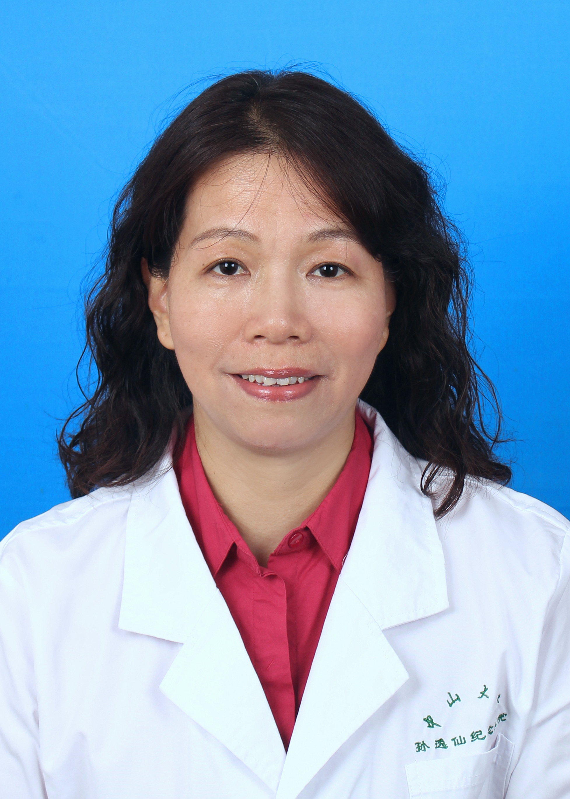

<!-- AUTO-GENERATED-BY: work/generate_obsidian_profiles.py -->

<!-- TEMPLATE: D:\workspace\信息收集整理\医生画像仓库\模板\医生画像模板.md -->

# 陈庆瑜

## 基础信息

| 字段 | 内容 |
|---|---|
| 姓名 | 陈庆瑜 |
| 医院 | 中山大学孙逸仙纪念医院 |
| 科室 | 健康管理中心 |
| 职称/身份 | 主任医师 |
| 来源链接 | [官网原文](https://www.gzsys.org.cn/node/14539) |
| 采集日期 | 2026-08-13 |

## 简介/擅长

## 教育与进修经历

- 毕业于中山医科大学，从事临床医疗保健工作三十多年，近二十年专注健康体检、慢病防控和高端医疗保健领域，是健康管理理念的推广者和执行者。

## 可包装亮点

- 广东省医学会健康体检管理分会副主委，广东省健康管理学会、精准医学应用学会、老年保健协会健康管理专委会副主委，省中西医结合学会治未病、医院协会慢病管理专委会副主委，省健康管理学会胸部肿瘤及肺结节管理专委会副主委，省医学会骨质疏松学分会临床学组、行为与心身医学分会委员；
- 擅长个性化体检定制（括早癌筛查与精准体检）、体检报告解读、疾病筛查分诊与健康管理，对内科常见病、中老年慢性病如肥胖症、高血脂、高血压、高尿酸、脂肪肝、骨质疏松、代谢综合征和糖尿病等的预防保健和筛查诊治积累了丰富经验。

## 重点疾病/人群标签

- 慢性病：高血压、糖尿病、慢性、代谢、肿瘤、癌
- 肿瘤：高血压、糖尿病、慢性、代谢、肿瘤、癌
- 生殖疾病：
- 免疫/风湿：
- 术后恢复/康复：
- 疑难重症：

## 证据摘录

> 只摘录官网公开信息中的短句或关键字段，不复制大段原文。

- 官网身份字段：主任医师
- 官网亮眼经历线索：广东省医学会健康体检管理分会副主委，广东省健康管理学会、精准医学应用学会、老年保健协会健康管理专委会副主委，省中西医结合学会治未病、医院协会慢病管理专委会副主委，省健康管理学会胸部肿瘤及肺结节管理专委会副主委，省医学会骨质疏松学分会临床学组、行为与心身医学分会委员； 擅长个性化体检定制（括早癌筛查与精准体检）、体检报告解读、疾病筛查分诊与健康管理，对内科常见病、中老年慢性病如肥胖症、高血脂、高血压、高尿酸、脂肪肝、骨质疏松、代谢综合征…
- 来源链接：https://www.gzsys.org.cn/node/14539

## BD 画像摘要

陈庆瑜医生可作为慢性病、肿瘤方向的基础画像候选。后续 BD 使用应继续以官网来源和人工复核为准，不添加疗效承诺或无来源包装。

## 合规边界

- 仅使用医院官网、官方公众号、官方小程序等公开渠道。
- 不采集私人电话、私人微信、家庭住址、患者隐私或非公开排班信息。
- 不写“保证治愈”“疗效第一”“包治疑难杂症”等无法由官网证明的表述。
