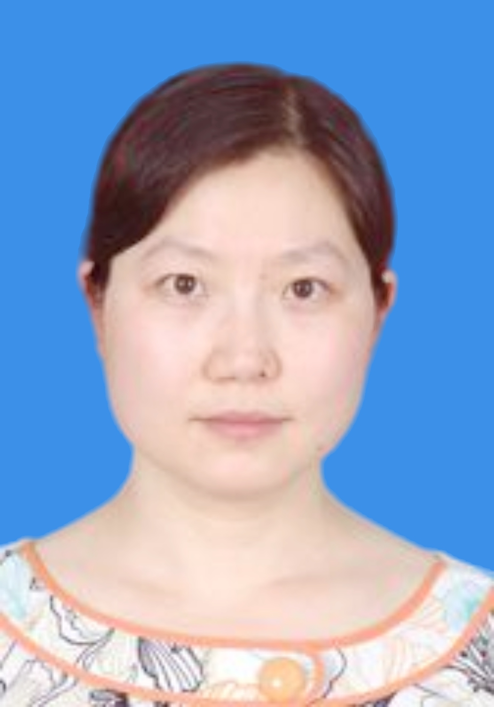

<!-- AUTO-GENERATED-BY: work/generate_obsidian_profiles.py -->

<!-- TEMPLATE: D:\workspace\信息收集整理\医生画像仓库\模板\医生画像模板.md -->

# 陈慧

## 基础信息

| 字段 | 内容 |
|---|---|
| 姓名 | 陈慧 |
| 医院 | 中山大学孙逸仙纪念医院 |
| 科室 | 妇科生殖内分泌专科 |
| 职称/身份 | 教授, 主任医师 |
| 来源链接 | [官网原文](https://www.gzsys.org.cn/node/14732) |
| 采集日期 | 2026-08-13 |

## 简介/擅长

## 科研项目与成果

- 生殖免疫主要专注于复发性流产、早产的发病机制及诊疗研究，获得了包括国家自然基金2项、省级、校级基金共10项，发表科研论文28篇（其中SCI 5篇）。
- 获得4项发明专利。
- 胚胎发育主要专注胚层细胞命运区域化调控机制研究，对胎儿发育异常患者进行表达谱、基因组测序、代谢组学以及蛋白表达等进行全面研究，获得国家重点研发计划1项，发表科研论文SCI 3篇。

## 论文与学术产出

- 生殖免疫主要专注于复发性流产、早产的发病机制及诊疗研究，获得了包括国家自然基金2项、省级、校级基金共10项，发表科研论文28篇（其中SCI 5篇）。
- 胚胎发育主要专注胚层细胞命运区域化调控机制研究，对胎儿发育异常患者进行表达谱、基因组测序、代谢组学以及蛋白表达等进行全面研究，获得国家重点研发计划1项，发表科研论文SCI 3篇。

## 可包装亮点

- 妇幼健康研究会生殖免疫学专业委员会常务委员、中国妇幼保健协会生育保健专业委员会青年委员、广东省医师协会妇产科医师分会副主任委员、广东省医学会生殖免疫与优生学分会副主任委员、广东省妇幼保健协会产后康复保健专业委会副主任委员、广东省医学会妇产科学分会青年副主任委员、广东省健康教育协会妇产科专业委员会副主任委员兼秘书长。
- 获得“广东省杰出青年医学人才”、“岭南名医”等称号。
- 生殖免疫主要专注于复发性流产、早产的发病机制及诊疗研究，获得了包括国家自然基金2项、省级、校级基金共10项，发表科研论文28篇（其中SCI 5篇）。
- 获得4项发明专利。

## 重点疾病/人群标签

- 慢性病：代谢、生殖、胚胎、免疫、康复
- 肿瘤：
- 生殖疾病：代谢、生殖、胚胎、免疫、康复
- 免疫/风湿：代谢、生殖、胚胎、免疫、康复
- 术后恢复/康复：代谢、生殖、胚胎、免疫、康复
- 疑难重症：

## 证据摘录

> 只摘录官网公开信息中的短句或关键字段，不复制大段原文。

- 官网身份字段：教授, 主任医师
- 官网亮眼经历线索：妇幼健康研究会生殖免疫学专业委员会常务委员、中国妇幼保健协会生育保健专业委员会青年委员、广东省医师协会妇产科医师分会副主任委员、广东省医学会生殖免疫与优生学分会副主任委员、广东省妇幼保健协会产后康复保健专业委会副主任委员、广东省医学会妇产科学分会青年副主任委员、广东省健康教育协会妇产科专业委员会副主任委员兼秘书长。 获得“广东省杰出青年医学人才”、“岭南名医”等称号。 生殖免疫主要专注于复发性流产、早产的发病机制及诊疗研究，获得了包括…
- 来源链接：https://www.gzsys.org.cn/node/14732

## BD 画像摘要

陈慧医生可作为慢性病、生殖疾病、免疫/风湿/感染、术后恢复/康复方向的基础画像候选。后续 BD 使用应继续以官网来源和人工复核为准，不添加疗效承诺或无来源包装。

## 合规边界

- 仅使用医院官网、官方公众号、官方小程序等公开渠道。
- 不采集私人电话、私人微信、家庭住址、患者隐私或非公开排班信息。
- 不写“保证治愈”“疗效第一”“包治疑难杂症”等无法由官网证明的表述。
