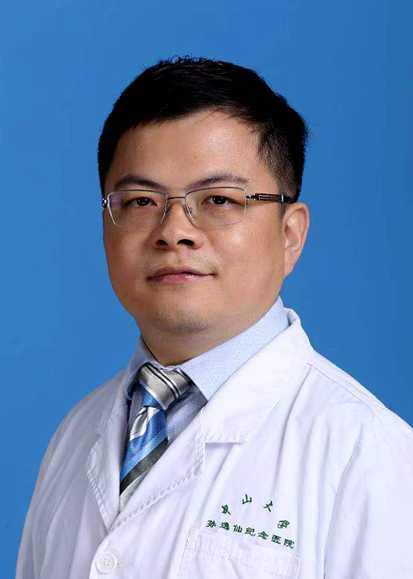

<!-- AUTO-GENERATED-BY: work/generate_obsidian_profiles.py -->

<!-- TEMPLATE: D:\workspace\信息收集整理\医生画像仓库\模板\医生画像模板.md -->

# 陈捷

## 基础信息

| 字段 | 内容 |
|---|---|
| 姓名 | 陈捷 |
| 医院 | 中山大学孙逸仙纪念医院 |
| 科室 | 肝胆外科 |
| 职称/身份 | 副主任医师 |
| 来源链接 | [官网原文](https://www.gzsys.org.cn/node/15408) |
| 采集日期 | 2026-08-13 |

## 简介/擅长

## 教育与进修经历

- 中山大学孙逸仙纪念医院肝胆外科，医学博士、副主任医师、 硕士生导师 美国宾夕法尼亚大学访问学者 广东省医师协会肝胆外科医师分会转移性肝癌学组委员 广东省肝脏病学会肝癌多学科协作诊疗专业委员会委员 广东省健康管理学会消化内镜MDT委员会委员 擅长肝癌，胆管癌，胰腺癌及肝内外胆管结石的诊断及治疗，熟练掌握腹腔镜微创技术。

## 科研项目与成果

- 主持国家级科研基金1项，参与省市级科研基金3项。

## 论文与学术产出

- 在国内外重要期刊上发表研究论文10余篇。

## 可包装亮点

- 中山大学孙逸仙纪念医院肝胆外科，医学博士、副主任医师、 硕士生导师 美国宾夕法尼亚大学访问学者 广东省医师协会肝胆外科医师分会转移性肝癌学组委员 广东省肝脏病学会肝癌多学科协作诊疗专业委员会委员 广东省健康管理学会消化内镜MDT委员会委员 擅长肝癌，胆管癌，胰腺癌及肝内外胆管结石的诊断及治疗，熟练掌握腹腔镜微创技术。
- 在国内外重要期刊上发表研究论文10余篇。

## 重点疾病/人群标签

- 慢性病：
- 肿瘤：癌、肝癌、多学科、MDT
- 生殖疾病：
- 免疫/风湿：
- 术后恢复/康复：
- 疑难重症：癌、肝癌、多学科、MDT

## 证据摘录

> 只摘录官网公开信息中的短句或关键字段，不复制大段原文。

- 官网身份字段：副主任医师
- 官网亮眼经历线索：中山大学孙逸仙纪念医院肝胆外科，医学博士、副主任医师、 硕士生导师 美国宾夕法尼亚大学访问学者 广东省医师协会肝胆外科医师分会转移性肝癌学组委员 广东省肝脏病学会肝癌多学科协作诊疗专业委员会委员 广东省健康管理学会消化内镜MDT委员会委员 擅长肝癌，胆管癌，胰腺癌及肝内外胆管结石的诊断及治疗，熟练掌握腹腔镜微创技术。 在国内外重要期刊上发表研究论文10余篇。
- 来源链接：https://www.gzsys.org.cn/node/15408

## BD 画像摘要

陈捷医生可作为肿瘤、疑难重症方向的基础画像候选。后续 BD 使用应继续以官网来源和人工复核为准，不添加疗效承诺或无来源包装。

## 合规边界

- 仅使用医院官网、官方公众号、官方小程序等公开渠道。
- 不采集私人电话、私人微信、家庭住址、患者隐私或非公开排班信息。
- 不写“保证治愈”“疗效第一”“包治疑难杂症”等无法由官网证明的表述。
