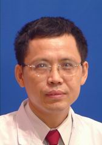

<!-- AUTO-GENERATED-BY: work/generate_obsidian_profiles.py -->

<!-- TEMPLATE: D:\workspace\信息收集整理\医生画像仓库\模板\医生画像模板.md -->

# 陈明春

## 基础信息

| 字段 | 内容 |
|---|---|
| 姓名 | 陈明春 |
| 医院 | 中山大学孙逸仙纪念医院 |
| 科室 | 皮肤科 |
| 职称/身份 | 主任医师 |
| 来源链接 | [官网原文](https://www.gzsys.org.cn/node/14595) |
| 采集日期 | 2026-08-13 |

## 简介/擅长

## 科研项目与成果

- 中山医科大学临床医学本科及皮肤病学研究生，一直在本院从事皮肤科医疗、教学和科研工作。

## 可包装亮点

- 主要学术任职：广东省医学美容学会皮肤美容专业委员会主任委员、广东省中西医结合学会医学美容专业委员会副主任委员、《中国热带医学》、《皮肤性病诊疗学》杂志编委等。

## 重点疾病/人群标签

- 慢性病：
- 肿瘤：肿瘤、重症
- 生殖疾病：
- 免疫/风湿：
- 术后恢复/康复：
- 疑难重症：肿瘤、重症

## 证据摘录

> 只摘录官网公开信息中的短句或关键字段，不复制大段原文。

- 官网身份字段：主任医师
- 官网亮眼经历线索：主要学术任职：广东省医学美容学会皮肤美容专业委员会主任委员、广东省中西医结合学会医学美容专业委员会副主任委员、《中国热带医学》、《皮肤性病诊疗学》杂志编委等。
- 来源链接：https://www.gzsys.org.cn/node/14595

## BD 画像摘要

陈明春医生可作为肿瘤、疑难重症方向的基础画像候选。后续 BD 使用应继续以官网来源和人工复核为准，不添加疗效承诺或无来源包装。

## 合规边界

- 仅使用医院官网、官方公众号、官方小程序等公开渠道。
- 不采集私人电话、私人微信、家庭住址、患者隐私或非公开排班信息。
- 不写“保证治愈”“疗效第一”“包治疑难杂症”等无法由官网证明的表述。
