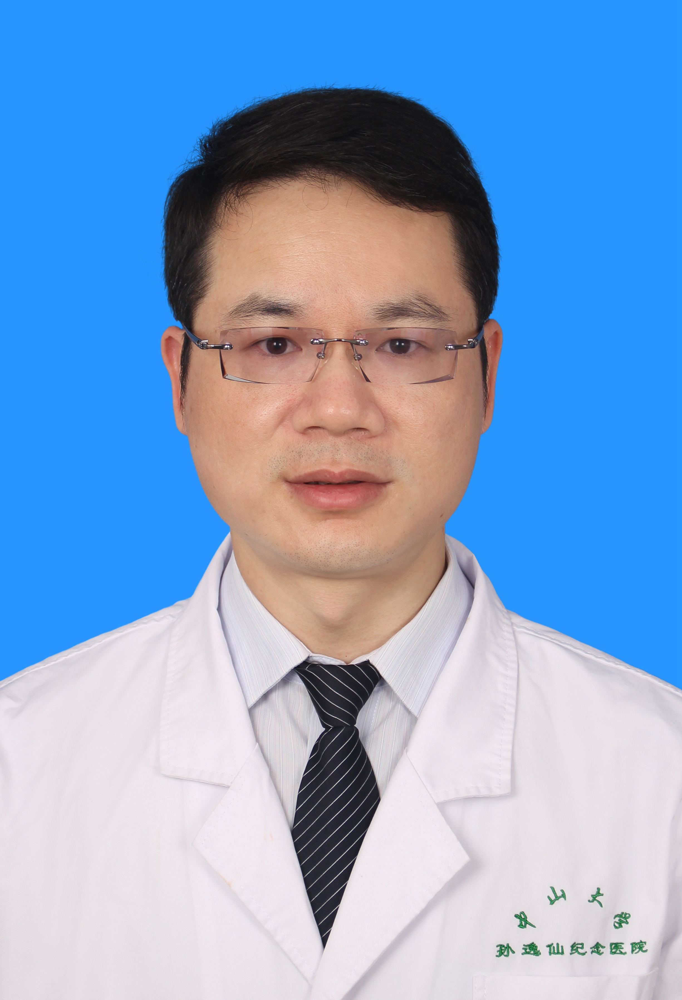

<!-- AUTO-GENERATED-BY: work/generate_obsidian_profiles.py -->

<!-- TEMPLATE: D:\workspace\信息收集整理\医生画像仓库\模板\医生画像模板.md -->

# 陈样新

## 基础信息

| 字段 | 内容 |
|---|---|
| 姓名 | 陈样新 |
| 医院 | 中山大学孙逸仙纪念医院 |
| 科室 | 心血管内科 |
| 职称/身份 | 教授, 主任医师 |
| 来源链接 | [官网原文](https://www.gzsys.org.cn/node/14820) |
| 采集日期 | 2026-08-13 |

## 简介/擅长

## 科研项目与成果

- 获广东省科技成果推广奖、广东省医学科技奖一等奖，主持1项国家重点研发计划，7项国家自然科学基金（含重点项目、专项），及多项省市级重点项目，从事心力衰竭、心律失常、心脏瓣膜病的临床和研究工作。

## 可包装亮点

- 教授，主任医师，博士生导师，中山大学孙逸仙纪念医院院长、党委副书记，中山大学中山医学院内科学系主任。
- 国家重点研发计划首席科学家，教育部新世纪优秀人才，广东省杰出青年医学人才。
- 国家心血管病专家委员会兼副秘书长，国家心律失常介入质控专家委员会委员，中国医师协会心律学专业委员会常务委员，中华医学会心血管病分会委员，中国医师协会心血管内科医师分会委员，美国心律学会委员（FHRS），中国卒中学会心血管病分会副主任委员，广东省医学会心血管病学分会候任主任委员，广东省精准医学应用学会副会长，《中华心血管病杂志》编委，《中国介入心脏病学杂志》…
- 是国内心脏植入器械（起搏器、ICD、CCM）的主要带教术者，率先在广东省内开展微创经导管二尖瓣钳夹术，率先在国内常规开展三尖瓣钳夹术、三尖瓣异位瓣膜植入术，同时协助多省数十家医院开展经导管瓣膜病手术。

## 重点疾病/人群标签

- 慢性病：心力衰竭
- 肿瘤：
- 生殖疾病：
- 免疫/风湿：
- 术后恢复/康复：
- 疑难重症：

## 证据摘录

> 只摘录官网公开信息中的短句或关键字段，不复制大段原文。

- 官网身份字段：教授, 主任医师
- 官网亮眼经历线索：教授，主任医师，博士生导师，中山大学孙逸仙纪念医院院长、党委副书记，中山大学中山医学院内科学系主任。 国家重点研发计划首席科学家，教育部新世纪优秀人才，广东省杰出青年医学人才。 国家心血管病专家委员会兼副秘书长，国家心律失常介入质控专家委员会委员，中国医师协会心律学专业委员会常务委员，中华医学会心血管病分会委员，中国医师协会心血管内科医师分会委员，美国心律学会委员（FHRS），中国卒中学会心血管病分会副主任委员，广东省医学会心血管病学…
- 来源链接：https://www.gzsys.org.cn/node/14820

## BD 画像摘要

陈样新医生可作为慢性病方向的基础画像候选。后续 BD 使用应继续以官网来源和人工复核为准，不添加疗效承诺或无来源包装。

## 合规边界

- 仅使用医院官网、官方公众号、官方小程序等公开渠道。
- 不采集私人电话、私人微信、家庭住址、患者隐私或非公开排班信息。
- 不写“保证治愈”“疗效第一”“包治疑难杂症”等无法由官网证明的表述。
