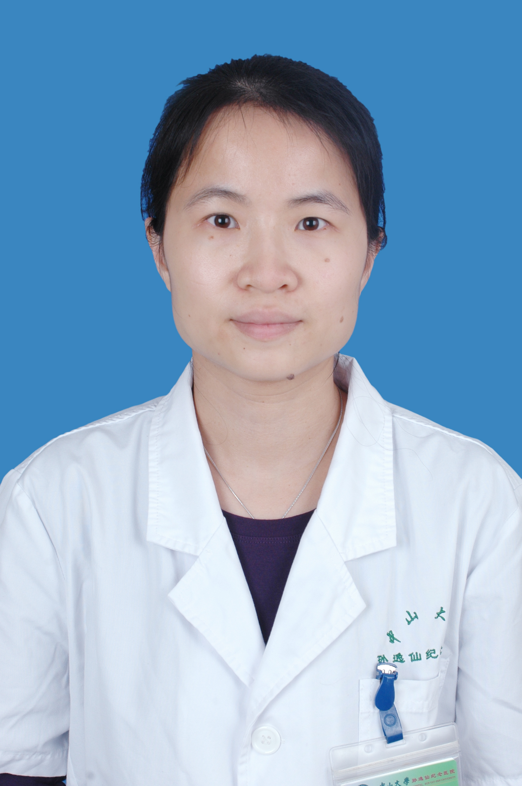

<!-- AUTO-GENERATED-BY: work/generate_obsidian_profiles.py -->

<!-- TEMPLATE: D:\workspace\信息收集整理\医生画像仓库\模板\医生画像模板.md -->

# 陈茵婷

## 基础信息

| 字段 | 内容 |
|---|---|
| 姓名 | 陈茵婷 |
| 医院 | 中山大学孙逸仙纪念医院 |
| 科室 | 消化内科 |
| 职称/身份 | 教授, 主任医师 |
| 来源链接 | [官网原文](https://www.gzsys.org.cn/node/14801) |
| 采集日期 | 2026-08-13 |

## 简介/擅长

## 科研项目与成果

- 科研方向为胰腺癌肿瘤转移和化疗耐药机制以及载药纳米微粒体内示踪和靶向治疗研究。
- 主持国家自然科学基金项目（3项）、广东省自然科学基金面上项目（2项）、广州市珠江科技新星专项（1项）、国家教育部博士点新教师基金（1项）、中山大学青年教师基金（1项），相关研究成果以第一/通讯作者发表SCI论著20余篇，已获得4项国家发明专利以及申请2项发明专利。
- 获得2017年度广东省杰出青年医学人才（第一批）、2016年度广州市珠江科技新星以及2013年度中山大学孙逸仙纪念医院“逸仙优秀医学人才”等人才项目。

## 论文与学术产出

- 主持国家自然科学基金项目（3项）、广东省自然科学基金面上项目（2项）、广州市珠江科技新星专项（1项）、国家教育部博士点新教师基金（1项）、中山大学青年教师基金（1项），相关研究成果以第一/通讯作者发表SCI论著20余篇，已获得4项国家发明专利以及申请2项发明专利。

## 可包装亮点

- 消化内科主任医师、教授。
- 主持国家自然科学基金项目（3项）、广东省自然科学基金面上项目（2项）、广州市珠江科技新星专项（1项）、国家教育部博士点新教师基金（1项）、中山大学青年教师基金（1项），相关研究成果以第一/通讯作者发表SCI论著20余篇，已获得4项国家发明专利以及申请2项发明专利。
- 2014年“载药免疫纳米微粒研制及其靶向诊治消化系肿瘤的基础与临床研究”获得广东省科学技术奖励三等奖（B14-0-3-01-R02，第二申请人）。
- 获得2017年度广东省杰出青年医学人才（第一批）、2016年度广州市珠江科技新星以及2013年度中山大学孙逸仙纪念医院“逸仙优秀医学人才”等人才项目。

## 重点疾病/人群标签

- 慢性病：
- 肿瘤：肿瘤、癌、瘤、化疗、靶向、免疫
- 生殖疾病：
- 免疫/风湿：肿瘤、癌、瘤、化疗、靶向、免疫
- 术后恢复/康复：
- 疑难重症：

## 证据摘录

> 只摘录官网公开信息中的短句或关键字段，不复制大段原文。

- 官网身份字段：教授, 主任医师
- 官网亮眼经历线索：消化内科主任医师、教授。 主持国家自然科学基金项目（3项）、广东省自然科学基金面上项目（2项）、广州市珠江科技新星专项（1项）、国家教育部博士点新教师基金（1项）、中山大学青年教师基金（1项），相关研究成果以第一/通讯作者发表SCI论著20余篇，已获得4项国家发明专利以及申请2项发明专利。 2014年“载药免疫纳米微粒研制及其靶向诊治消化系肿瘤的基础与临床研究”获得广东省科学技术奖励三等奖（B14-0-3-01-R02，第二申请人）…
- 来源链接：https://www.gzsys.org.cn/node/14801

## BD 画像摘要

陈茵婷医生可作为肿瘤、免疫/风湿/感染方向的基础画像候选。后续 BD 使用应继续以官网来源和人工复核为准，不添加疗效承诺或无来源包装。

## 合规边界

- 仅使用医院官网、官方公众号、官方小程序等公开渠道。
- 不采集私人电话、私人微信、家庭住址、患者隐私或非公开排班信息。
- 不写“保证治愈”“疗效第一”“包治疑难杂症”等无法由官网证明的表述。
