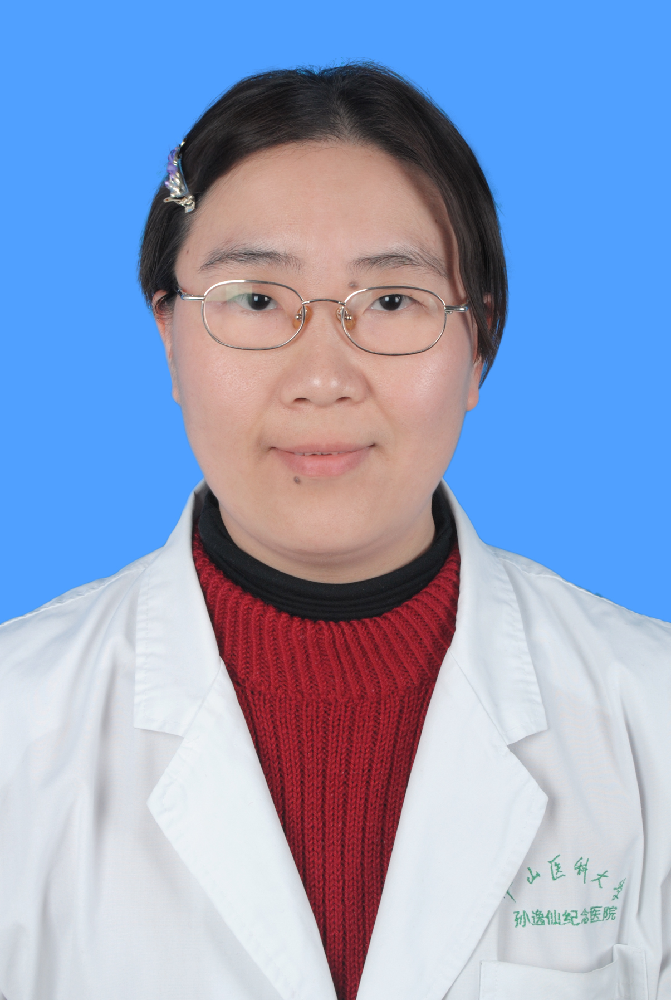

<!-- AUTO-GENERATED-BY: work/generate_obsidian_profiles.py -->

<!-- TEMPLATE: D:\workspace\信息收集整理\医生画像仓库\模板\医生画像模板.md -->

# 雷娟

## 基础信息

| 字段 | 内容 |
|---|---|
| 姓名 | 雷娟 |
| 医院 | 中山大学孙逸仙纪念医院 |
| 科室 | 心血管内科 |
| 职称/身份 | 主任医师 |
| 来源链接 | [官网原文](https://www.gzsys.org.cn/node/14831) |
| 采集日期 | 2026-08-13 |

## 简介/擅长

## 科研项目与成果

- 从事心血管内科医疗、教学和科研工作19年，现任心力衰竭亚专科副主任。
- 2013年获中山大学孙逸仙纪念医院“博济优秀医学人才”项目资助，到美国纽约州立大学上州医科大学附属医院心脏与血管中心访问学习。
- 主持和参与多项国家自然科学基金和省级科研基金。

## 论文与学术产出

- 在Int J Cardiol、Am J Hyperten、Eur Heart J: Acute Cardiovasc Care、Inflammation、Mol Cell Biochem、Europace、Exp Diabetes Res、J Cardiovasc Pharmacol、Chin Med J、《中华高血压杂志》、和《中国心脏起搏与电生理杂志》等国内外杂志上发表论文30余篇，副主编本专业学术专著一部《现代心血管疾病药物治疗学》。

## 可包装亮点

- 雷娟，主任医师，医学博士，硕士生导师，八年制全程导师。
- 2013年获中山大学孙逸仙纪念医院“博济优秀医学人才”项目资助，到美国纽约州立大学上州医科大学附属医院心脏与血管中心访问学习。
- 美国心脏病学会（ACC）国际会员、广东省中医药学会心力衰竭专业委员会常务委员、广东省女医师协会心电学与起搏电生理常务委员，广东省医师协会心脏起搏与电生理专业医师分会委员、广东省医师协会心脏病器械辅助治疗医师分会委员，广东省健康管理学会老年医学与抗衰老专业委员会委员、广东省精准医学应用学会高血压分会委员。
- 擅长急慢性心力衰竭、心律失常、冠心病、高血压、血脂异常、晕厥和心脏瓣膜病等疾病的诊断和治疗，尤其是人工心脏起搏器（含ICD、CRT/CRTD）的术后程控优化和管理，以及心血管急危重症的抢救。

## 重点疾病/人群标签

- 慢性病：高血压、冠心病、心力衰竭、慢性、术后、急危重
- 肿瘤：
- 生殖疾病：
- 免疫/风湿：
- 术后恢复/康复：高血压、冠心病、心力衰竭、慢性、术后、急危重
- 疑难重症：高血压、冠心病、心力衰竭、慢性、术后、急危重

## 证据摘录

> 只摘录官网公开信息中的短句或关键字段，不复制大段原文。

- 官网身份字段：主任医师
- 官网亮眼经历线索：雷娟，主任医师，医学博士，硕士生导师，八年制全程导师。 2013年获中山大学孙逸仙纪念医院“博济优秀医学人才”项目资助，到美国纽约州立大学上州医科大学附属医院心脏与血管中心访问学习。 美国心脏病学会（ACC）国际会员、广东省中医药学会心力衰竭专业委员会常务委员、广东省女医师协会心电学与起搏电生理常务委员，广东省医师协会心脏起搏与电生理专业医师分会委员、广东省医师协会心脏病器械辅助治疗医师分会委员，广东省健康管理学会老年医学与抗衰老专业…
- 来源链接：https://www.gzsys.org.cn/node/14831

## BD 画像摘要

雷娟医生可作为慢性病、术后恢复/康复、疑难重症方向的基础画像候选。后续 BD 使用应继续以官网来源和人工复核为准，不添加疗效承诺或无来源包装。

## 合规边界

- 仅使用医院官网、官方公众号、官方小程序等公开渠道。
- 不采集私人电话、私人微信、家庭住址、患者隐私或非公开排班信息。
- 不写“保证治愈”“疗效第一”“包治疑难杂症”等无法由官网证明的表述。
