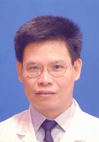

<!-- AUTO-GENERATED-BY: work/generate_obsidian_profiles.py -->

<!-- TEMPLATE: D:\workspace\信息收集整理\医生画像仓库\模板\医生画像模板.md -->

# 麦友刚

## 基础信息

| 字段 | 内容 |
|---|---|
| 姓名 | 麦友刚 |
| 医院 | 中山大学孙逸仙纪念医院 |
| 科室 | 新生儿及儿童重症专科 |
| 职称/身份 | 主任医师 |
| 来源链接 | [官网原文](https://www.gzsys.org.cn/node/14582) |
| 采集日期 | 2026-08-13 |

## 简介/擅长

儿科常见病、疑难病 ，新生儿及早产儿疾病，新生儿及儿童危重症的监护和抢救治疗。

## 教育与进修经历

- 1989年中山医科大学临床医学系毕业，1995年获儿科临床医学硕士学位，儿科副主任医师。
- 曾经在北京市儿童医院危重新生儿监护治疗中心和香港中文大学威尔斯亲王医院儿科系新生儿及危重症儿童深切治疗部进修学习。

## 论文与学术产出

- 发表论文20余篇，现为广东省医学会儿童危重病分会委员、广东省医学会围产医学分会新生儿复苏组组员。

## 可包装亮点

- 儿科主任医师、硕士生导师，现任儿科新生儿及儿童重症专科主任。
- 1989年中山医科大学临床医学系毕业，1995年获儿科临床医学硕士学位，儿科副主任医师。
- 曾经在北京市儿童医院危重新生儿监护治疗中心和香港中文大学威尔斯亲王医院儿科系新生儿及危重症儿童深切治疗部进修学习。
- 一直从事儿科一线临床工作近25年，对各种儿科常见病、疑难病的诊治有丰富的临床经验，尤其擅长于危重新生儿、早产儿及危重症儿童的监护和抢救治疗。

## 重点疾病/人群标签

- 慢性病：
- 肿瘤：
- 生殖疾病：
- 免疫/风湿：
- 术后恢复/康复：
- 疑难重症：疑难、危重、重症

## 证据摘录

> 只摘录官网公开信息中的短句或关键字段，不复制大段原文。

- 官网身份字段：主任医师
- 官网简介/擅长：儿科常见病、疑难病 ，新生儿及早产儿疾病，新生儿及儿童危重症的监护和抢救治疗。
- 官网亮眼经历线索：儿科主任医师、硕士生导师，现任儿科新生儿及儿童重症专科主任。 1989年中山医科大学临床医学系毕业，1995年获儿科临床医学硕士学位，儿科副主任医师。 曾经在北京市儿童医院危重新生儿监护治疗中心和香港中文大学威尔斯亲王医院儿科系新生儿及危重症儿童深切治疗部进修学习。 一直从事儿科一线临床工作近25年，对各种儿科常见病、疑难病的诊治有丰富的临床经验，尤其擅长于危重新生儿、早产儿及危重症儿童的监护和抢救治疗。
- 来源链接：https://www.gzsys.org.cn/node/14582

## BD 画像摘要

麦友刚医生可作为疑难重症方向的基础画像候选。后续 BD 使用应继续以官网来源和人工复核为准，不添加疗效承诺或无来源包装。

## 合规边界

- 仅使用医院官网、官方公众号、官方小程序等公开渠道。
- 不采集私人电话、私人微信、家庭住址、患者隐私或非公开排班信息。
- 不写“保证治愈”“疗效第一”“包治疑难杂症”等无法由官网证明的表述。
