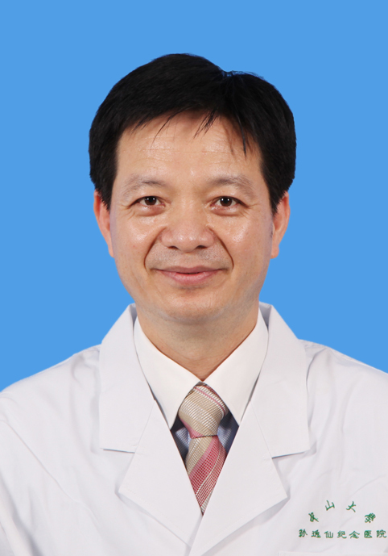

<!-- AUTO-GENERATED-BY: work/generate_obsidian_profiles.py -->

<!-- TEMPLATE: D:\workspace\信息收集整理\医生画像仓库\模板\医生画像模板.md -->

# 麦明泉

## 基础信息

| 字段 | 内容 |
|---|---|
| 姓名 | 麦明泉 |
| 医院 | 中山大学孙逸仙纪念医院 |
| 科室 | 康复医学科 |
| 职称/身份 | 副主任技师 |
| 来源链接 | [官网原文](https://www.gzsys.org.cn/doctor/15274) |
| 采集日期 | 2026-08-13 |

## 简介/擅长

## 教育与进修经历

- 91年中山医毕业，从事康复治疗30多年，擅长用传统中医手法治疗颈椎综合征(颈椎病、头痛头晕、失眠耳鸣、落枕、手臂麻痛等)，腰椎骨盆综合症(腰椎间盘突出、腰椎滑脱、腰肌劳损、腰3横突综合症等)，软组织损伤(胸背痛、肩周炎、网球肘、腰踝扭伤、膝关节炎、脚跟痛等)以及各种疼痛的治疗。

## 可包装亮点

-

## 重点疾病/人群标签

- 慢性病：
- 肿瘤：
- 生殖疾病：
- 免疫/风湿：
- 术后恢复/康复：康复、疼痛
- 疑难重症：

## 证据摘录

> 只摘录官网公开信息中的短句或关键字段，不复制大段原文。

- 官网身份字段：副主任技师
- 来源链接：https://www.gzsys.org.cn/doctor/15274

## BD 画像摘要

麦明泉医生可作为术后恢复/康复方向的基础画像候选。后续 BD 使用应继续以官网来源和人工复核为准，不添加疗效承诺或无来源包装。

## 合规边界

- 仅使用医院官网、官方公众号、官方小程序等公开渠道。
- 不采集私人电话、私人微信、家庭住址、患者隐私或非公开排班信息。
- 不写“保证治愈”“疗效第一”“包治疑难杂症”等无法由官网证明的表述。
